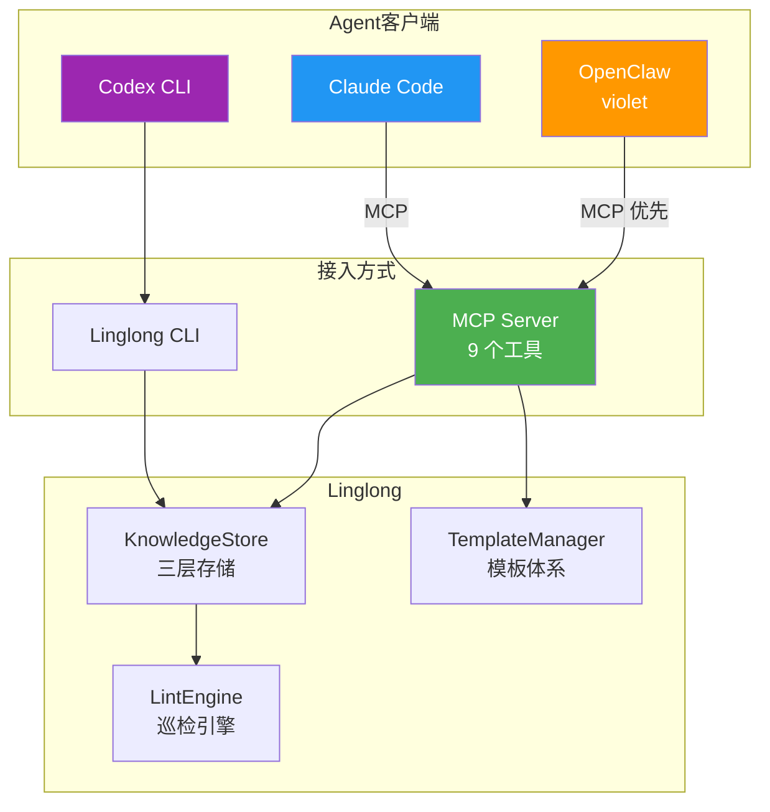

# Agent 接入总览

> **定位**：各 Agent 接入 Linglong 的统一入口。每个 Agent 的详细方案见对应文件。
> **最后更新**：2026-05-21

---

## 文档索引

| 文档 | 内容 |
|------|------|
| [01-onboarding.md](01-onboarding.md) | 三方接入指南（快速/深度/移除） |
| [claude-code.md](claude-code.md) | Claude Code 接入详情 |
| [openclaw.md](openclaw.md) | OpenClaw 接入详情 |
| [codex.md](codex.md) | Codex CLI 预留 |

---

## 接入架构



---

## Agent 状态

| Agent | 接入方式 | 同步适配器 | 状态 | 方案 |
|-------|----------|-----------|------|------|
| OpenClaw (violet) | MCP 优先 | `OpenClawSyncAdapter` | 🟡 接入中 | [openclaw.md](openclaw.md) |
| Claude Code | MCP | `ClaudeCodeSyncAdapter` | ✅ 已接入 | [claude-code.md](claude-code.md) |
| Codex CLI | CLI | `CodexSyncAdapter` | ⚪ 预留 | [codex.md](codex.md) |

---

## MCP 工具清单

所有 Agent 共享同一套 MCP 工具（9 个）：

| 工具 | 用途 |
|------|------|
| `search_wiki` | FTS5 全文搜索 |
| `search_similar` | 向量语义搜索（失败回退 FTS5） |
| `search_and_read` | 搜索+读取全文（默认截断 2000 字符） |
| `read_entity` | 读取完整内容 |
| `write_entity` | 写入新知识 |
| `update_entity` | 更新已有条目（替换/追加） |
| `list_entities` | 浏览最近条目 |
| `get_template` | 获取写作模板 |
| `list_templates` | 列出所有模板 |

---

## 写入流程（所有 Agent 统一）

```
1. get_template(facet) → 获取模板结构
2. search_wiki(facet) → 搜索同类文档参考格式
3. write_entity(title, content, facet, tags) → 写入
```

## 写入时机

| 触发点 | 时机 | Facet |
|--------|------|-------|
| 用户说"记住" | 显式指令 | 根据内容判断 |
| 解决 bug 后 | 问题解决 | `experience` |
| 学到新知识 | 对话中 | `concept` |
| 完成任务 | 任务完成 | `source` |
| 发现新实体 | 提到新名词 | `entity` |

## 读取时机

| 触发点 | 时机 | 做什么 |
|--------|------|--------|
| 用户提问 | Agent 收到问题 | `search_wiki` / `search_and_read` |
| 遇到陌生话题 | Agent 不确定 | `search_wiki --facet concept` |
| 引用历史 | 提到过去决策 | `read_entity` |

---

## 命名空间

每个 Agent 写入时带 `created_by` 前缀：
- `agent:openclaw`
- `agent:claude`
- `agent:codex`
