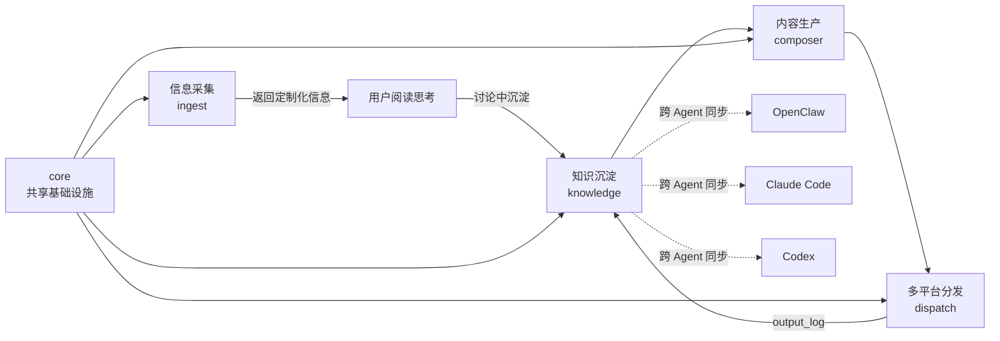
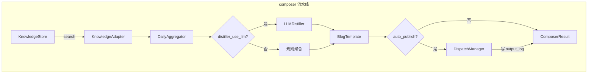
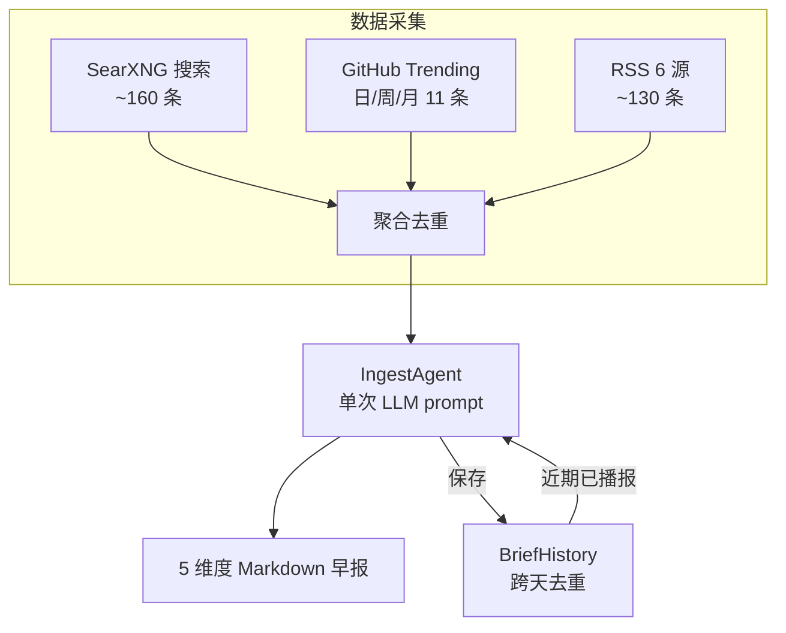
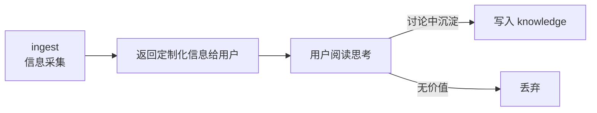
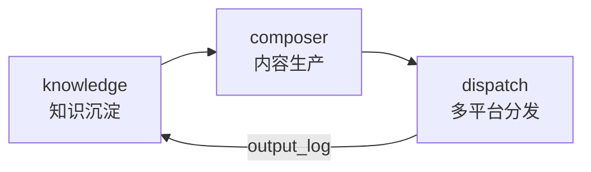
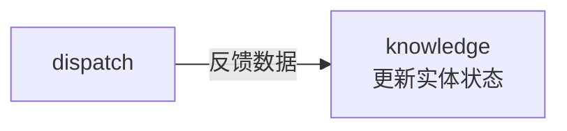
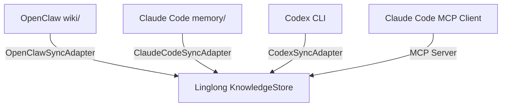

# Linglong 架构设计

## 概述

Linglong 是一个**跨 Agent 知识中枢**，采用模块化设计，支持从信息获取到知识沉淀，再到内容生产与分发的完整闭环。

**核心问题**：OpenClaw、Claude Code、Codex 等 AI Agent 各自维护独立的知识库，互不相通。Linglong 作为统一知识底座，让所有 Agent 共享同一个知识库。

## 设计原则

1. **跨 Agent 统一**：所有 Agent（OpenClaw、Claude Code、Codex 等）通过 Linglong 读写知识，避免重复存储
2. **模块化**：每个模块可独立运行、测试和部署
3. **可扩展**：通过接口和插件机制支持新数据源和平台
4. **可观测**：完整的日志、指标和追踪
5. **渐进式**：从简单开始，逐步增强

## 系统架构

```
┌─────────────────────────────────────────────────────────────────────┐
│                         外部 AI Agent 层                             │
│  ┌──────────┐  ┌─────────────┐  ┌──────────┐  ┌──────────────────┐ │
│  │ OpenClaw │  │ Claude Code │  │   Codex  │  │    其他 Agent     │ │
│  │ (violet) │  │   (main)    │  │ (backup) │  │                  │ │
│  └────┬─────┘  └──────┬──────┘  └────┬─────┘  └────────┬─────────┘ │
│       │               │              │                 │           │
│       └───────────────┴──────────────┴─────────────────┘           │
│                              │                                      │
│                              ▼                                      │
│  ┌─────────────────────────────────────────────────────────────┐   │
│  │              Linglong 知识中枢                               │   │
│  │                                                              │   │
│  │  ┌─────────┐                                                 │   │
│  │  │ ingest  │ ← 信息采集助手（返回定制化信息，不写知识库）   │   │
│  │  │ 采集    │                                                 │   │
│  │  └─────────┘                                                 │   │
│  │                                                              │   │
│  │  ┌──────────┐   ┌──────────┐   ┌──────────┐                 │   │
│  │  │ knowledge│ → │ composer │ → │ dispatch │                 │   │
│  │  │ 知识库   │   │ 编译     │   │ 分发     │                 │   │
│  │  └──────────┘   └──────────┘   └──────────┘                 │   │
│  │       ↑             ↑              ↓                         │   │
│  │       └─────────────┴──────────────┘                         │   │
│  │                 output_log（已输出追踪）                       │   │
│  │                                                              │   │
│  │  ┌──────────────────────────────────────────────────────┐   │   │
│  │  │ core（共享基础设施：模型、配置、工具）                │   │   │
│  │  └──────────────────────────────────────────────────────┘   │   │
│  └─────────────────────────────────────────────────────────────┘   │
└─────────────────────────────────────────────────────────────────────┘
```

### Mermaid 架构图





## 模块详解

### core（共享基础设施）

**职责**：
- 定义共享数据模型（Entity、Task、Source 等）
- 管理统一配置（.linglong.yaml 文件、环境变量）
- 提供跨模块工具函数

**设计要点**：
- 不依赖任何业务模块
- 使用 Pydantic 保证类型安全
- 配置分层：通用 / 模块级

### ingest（信息采集助手）

**定位**：用户的信息采集助手，采集结果交给用户阅读思考，有价值的内容在讨论中沉淀进知识库。

**IngestAgent 架构（v2.0+）**：

v2.0 起早报生成从代码流水线重构为 LLM Agent 单 prompt 模式。预搜索所有数据源后，一次 LLM 调用直接输出结构化 markdown。



**信息维度（5 个）**：

| 维度 | 采集内容 | 数据源 |
|------|---------|--------|
| 关键人物 | 观点/言论/人事变动 | SearXNG + RSS |
| 公司动态 | 产品发布、融资、股价 | SearXNG + RSS |
| 政策动态 | AI 监管、产业政策 | SearXNG + RSS |
| 开源趋势 | AI 新项目 Stars 增长 | OpenGithubs（日/周/月） |
| 应用落地 | 模型/Agent/机器人更新 | SearXNG + RSS |

**设计要点**：
- **不写知识库**：采集结果返回给调用方，写入由人决定
- **LLM Agent 驱动**：预搜索 + 单次 prompt → 直接输出（v2.0+）
- **RSS 数据源**：6 个订阅源（AIHOT/36氪/量子位/The Rundown AI/财联社/36氪快讯），信噪比高于搜索
- **BriefHistory 去重**：历史输出注入 prompt，LLM 语义级跨天去重
- **GitHub Trending**：OpenGithubs 三级 fallback（日/周/月分层）
- 支持 CLI 和 MCP 两种调用方式
- 详细设计 → [ingest 设计总览](ingest/design/00-overview.md)

### knowledge（跨 Agent 知识库）

**职责**：
- **统一存储**：兼容 OpenClaw wiki 结构 + Claude Code memory 结构 + Codex 记忆
- **向量搜索**：复用 OpenClaw 远程 embedding 服务（`nomic-embed-text-v1.5`）+ 本地 sqlite-vec fallback
- **混合搜索**：关键词 + 语义 + 时间衰减 + MMR
- **多 Agent 读写**：OpenClaw、Claude Code、Codex 通过 API/文件同步接入
- **WikiLinks 支持**：`[[概念名]]` 自动解析和补全（兼容 Obsidian）
- **短期→长期转换**：自动判断任务是否有长期价值，有则写入 wiki
- **写入冲突解决**：多个 Agent 同时修改同一篇 wiki 时的 merge 策略

**存储设计（三层）**：

```yaml
storage:
  filesystem:     # Markdown + YAML frontmatter
    - 人类可读
    - Git 友好
    - 便于手动编辑
    - 兼容 OpenClaw wiki/ 目录结构

  sqlite:         # 结构化数据
    - 元数据查询
    - 关系图谱
    - 版本历史
    - Agent 命名空间（openclaw:、claude:、codex:）

  vector:         # 语义索引
    - 远程：OpenClaw embedding 服务（nomic-embed-text）
    - 本地：sqlite-vec fallback
    - 混合搜索 + MMR + 时间衰减
```

**Review 机制**：

```
┌─────────┐    ┌──────────┐    ┌──────────┐
│  获取   │ →  │ Review   │ →  │  存储    │
│ 原始数据│    │ 引擎     │    │ 知识库   │
└─────────┘    └──────────┘    └──────────┘
                    │
                    ↓
               ┌──────────┐
               │ 规则评估  │
               │ - 置信度  │
               │ - 来源    │
               │ - 敏感词  │
               └──────────┘
```

### composer（知识编译引擎）

**职责**：
- 从知识库读取各 Agent 产出的碎片
- **主题聚类**：识别"这周一直在研究 Rust 并发"，自动聚合成深度文章
- **跨天合并**：跨天、跨 Agent 的内容聚合
- **LLM 提炼**：总结、加解读、生成封面图提示词
- **多格式输出**：博客（Hexo）、早报、周报、PPT 大纲（抖音口播脚本）、Twitter 线程
- **内容验证**：检查是否符合模板规范

**设计要点**：
- 输入：只从 knowledge 读取（已沉淀的知识，非原始 ingest 数据）
- 输出：写入 dispatch 队列
- 不直接处理发布
- 草稿模式支持人工审核
- **输出追踪**：发布后记录 entity_id + publisher + published_at 到 output_log 表，避免重复消费

**编译流程**：

```
知识库（已沉淀的知识）
           │
           ▼
   ┌───────────────┐
   │KnowledgeAdapter│  ← 统一读取接口
   └───────┬───────┘
           │
   ┌───────┴───────┐
   │  ThemeAggregator│  ← 按主题聚类（跨天、跨 Agent）
   └───────┬───────┘
           │
   ┌───────┴───────┐
   │  LLM Distiller  │  ← 提炼、总结、加解读
   └───────┬───────┘
           │
   ┌───────┴───────┐
   │  TemplateEngine │  ← 套用博客/早报/PPT/视频脚本模板
   └───────┬───────┘
           │
           ▼
    成品（Markdown / PPT / 视频脚本）
```

### dispatch（智能分发器）

**职责**：
- **发布队列**：待发布 / 发布中 / 已发布 / 失败（可重试）
- **内容路由**：根据内容类型自动分发到不同平台
  - 博客文章 → Hexo (`linglong.wiki`) → Git Workflow Publisher
  - AI 早报 → 钉钉（复用 OpenClaw dingtalk-connector）
  - 短视频脚本 → 抖音（脚本 + AI 封面图）
  - Twitter 线程 → Twitter/X API
  - 周报 → 邮件 / Notion
- **反馈收集**：阅读量、点赞、评论回流到 knowledge

**设计要点**：
- 平台适配器插件化
- 支持定时/条件触发
- 反馈数据回流到 knowledge

## 数据流

### 信息采集流程（ingest）



### 内容生产流程（knowledge → dispatch）



### 反馈流程



### 跨 Agent 同步流程



同步方式有两种：
1. **批处理同步**：`SyncAdapter` 定期拉取 Agent 本地文件（OpenClaw wiki、Claude Code memory）到 KnowledgeStore
2. **实时 MCP 接入**：Claude Code 通过 MCP Server 直接调用 `search_wiki` / `write_entity` 等工具读写知识库

## 模块间协作规则

1. **单向依赖**：业务模块依赖 core，core 不依赖业务模块
2. **不直接通信**：业务模块间不直接调用，通过数据流转
3. **接口隔离**：每个模块暴露清晰的接口
4. **数据一致性**：通过 Entity 模型保证数据格式统一
5. **Agent 命名空间**：每个 Agent 写入时带前缀（`openclaw:`、`claude:`、`codex:`），避免冲突

## 技术选型

| 层面 | 技术 | 理由 |
|------|------|------|
| 语言 | Python 3.11+ | AI 生态、开发效率 |
| 数据验证 | Pydantic | 类型安全、序列化 |
| 配置管理 | pydantic-settings | 环境变量支持 |
| 向量存储（本地） | sqlite-vec | 轻量、无依赖 |
| 向量存储（远程） | OpenClaw embedding 服务 | nomic-embed-text-v1.5，混合搜索 |
| 测试 | pytest | 生态成熟 |
| 打包 | hatchling | 现代标准 |

## 扩展点

### 添加新数据源

```python
class CustomSource:
    async def fetch(self) -> List[Entity]:
        pass
```

### 添加新平台

```python
class CustomPlatform:
    async def publish(self, content: str) -> bool:
        pass
    
    async def collect_feedback(self) -> Dict:
        pass
```

### 添加 Review 规则

```python
engine.add_rule(
    Rule(
        name="custom",
        condition=lambda e: ...,
        action=Action.FLAG_FOR_REVIEW,
    )
)
```

### 添加 Agent 同步适配器

```python
class ClaudeCodeSyncAdapter:
    """同步 Claude Code memory 到 Linglong Knowledge Store"""
    def pull(self) -> List[Entity]:
        pass
    
    def push(self, entities: List[Entity]) -> None:
        pass
```

## 部署架构

### 开发环境

```bash
pip install -e ".[dev]"
pytest
```

### 生产环境

```bash
pip install linglong[all]
```

### Docker（未来）

```yaml
version: '3'
services:
  linglong:
    image: linglong:latest
    volumes:
      - ./data:/data
      - ./wiki:/wiki
    environment:
      - LL_KNOWLEDGE_WIKI_PATH=/wiki
      - LL_KNOWLEDGE_VECTOR_REMOTE_URL=http://localhost:7997
```

## 演进路线

### Phase 1–3（v0.1–v0.8：已完成）
- core：共享模型、配置中心（`.linglong.yaml`）
- ingest：RSS/API/Web 数据获取、真实性验证引擎
- knowledge：SQLite + sqlite-vec、Review 引擎、OpenClaw/Claude/Codex 同步
- composer：LLM/规则提炼、博客模板、草稿审核、图片资产管线
- dispatch：Hexo 发布（git workflow）、本地文件输出、发布队列

### Phase 4（v0.9–v1.3：已完成）
- v0.9 ✅：CLI 入口、集成测试、auto-publish、配置外部化
- v1.0 ✅：MCP Server、RRF 混合搜索、lint 巡检、Agent 接入、276 测试
- v1.2 ✅：SearXNG 搜索 + AIHOT 适配器 + 多源聚合 + LLM 解读 + 晨报模板
- v1.3 ✅：ArXiv/GitHub/RSS 信源 + LLM 动态标签 + 反馈闭环

### Phase 5（v2.0–v2.1：当前）
- v2.0 ✅：IngestAgent LLM 单 prompt 早报 + GitHub Trending 多源 fallback + BriefHistory 维度去重 + 394 测试
- v2.1 ✅：RSS 订阅源接入（AIHOT/36氪/量子位/The Rundown AI/财联社）+ 交叉去重

## 参考

- [开发规范](rules.md)
- [API 文档](api.md)
- [版本路线图](roadmap.md)
- [测试策略](testing.md)
- [运维与发布](operations.md)
