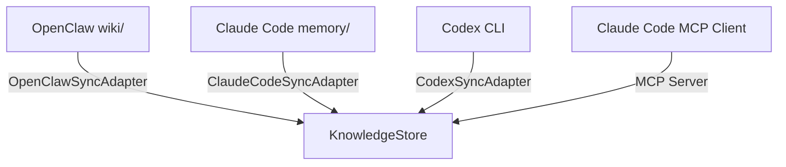
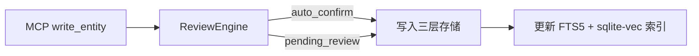

# Linglong 架构设计

跨 Agent 统一知识库，为 OpenClaw、Claude Code、Codex 等 AI Agent 提供共享知识底座。

## 系统架构

```
┌──────────────────────────────────────────────────────────────────┐
│                        外部 Agent 层                              │
│  ┌──────────┐  ┌─────────────┐  ┌──────────┐                    │
│  │ OpenClaw │  │ Claude Code │  │   Codex  │                    │
│  └────┬─────┘  └──────┬──────┘  └────┬─────┘                    │
│       │               │              │                           │
│       │    ┌──────────┴──────────┐   │                          │
│       │    │  MCP Server (HTTP)  │   │                          │
│       │    │  /mcp/knowledge     │   │                          │
│       │    └──────────┬──────────┘   │                          │
│       │               │              │                           │
│       └───────────────┼──────────────┘                           │
│                       ▼                                          │
│  ┌──────────────────────────────────────────────────────────┐   │
│  │                KnowledgeStore                             │   │
│  │  ┌────────────┐  ┌────────────┐  ┌──────────────────┐   │   │
│  │  │ Filesystem │  │  SQLite    │  │  sqlite-vec      │   │   │
│  │  │ Markdown + │  │  元数据 +  │  │  语义索引        │   │   │
│  │  │ Frontmatter│  │  关系图谱  │  │  (embedding)     │   │   │
│  │  └────────────┘  └────────────┘  └──────────────────┘   │   │
│  └──────────────────────────────────────────────────────────┘   │
│                       ▲                                          │
│  ┌────────────────────┴─────────────────────────────────────┐   │
│  │  Sync Adapters (pull)                                     │   │
│  │  OpenClawSyncAdapter │ ClaudeCodeSyncAdapter │ CodexSync  │   │
│  └──────────────────────────────────────────────────────────┘   │
└──────────────────────────────────────────────────────────────────┘
```

### 模块依赖图

```
core (models, config, templates)
  ← knowledge (store, review, embeddings, indexer, lint, sync, wikilinks, lock)
    ← mcp (server, tools, _auth)
```

所有业务代码在 `knowledge` 模块内，`mcp` 是对外接口层，`core` 是共享基础设施。

## 模块详解

### core（共享基础设施）

- 数据模型：`Entity`、`Source`、`Relation`、`Version`、枚举类型
- 配置管理：`LinglongConfig` 从 `.knowledge.yml` + 环境变量加载
- 写作模板：`TemplateManager` 管理各 facet 的 markdown 模板

不依赖任何业务模块。

### knowledge（知识库核心）

三层存储：

| 层 | 格式 | 用途 |
|----|------|------|
| Filesystem | Markdown + YAML frontmatter | 人类可读、Git 友好、兼容 Obsidian |
| SQLite (sqlean) | 结构化表 | 元数据查询、关系图谱、版本历史 |
| sqlite-vec | 向量索引 | 语义搜索 + 混合搜索 |

核心能力：

- **混合搜索**：FTS5 关键词 + sqlite-vec 语义 + 时间衰减 + MMR，RRF 融合排序
- **Review 引擎**：基于规则的质量控制（置信度、来源可信度、敏感内容、长度），自动确认或标记审核
- **跨 Agent 同步**：OpenClaw / Claude Code / Codex 三个 pull adapter，从各 Agent 本地目录拉取知识
- **WikiLinks**：`[[概念名]]` 自动解析和补全
- **Lint 巡检**：定期扫描知识库完整性，支持 cron 调度
- **初始化**：支持 bare / from-backup / from-openclaw / from-git / interactive 五种模式

### mcp（对外接口）

FastMCP Server，8 个知识库工具：

| 工具 | 功能 |
|------|------|
| `search_wiki` | 自动选择最佳搜索模式（关键词/向量/混合） |
| `search_similar` | 语义向量搜索，不可用时退化为 FTS5 |
| `search_and_read` | 搜索 + 读取 Top-N，支持内容截断 |
| `read_entity` | 按 ID 读取完整实体 |
| `write_entity` | 创建新实体，自动检测 facet 拥挤度 |
| `update_entity` | 更新实体，支持追加模式 |
| `list_entities` | 按时间线浏览，可按 facet 过滤 |
| `get_template` / `list_templates` | 获取写作模板 |

部署模式：

- **stdio**：本地 Claude Code 直接连接
- **streamable-http**：远程部署，Cloudflare Tunnel 暴露，按模块路由 `/mcp/knowledge`
- **认证**：Redis 动态 Token（优先） / 静态 Token 降级

## 数据流

### 跨 Agent 同步



两种同步方式：
1. **批处理同步**：SyncAdapter 定期拉取 Agent 本地文件到 KnowledgeStore
2. **实时 MCP 接入**：Agent 通过 MCP 工具直接读写知识库

### 写入路径



## 技术选型

| 层面 | 技术 | 理由 |
|------|------|------|
| 语言 | Python 3.11+ | AI 生态、开发效率 |
| 数据验证 | Pydantic | 类型安全、序列化 |
| 配置管理 | pydantic-settings | 环境变量 + YAML |
| 结构化存储 | sqlean (SQLite) | 元数据查询，无额外依赖 |
| 向量存储 | sqlite-vec | 轻量本地语义搜索 |
| Embedding | 远程 embedding 服务 | nomic-ai/nomic-embed-text-v1.5 |
| MCP 框架 | FastMCP | Agent 工具协议标准 |
| HTTP | Starlette + Uvicorn | 轻量 ASGI |
| 认证 | Redis (可选) | 动态 Token 管理 |
| 测试 | pytest | 生态成熟 |
| 打包 | hatchling | 现代标准 |

## 参考

- [API 文档](api.md)
- [版本路线图](roadmap.md)
- [运维与发布](operations.md)
