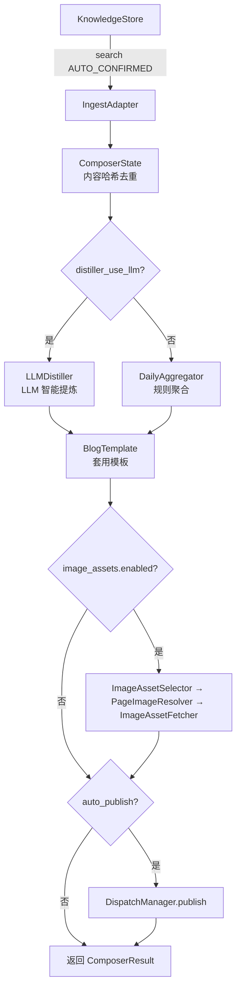

# Composer — 内容生产模块

## 职责

从知识库读取碎片 → 聚合 → 提炼 → 套模板 → 输出成品。

## 流水线流程



## 组件列表

| 组件 | 路径 | 说明 |
|------|------|------|
| `Composer` | `composer/composer.py` | 编排器 |
| `DraftManager` | `composer/draft.py` | 草稿生命周期管理 |
| `ComposerState` | `composer/state.py` | 内容哈希去重与状态持久化 |
| `IngestAdapter` | `composer/ingest_adapter.py` | Entity → MemoryFragment 适配层 |
| `DailyAggregator` | `composer/distiller/aggregator.py` | 按天聚合记忆片段 |
| `LLMDistiller` | `composer/distiller/llm_distiller.py` | LLM 智能提炼与主题合并 |
| `BlogTemplate` | `composer/templates/blog.py` | Hexo 博客模板 |
| `TextAssetGenerator` | `composer/assets/text.py` | 摘要、标签、引言生成 |
| `ImageAssetFetcher` | `composer/assets/image_asset_fetcher.py` | 图片下载/压缩/EXIF 清理 |
| `ImageAssetSelector` | `composer/assets/image_asset_selector.py` | URL 文件解析 + 随机选择 + 去重 |
| `PageImageResolver` | `composer/assets/page_image_resolver.py` | Playwright 页面 → 图片 URL |

## 使用方式

```bash
# CLI
linglong pipeline compose              # 正常运行
linglong pipeline compose --dry-run    # 试运行（不保存）
linglong pipeline compose --draft      # 草稿模式（保存待审核）
```

```python
# Python
from linglong.composer.composer import Composer

composer = Composer()
result = composer.run(dry_run=False, draft=False)
# result.success, result.articles, result.errors
```

## 配置

```yaml
# .linglong.yaml
composer:
  llm_provider: openai
  llm_model: gpt-4
  distiller_use_llm: false
  auto_publish: false
  default_publisher: hexo
  drafts_dir: ~/linglong/data/drafts
  image_assets:
    enabled: true
    sources:
      - name: tuchong
        url_file: ~/Downloads/resource.txt
        resolve_via: playwright
```

## 相关文档

- [图片资产系统](image-assets.md)
- [模板引擎](templates.md)
