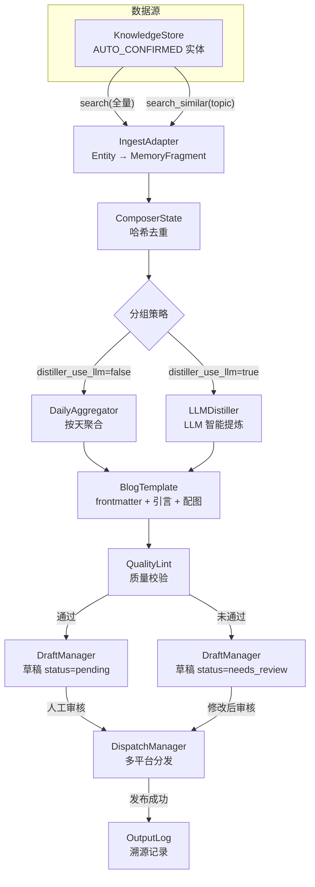

# Composer 设计总览

> 创建日期：2026-05-26 | 最后更新：2026-05-26 | 状态：已实现

---

## 定位

**composer 是知识库的内容编译器。** 从知识库读取已沉淀的确认实体，经过聚合、提炼、模板化，输出可发布的成品文章。

```
知识库（已确认实体）→ composer（聚合+提炼+模板+校验）→ 草稿 → 审核 → dispatch → 发布
```

composer 不关心知识的来源（ingest / 讨论 / Agent 写入），只消费知识库中 `AUTO_CONFIRMED` 的实体。composer 不直接发布，发布由 dispatch 模块处理。

---

## 架构图



---

## 子设计索引

| 编号 | 文档 | 分类 | 状态 | 依赖 | 最后更新 |
|------|------|------|------|------|----------|
| D-01 | [流水线设计](01-pipeline.md) | 核心流程 | ✅ 已实现 | — | 2026-05-26 |
| D-02 | [质量校验](02-quality-lint.md) | 质量层 | ✅ 已实现 | D-01 | 2026-05-26 |
| D-03 | [审查流程](03-review-flow.md) | 流程层 | ✅ 已实现 | D-01 | 2026-05-26 |
| D-04 | [溯源记录](04-output-log.md) | 追踪层 | ✅ 已实现 | D-01 | 2026-05-26 |

---

## 全局设计决策

| 编号 | 决策 | 选择 | 原因 | 替代方案 |
|------|------|------|------|----------|
| GD-01 | 输入来源 | 知识库 AUTO_CONFIRMED 实体 | 只消费已沉淀的知识 | 直接读 ingest 输出 |
| GD-02 | 提炼模式 | 双模式：规则聚合 / LLM 智能提炼 | 按需选择成本和质量 | 仅 LLM / 仅规则 |
| GD-03 | 发布流程 | 强制草稿 → 审核 → 发布 | 人对内容质量把关 | auto_publish 直接发布 |
| GD-04 | 质量校验 | 规则层 + LLM 层 | 规则层零成本兜底，LLM 层深度检查 | 仅 LLM / 仅规则 |
| GD-05 | 溯源方式 | output_log JSONL 追加 | 纯记录不过滤，实体可重复编排 | 实体 metadata 打标记 |
| GD-06 | 模板引擎 | BlogTemplate（Hexo 兼容） | 当前发布目标是 Hexo 博客 | 通用模板引擎 |

---

## 核心设计原则

### 1. 只读知识库

composer 只从 KnowledgeStore 读取，不写入。知识库的入口是人的讨论沉淀。

### 2. 质量优先

文章生成后必须经过质量校验。校验不通过标记为 `needs_review`，由人决定是否修改。

### 3. 可溯源

每次编排记录"哪些实体 → 哪篇文章 → 发布到哪"。output_log 是纯追加审计日志，不过滤实体。

### 4. 不直接发布

composer 的产出是草稿（DraftManager），由 dispatch 负责实际发布。composer → dispatch 之间有人的审核。

---

## 组件列表

| 组件 | 路径 | 说明 |
|------|------|------|
| `Composer` | `composer/composer.py` | 编排器：串联完整流水线 |
| `QualityLint` | `composer/lint.py` | 质量校验：规则层 + LLM 层 |
| `OutputLog` | `composer/output_log.py` | 溯源记录：JSONL 审计日志 |
| `DraftManager` | `composer/draft.py` | 草稿生命周期管理 |
| `ComposerState` | `composer/state.py` | 内容哈希去重 |
| `IngestAdapter` | `composer/ingest_adapter.py` | Entity → MemoryFragment 适配 |
| `DailyAggregator` | `composer/distiller/aggregator.py` | 按天聚合 |
| `LLMDistiller` | `composer/distiller/llm_distiller.py` | LLM 智能提炼 + 主题分组 |
| `BlogTemplate` | `composer/templates/blog.py` | Hexo 博客模板 |
| `TextAssetGenerator` | `composer/assets/text.py` | 摘要、标签、引言生成 |
| `ImageAssetFetcher` | `composer/assets/image_asset_fetcher.py` | 图片下载/压缩/EXIF 清理 |
| `ImageAssetSelector` | `composer/assets/image_asset_selector.py` | URL 选择 + 去重 |
| `PageImageResolver` | `composer/assets/page_image_resolver.py` | Playwright 页面 → 图片 URL |

---

## 版本变动历史

| 版本 | 日期 | 变动摘要 | 影响范围 |
|------|------|----------|----------|
| v1.0 | 2026-05-12 | 初始实现：流水线 + 草稿 + 模板 + 图片资产 | 全部 |
| v1.1 | 2026-05-26 | 新增质量校验 + 审查流程 + 溯源记录 + 设计文档体系 | 全部 |
