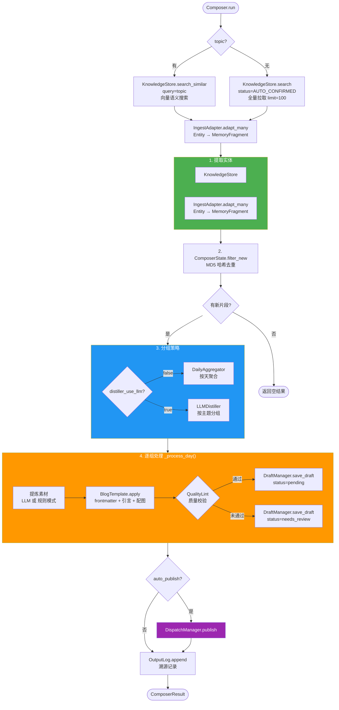
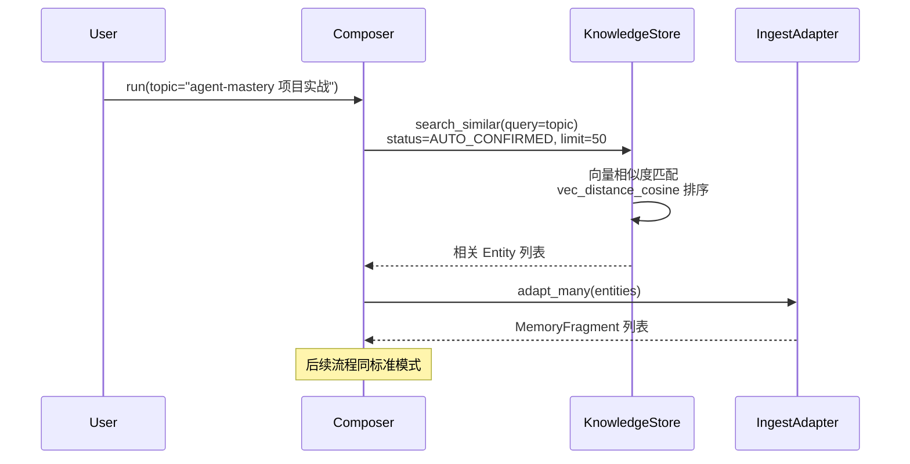
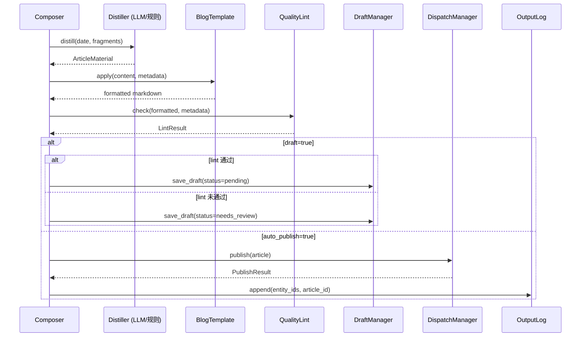

# D-01 流水线设计

> 状态：✅ 已实现 | 最后更新：2026-05-26

---

## 概述

`Composer.run()` 是一条完整的内容生产流水线，从知识库提取实体到输出可发布文章。支持无差别拉取和语义查询两种模式。

---

## 完整流程图



---

## 分组策略对比

| | 按天聚合 | 按主题分组 |
|---|---|---|
| 配置 | `distiller_use_llm: false` | `distiller_use_llm: true` |
| 实现 | `DailyAggregator` | `LLMDistiller` |
| 成本 | 零 | LLM 调用 |
| 效果 | 每天一篇 | 跨天合并同主题 |
| 适用 | 碎片化记录 | 有明确主题线索的内容 |

---

## 语义查询模式

`Composer.run(topic="agent-mastery 项目实战")` 触发语义查询模式：



与标准模式的区别：

| | 标准模式 | 语义查询模式 |
|---|---|---|
| 触发 | `run()` / `run(since=...)` | `run(topic="...")` |
| 知识库查询 | `search(status=..., limit=100)` | `search_similar(query=topic, limit=50)` |
| 匹配方式 | 全量拉取 | 向量余弦相似度 |
| LLM 分组 | 自动发现主题 | 围绕指定主题分组 |
| 适用场景 | 定期全量编排 | 按需生成专题文章 |

---

## _process_day 详细流程



---

## MemoryFragment 模型

```python
@dataclass
class MemoryFragment:
    source: str           # 来源标识（entity 的 source name）
    content: str          # 内容正文
    timestamp: datetime   # 实体创建时间
    metadata: dict        # entity_id, confidence, status, created_by
    raw_path: str = ""
```

---

## ArticleMaterial 模型

```python
class ArticleMaterial:
    date: str                         # 日期或主题 key
    fragments: list[MemoryFragment]   # 原始片段
    title: str                        # 文章标题
    excerpt: str                      # 摘要
    tags: list[str]                   # 标签
    categories: list[str]             # 分类
    raw_content: str                  # 编译后的正文
```

---

## 关键文件

| 文件 | 说明 |
|------|------|
| `src/linglong/composer/composer.py` | 编排器，`Composer.run()` 和 `_process_day()` |
| `src/linglong/composer/ingest_adapter.py` | `IngestAdapter` Entity → MemoryFragment |
| `src/linglong/composer/state.py` | `ComposerState` 哈希去重 |
| `src/linglong/composer/distiller/aggregator.py` | `DailyAggregator` + `ArticleMaterial` |
| `src/linglong/composer/distiller/llm_distiller.py` | `LLMDistiller` 智能提炼 + 主题分组 |
| `src/linglong/composer/assets/prompts/blog/` | LLM prompt 模板（system.md, user_template.md） |
