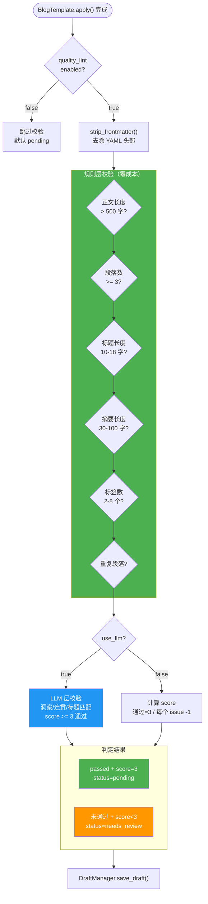
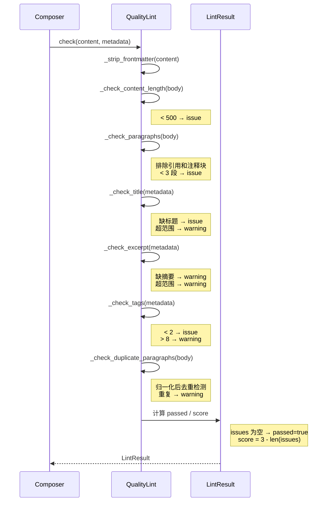
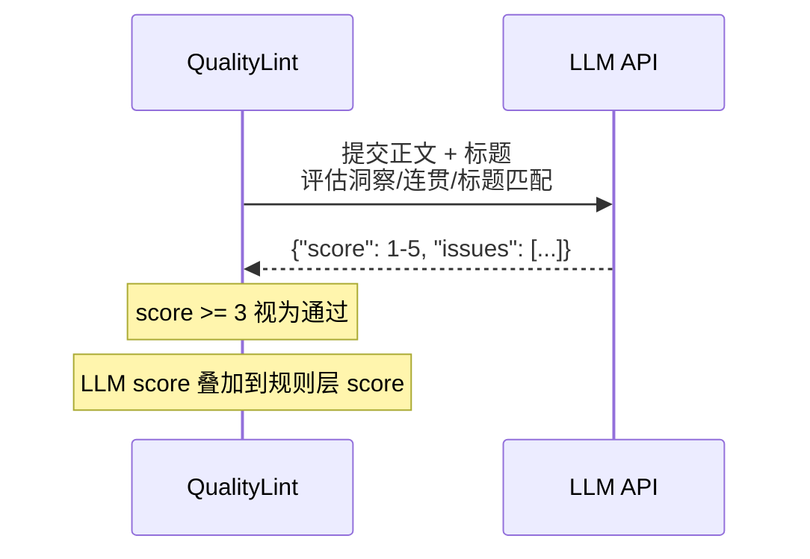

# D-02 质量校验设计

> 状态：✅ 已实现 | 最后更新：2026-05-26 | 依赖：[D-01 流水线](01-pipeline.md)

---

## 概述

文章生成后、保存草稿前，自动校验内容质量。两层检查：规则层（零成本）+ LLM 层（可选）。校验不通过不阻断流程，而是标记草稿为 `needs_review`。

---

## 校验流程图



---

## 规则层检查时序



---

## 规则层检查项

| 检查项 | 阈值 | 通过 | 不通过 |
|--------|------|------|--------|
| 正文长度 | > 500 字 | — | issue |
| 段落数 | >= 3（排除引用/注释） | — | issue |
| 标题长度 | 10-18 字符 | — | 缺标题=issue，超范围=warning |
| 摘要长度 | 30-100 字符 | — | 缺摘要=warning，超范围=warning |
| 标签数 | 2-8 个 | — | < 2=issue，> 8=warning |
| 重复段落 | 无 | — | warning |

**判定规则**：`issues` 为空 → `passed=true`，`score = 3.0 - len(issues)`。

---

## LLM 层（可选）

当 `quality_lint.use_llm: true` 时启用，消耗 token。



Prompt 要求 LLM 评估：
1. 正文是否有核心洞察（不是简单转述片段）
2. 段落之间逻辑是否连贯
3. 标题是否准确反映内容

返回格式：
```json
{
  "score": 4,
  "issues": ["第三段与上下文衔接生硬"]
}
```

score >= 3 视为通过。

---

## LintResult 数据模型

```python
@dataclass
class LintResult:
    passed: bool              # issues 为空 → True
    score: float              # 规则层通过=3，LLM 层可加分
    issues: list[str]         # 未通过的原因（阻断发布）
    warnings: list[str]       # 警告（不阻断）
```

---

## 配置

```yaml
composer:
  quality_lint:
    enabled: true
    use_llm: false
    min_content_length: 500
    min_paragraphs: 3
```

---

## 与草稿状态的关系

| lint 结果 | score | 草稿状态 | 后续 |
|-----------|-------|---------|------|
| 通过（无 issues） | 3.0 | `pending` | 等待人工审核后发布 |
| 未通过（有 issues） | < 3.0 | `needs_review` | 人工修改后重新审核 |
| 校验禁用 | — | `pending` | 直接进审核队列 |

---

## 关键文件

| 文件 | 说明 |
|------|------|
| `src/linglong/composer/lint.py` | QualityLint + LintResult |
| `src/linglong/composer/composer.py` | `_process_day()` 中调用 lint |
