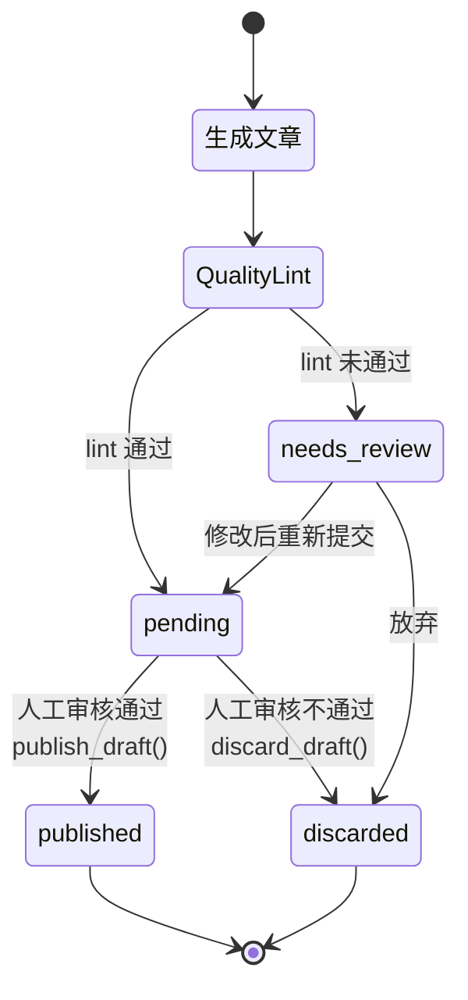
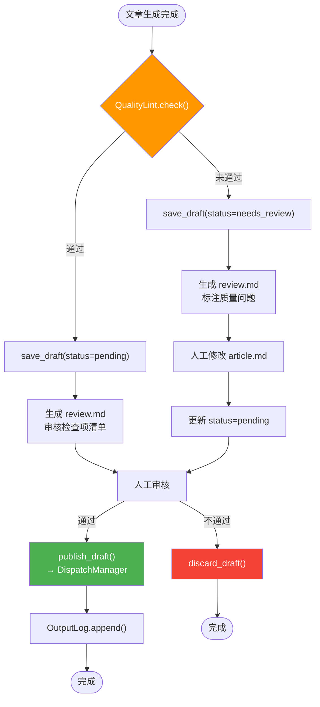

# D-03 审查流程设计

> 状态：✅ 已实现 | 最后更新：2026-05-26 | 依赖：[D-01 流水线](01-pipeline.md)

---

## 概述

composer 生成的文章**不直接发布**，强制走草稿 → 审核 → 发布流程。

---

## 草稿生命周期



---

## 审查流程图



---

## 草稿目录结构

```
~/linglong/data/drafts/
├── state.json              # 草稿元数据索引
├── abc123/                 # 草稿 ID
│   ├── article.md          # 文章正文
│   ├── metadata.json       # 元数据（标题、标签、封面等）
│   └── review.md           # 审核摘要（检查项清单）
├── def456/
└── discard/                # 废弃草稿（可选保留）
    └── xyz789/
```

---

## 审核检查项（review.md 自动生成）

- [ ] 标题长度 10-18 汉字
- [ ] 摘要质量 30-40 汉字
- [ ] 标签准确、不重复
- [ ] 正文有核心洞察，非简单拼接
- [ ] 封面图适配（如有）

---

## 关键文件

| 文件 | 说明 |
|------|------|
| `src/linglong/composer/draft.py` | `DraftManager` 草稿 CRUD |
| `src/linglong/composer/composer.py` | `_process_day()` 中决定 draft/publish |
