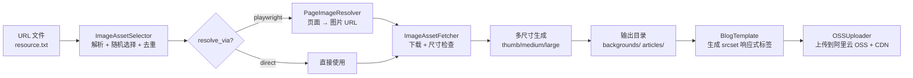

# 图片资产系统

## 概述

为博客文章提供背景图和文章配图，支持多源、随机选择、去重、Playwright 页面解析、**多尺寸响应式图片生成**。

## 系统流程



## 多尺寸变体（v1.0 新增）

下载原图后自动生成三套尺寸，用于响应式图片加载：

| 变体 | 最大宽度 | 典型大小 | 用途 |
|------|----------|----------|------|
| `thumb` | 400px | ~2-5KB | 移动端、列表缩略图 |
| `medium` | 800px | ~6-15KB | 文章默认、cover_image |
| `large` | 1200px | ~13-30KB | 桌面端、点击放大 |

使用 `PIL.Image.thumbnail()` 保持宽比，`LANCZOS` 重采样。变体宽度超过原图时直接保存原图。

## 两种图片规格

| 用途 | 最小尺寸 | 质量 | 输出目录 |
|------|----------|------|----------|
| `background` | 1920×1080 | 90 | `~/linglong/images/backgrounds/` |
| `article_image` | 800×600 | 85 | `~/linglong/images/articles/` |

## URL 文件格式

**行内格式**：
```
https://photo.tuchong.com/xxx/f/yyy.jpg # 风光,自然 [background]
```

**多行格式**（标签单独一行）：
```
# 风光
https://tuchong.com/xxx/yyy/
https://tuchong.com/zzz/www/
# 城市 [background]
https://tuchong.com/aaa/bbb/
```

## 组件

| 组件 | 职责 |
|------|------|
| `ImageAssetSelector` | 解析 URL 文件，按 usage 随机选择，跟踪已用 URL 去重 |
| `PageImageResolver` | Playwright 访问页面 URL，提取实际图片 URL（懒加载 playwright） |
| `ImageAssetFetcher` | 下载图片 → 尺寸检查 → RGB 转换 → **多尺寸变体生成** → JPEG 压缩 → EXIF 清理 |
| `OSSUploader` | 上传图片到阿里云 OSS，将本地路径替换为 CDN URL（在 dispatch 阶段执行） |

## 数据模型

### ImageResult

`ImageAssetFetcher.fetch()` 返回 `ImageResult`（而非旧版的单个 `Path`）：

```python
@dataclass
class ImageResult:
    variants: dict[str, Path]  # {"thumb": Path, "medium": Path, "large": Path}
    width: int                 # 原图宽度
    height: int                # 原图高度
```

### metadata 中的图片数据

Composer 将多尺寸路径存入 metadata dict：

```python
metadata["article_image"] = {
    "thumb": "~/linglong/images/articles/01234.thumb.jpg",
    "medium": "~/linglong/images/articles/01234.medium.jpg",
    "large": "~/linglong/images/articles/01234.large.jpg",
}
```

BlogTemplate 根据数据类型自动选择渲染方式：
- **dict** → 生成 `` 响应式 HTML
- **str** → 生成标准 `` Markdown（向后兼容）

## 响应式图片输出

BlogTemplate 生成的 HTML：

```html

```

浏览器根据视口宽度自动选择最合适的尺寸，`loading="lazy"` 实现懒加载。

## OSS CDN 集成

图片在 dispatch 阶段自动上传到阿里云 OSS，本地路径替换为 CDN URL：

```
本地: ~/linglong/images/articles/01234.medium.jpg
  ↓ OSSUploader
CDN:  https://linglong-blog.oss-cn-zhangjiakou.aliyuncs.com/images/01234.medium.jpg
```

配置见 [dispatch 文档](../dispatch/README.md#oss-图片-cdn)。

## 去重机制

- 状态文件：`~/linglong/state/image_dedup.json`
- 记录每个 URL 的使用日期
- 选择时排除 dedup_days 天内用过的 URL
- 池耗尽时重置

## 配置

```yaml
# .linglong.yaml
composer:
  image_assets:
    enabled: true
    specs:
      background:
        min_width: 1920
        min_height: 1080
        quality: 90
        output_dir: ~/linglong/images/backgrounds
        variants:                # 响应式图片尺寸
          thumb: 400
          medium: 800
          large: 1200
      article_image:
        min_width: 800
        min_height: 600
        quality: 85
        output_dir: ~/linglong/images/articles
        variants:
          thumb: 400
          medium: 800
          large: 1200
    sources:
      - name: tuchong
        url_file: ~/Downloads/resource.txt
        default_usage: both
        resolve_via: playwright  # direct | playwright
        headless: true
        delay_range: [3, 8]
        max_count: 50
    selection:
      strategy: random
      dedup_days: 30
```

## Playwright 依赖

```bash
pip install playwright && playwright install chromium
```

Playwright 是可选依赖，未安装时 `PageImageResolver.health_check()` 返回 False，fallback 到直接使用 URL。
