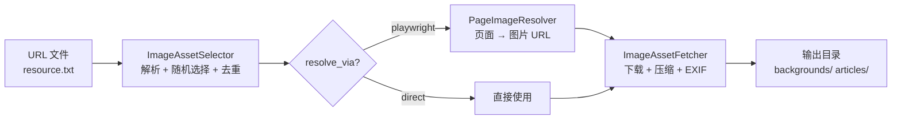

# 图片资产系统

## 概述

为博客文章提供背景图和文章配图，支持多源、随机选择、去重、Playwright 页面解析。

## 系统流程



## 两种图片规格

| 用途 | 最小尺寸 | 质量 | 输出目录 |
|------|----------|------|----------|
| `background` | 1920×1080 | 90 | `~/linglong/images/backgrounds/` |
| `article_image` | 800×600 | 85 | `~/linglong/images/articles/` |

## URL 文件格式

**行内格式**：
```
https://photo.tuchong.com/xxx/f/yyy.jpg # 风光,自然 [background]
```

**多行格式**（标签单独一行）：
```
# 风光
https://tuchong.com/xxx/yyy/
https://tuchong.com/zzz/www/
# 城市 [background]
https://tuchong.com/aaa/bbb/
```

## 组件

| 组件 | 职责 |
|------|------|
| `ImageAssetSelector` | 解析 URL 文件，按 usage 随机选择，跟踪已用 URL 去重 |
| `PageImageResolver` | Playwright 访问页面 URL，提取实际图片 URL（懒加载 playwright） |
| `ImageAssetFetcher` | 下载图片 → 尺寸检查 → RGB 转换 → JPEG 压缩 → EXIF 清理 |

## 去重机制

- 状态文件：`~/linglong/state/image_dedup.json`
- 记录每个 URL 的使用日期
- 选择时排除 dedup_days 天内用过的 URL
- 池耗尽时重置

## 配置

```yaml
# .linglong.yaml
composer:
  image_assets:
    enabled: true
    specs:
      background:
        min_width: 1920
        min_height: 1080
        quality: 90
        output_dir: ~/linglong/images/backgrounds
      article_image:
        min_width: 800
        min_height: 600
        quality: 85
        output_dir: ~/linglong/images/articles
    sources:
      - name: tuchong
        url_file: ~/Downloads/resource.txt
        default_usage: both
        resolve_via: playwright  # direct | playwright
        headless: true
        delay_range: [3, 8]
        max_count: 50
    selection:
      strategy: random
      dedup_days: 30
```

## Playwright 依赖

```bash
pip install playwright && playwright install chromium
```

Playwright 是可选依赖，未安装时 `PageImageResolver.health_check()` 返回 False，fallback 到直接使用 URL。
