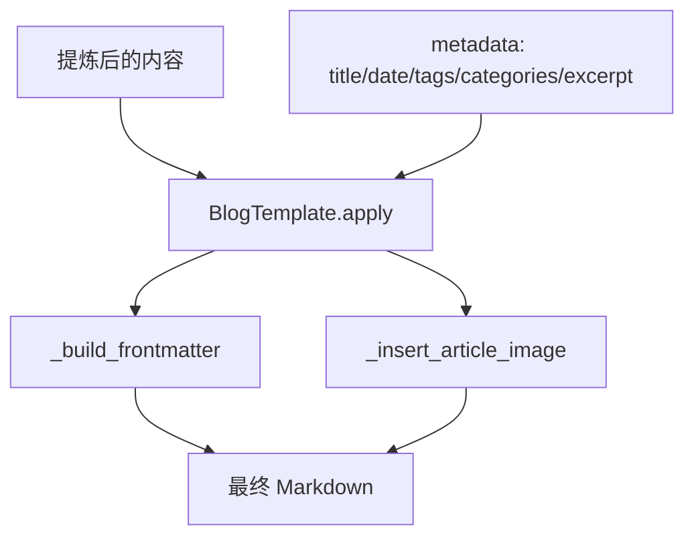

# 模板引擎

## 概述

Composer 使用模板将提炼后的内容格式化为最终输出。当前实现 BlogTemplate（Hexo 博客格式）。

## 模板架构



## BlogTemplate

生成 Hexo 兼容的 Markdown 文件：

```markdown
---
title: 每日回顾 2026-05-13
date: 2026-05-13
tags: [AI, 技术]
categories: [技术笔记]
excerpt: 今日要点...
cover_image: /images/backgrounds/xxx.jpg
---

> 今日要点...


正文内容...
```

## 组件

| 组件 | 路径 | 说明 |
|------|------|------|
| `BaseTemplate` | `composer/templates/base.py` | 模板基类，定义 `apply()` 接口 |
| `BlogTemplate` | `composer/templates/blog.py` | Hexo 博客模板 |

## Frontmatter 字段

| 字段 | 来源 | 说明 |
|------|------|------|
| `title` | ArticleMaterial.title | 文章标题 |
| `date` | 聚合日期键 | 发布日期 |
| `tags` | TextAssetGenerator / LLMDistiller | 标签列表 |
| `categories` | ArticleMaterial.categories | 分类列表 |
| `excerpt` | TextAssetGenerator / LLMDistiller | 摘要 |
| `cover_image` | ImageAssetFetcher（background） | 背景图路径 |

## 新增模板

继承 `BaseTemplate`：

```python
from linglong.composer.templates.base import BaseTemplate

class NewsletterTemplate(BaseTemplate):
    def apply(self, content: str, metadata: dict) -> str:
        title = metadata.get("title", "")
        return f"# {title}\n\n{content}\n"
```
