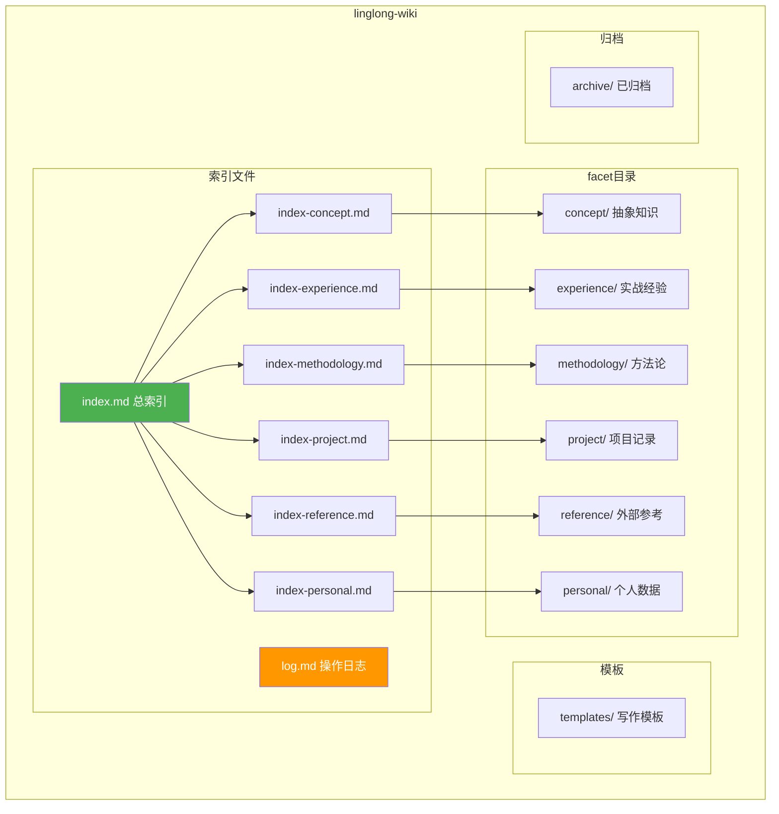

# 知识库目录结构设计


| 属性 | 值 |
|------|-----|
| 分类 | 存储层 |
| 状态 | ✅ 已实现 |
| 依赖 | [D-01 数据模型](01-data-model.md) |
| 关联实现 | `src/linglong/knowledge/store.py`, `src/linglong/knowledge/sync/openclaw.py` |
| 最后更新 | 2026-05-22 |

---

## 目录全景图



---

## 顶层布局

```
~/linglong/wiki/
├── index.md                    # 总索引（~500 tokens，LLM 入口）
├── index-concept.md            # concept 分类索引
├── index-experience.md         # experience 分类索引
├── index-methodology.md        # methodology 分类索引
├── index-project.md            # project 分类索引
├── index-reference.md          # reference 分类索引
├── index-personal.md           # personal 分类索引
├── log.md                      # 操作日志
│
├── templates/                  # 写作模板
│   ├── concept.md
│   ├── experience.md
│   ├── methodology.md
│   ├── project.md
│   ├── reference.md
│   └── personal.md
│
├── concept/                    # 抽象知识（含实体卡片、综合分析）
│   ├── openclaw-architecture/  # 分组：OpenClaw 架构相关
│   ├── knowledge-mgmt/         # 分组：知识管理
│   ├── agent-system/           # 分组：Agent 系统
│   ├── llm-pattern/            # 分组：LLM 模式
│   └── *.md                    # 未分组的 concept
│
├── experience/                 # 实战经验
│   ├── agent-system/           # 分组：Agent 系统经验
│   ├── blog-dev/               # 分组：博客开发
│   ├── platform-integration/   # 分组：平台集成
│   └── *.md                    # 未分组的 experience
│
├── methodology/                # 方法论
│   ├── template/               # 分组：模板方法
│   ├── agent-mastery/          # 分组：Agent 精通
│   ├── source-analysis/        # 分组：源码分析
│   ├── codex-design/           # 分组：Codex 设计
│   ├── agent-architecture/     # 分组：Agent 架构
│   └── *.md                    # 未分组的 methodology
│
├── project/                    # 项目记录、里程碑
│   ├── openclaw/               # 分组：OpenClaw 项目
│   ├── codex/                  # 分组：Codex 项目
│   ├── linglong/               # 分组：Linglong 项目
│   ├── agent-mastery/          # 分组：Agent Mastery 项目
│   └── *.md                    # 未分组的 project
│
├── reference/                  # 外部参考、资料
│   ├── openclaw/               # 分组：OpenClaw 相关参考
│   └── *.md                    # 未分组的 reference
│
├── personal/                   # 个人数据
│   └── *.md                    # 全部扁平存放
│
└── archive/                    # 已归档文件
    └── YYYY-MM/                # 按月归档
```

---

## Facet 目录结构

### concept/ — 抽象知识

```
concept/
├── openclaw-architecture/       # 分组：OpenClaw 架构知识
│   ├── openclaw-core-design.md
│   ├── openclaw-memory-system.md
│   └── ...
├── knowledge-mgmt/              # 分组：知识管理
│   ├── llm-wiki.md
│   ├── knowledge-compiler.md
│   └── ...
├── agent-system/                # 分组：Agent 系统
│   ├── multi-agent-sync.md
│   └── ...
├── llm-pattern/                 # 分组：LLM 模式
│   └── ...
├── openclaw.md                  # 产品实体卡片
├── claude-code.md               # Agent 实体卡片
├── codex.md                     # Agent 实体卡片
├── sqlite-vec.md                # 工具实体卡片
├── nomic-embed-text.md          # 模型实体卡片
├── blog-post-format.md          # 博客格式概念
├── truth-verification.md        # 验证概念
├── agent-architecture.md        # Agent 架构概念
├── embedding-兼容性风险.md       # 综合分析（原 synthesis）
├── agent-协作成本分析.md         # 综合分析（原 synthesis）
└── ...                          # 其他未分组 concept
```

**来源**：OpenClaw 的 `concepts/` + 原 `entity/` + 原 `synthesis/`

**说明**：
- 原 `entity/` 的专有名词卡片合并到 concept 根目录（每个文件是 3-10 行的实体卡片）
- 原 `synthesis/` 的跨源综合文章合并到 concept（每篇仍需 `sources` 字段引用来源）
- 分组子目录用于同一主题的知识聚合

**当前分布**（30 篇）：openclaw-architecture/15, root/9, knowledge-mgmt/3, agent-system/2, llm-pattern/1

### experience/ — 实战经验

```
experience/
├── agent-system/                # 分组：Agent 系统经验
│   ├── claude-code-efficiency.md
│   ├── vector-search-sqlite.md
│   └── ...
├── blog-dev/                    # 分组：博客开发
│   ├── module-migration.md
│   └── ...
├── platform-integration/        # 分组：平台集成
│   └── ...
├── best-practices/              # 最佳实践（保留 OpenClaw 子目录名）
│   ├── search.md
│   └── search-tools.md
├── pitfalls/                    # 踩坑记录（保留 OpenClaw 子目录名）
│   └── skill-trigger.md
└── ...                          # 其他未分组 experience
```

**来源**：OpenClaw 的 `experiences/`

**当前分布**（23 篇）：agent-system/16, blog-dev/6, platform-integration/1

### methodology/ — 方法论

```
methodology/
├── template/                    # 分组：模板方法
│   ├── context-restore-workflow.md
│   └── ...
├── agent-mastery/               # 分组：Agent 精通方法论
│   ├── agent-integration.md
│   └── ...
├── source-analysis/             # 分组：源码分析流程
│   ├── source-code-analysis-workflow.md
│   └── ...
├── codex-design/                # 分组：Codex 设计方法论
│   └── ...
├── agent-architecture/          # 分组：Agent 架构方法论
│   └── ...
├── problem-understanding.md     # 问题理解框架
├── problem-decomposition.md     # 问题分解
├── visualization-standards.md   # 可视化标准
├── long-task-execution-framework.md
└── ...                          # 其他未分组 methodology
```

**来源**：OpenClaw 的 `methodologies/`

**当前分布**（41 篇）：template/11, agent-mastery/9, source-analysis/7, codex-design/3, agent-architecture/1, root/10

### project/ — 项目记录

```
project/
├── openclaw/                    # 分组：OpenClaw 项目
│   ├── roadmap.md
│   ├── milestones.md
│   └── ...
├── codex/                       # 分组：Codex 项目
│   ├── roadmap.md
│   └── ...
├── linglong/                    # 分组：Linglong 项目
│   ├── architecture.md
│   └── ...
├── agent-mastery/               # 分组：Agent Mastery 项目
│   └── ...
└── ...                          # 其他未分组 project
```

**来源**：原 `source/projects/`，升级为顶级 facet

**说明**：
- 项目记录从原 `source/projects/` 提升，不再嵌套在 source 下
- 每个项目一个分组子目录，包含 roadmap、milestones、架构等
- 原 `source/` 的 projects/ 内容全部迁移至此

**当前分布**（38 篇）：openclaw/17, codex/10, linglong/3, agent-mastery/1, root/7

### reference/ — 外部参考

```
reference/
├── openclaw/                    # 分组：OpenClaw 相关参考
│   └── ...
├── llm-wiki-pattern.md          # 外部引用（保留 OpenClaw 子目录名）
├── design-agent-system.md       # 问题解决记录
└── ...                          # 其他未分组 reference
```

**来源**：原 `source/references/` + `source/problems/`

**说明**：
- 外部参考资料从原 `source/references/` 迁移
- 问题解决记录从原 `source/problems/` 迁移
- 数量较少，部分直接放在根目录

**当前分布**（1 篇）：openclaw/1

### personal/ — 个人数据

```
personal/
├── profile.md                   # 用户画像（原 user/profile.md）
├── communication-style.md       # 沟通风格（原 user/communication-style.md）
├── preferences.md               # 工作偏好（原 user/preferences.md）
├── growth-auto-log.md           # 成长日志（原 user/growth-auto-log.md）
├── emotion-memory.md            # 情感记忆（原 emotion/emotion-memory.md）
├── infra/                       # 基础设施（原 infra/）
│   └── passwords.md
└── diary/                       # 灵魂日记（原 soul/diary/）
    └── 2026-04-11.md
```

**来源**：OpenClaw 的 `user/` + `emotion/` + `soul/` + `infra/`

**当前分布**（9 篇）：全部在根目录

---

## OpenClaw 13 目录 → 6 Facet 映射

| OpenClaw 目录 | 文件数 | → Linglong facet | 路径变化 |
|---------------|--------|-----------------|----------|
| `concepts/` | 9 | `concept/` | 不变 |
| `concepts/skills/` | 4 | `concept/` | 合并到 concept 根 |
| `projects/` | 12 | `project/` | 提升为顶级 facet |
| `references/` | 4 | `reference/` | 提升为顶级 facet |
| `problems/` | 1 | `reference/` | 合并到 reference |
| `experiences/` | 14 | `experience/` | 不变 |
| `methodologies/` | 7 | `methodology/` | 不变 |
| `user/` | 4 | `personal/` | 目录名变了 |
| `emotion/` | 1 | `personal/` | 合并 |
| `soul/` | 1 | `personal/diary/` | 合并 |
| `infra/` | 1 | `personal/infra/` | 合并 |
| `dashboards/` | 2 | （不迁移） | - |
| `templates/` | 3 | （不迁移） | - |
| `todo/` | 3 | （不迁移） | - |

---

## Facet 分布统计

当前知识库共 142 篇，分布如下：

| Facet | 篇数 | 分组分布 |
|-------|------|----------|
| methodology | 41 | template/11, agent-mastery/9, source-analysis/7, codex-design/3, agent-architecture/1, root/10 |
| project | 38 | openclaw/17, codex/10, linglong/3, agent-mastery/1, root/7 |
| concept | 30 | openclaw-architecture/15, root/9, knowledge-mgmt/3, agent-system/2, llm-pattern/1 |
| experience | 23 | agent-system/16, blog-dev/6, platform-integration/1 |
| personal | 9 | root/9 |
| reference | 1 | openclaw/1 |

---

## 索引文件规范

### index.md — 总索引

```markdown
# 知识库索引

> 最后更新：2026-05-22

## 按分类

- [[index-concept|Concept]] — 抽象知识（N 篇）
- [[index-experience|Experience]] — 实战经验（N 篇）
- [[index-methodology|Methodology]] — 方法论（N 篇）
- [[index-project|Project]] — 项目记录（N 篇）
- [[index-reference|Reference]] — 外部参考（N 篇）
- [[index-personal|Personal]] — 个人数据（N 篇）

## 最近更新

| 日期 | 分类 | 文章 | 说明 |
|------|------|------|------|
| 2026-05-22 | concept | xxx | xxx |
```

### index-*.md — 分类索引

```markdown
# Concept 索引

## openclaw-architecture/
- [[concept/openclaw-architecture/openclaw-core-design|OpenClaw Core Design]] — 核心架构

## root/
- [[concept/openclaw|OpenClaw]] — 知识管理产品
- [[concept/claude-code|Claude Code]] — Anthropic CLI Agent
```

```markdown
# Project 索引

## openclaw/
- [[project/openclaw/roadmap|OpenClaw Roadmap]] — 路线图
- [[project/openclaw/milestones|Milestones]] — 里程碑

## codex/
- [[project/codex/roadmap|Codex Roadmap]] — 路线图
```

---

## 归档目录

```
archive/
├── 2026-04/                    # 按月归档
│   ├── old-article-1.md
│   └── old-article-2.md
└── 2026-05/
    └── ...
```

归档条件：
- Entity 状态为 ARCHIVED
- 超过 N 天未被引用（可配置）

---

## 命名规范

### 文件名

| Facet | 命名规则 | 示例 |
|-------|----------|------|
| concept | 小写连字符 | `llm-wiki.md`、`openclaw.md`、`agent-architecture.md` |
| experience | 描述性名称 | `vector-search-sqlite.md`、`claude-code-efficiency.md` |
| methodology | 描述性名称 | `problem-understanding.md`、`problem-decomposition.md` |
| project | 项目名/主题名 | `roadmap.md`、`architecture.md` |
| reference | 描述性名称 | `llm-wiki-pattern.md`、`design-agent-system.md` |
| personal | 描述性名称 | `profile.md`、`preferences.md` |

### 目录名（分组子目录）

- 全小写
- 连字符分隔（`best-practices`、`openclaw-architecture`）
- 保留 OpenClaw 原有目录名（`projects/`、`references/`）
- 分组名反映内容主题，如 `openclaw/`、`codex/`、`template/`

---

## 设计决策记录

| 编号 | 决策 | 选择 | 原因 | 替代方案 |
|------|------|------|------|----------|
| D-02a | 目录层级 | facet/group/ 子目录 | 保留 OpenClaw 原有目录结构 + 分组聚合 | 全扁平 / 无分组 |
| D-02b | 文件命名 | {id[:8]}-{slug}.md | 防止标题碰撞，保留语义 | 纯 slug / 纯 ID |
| D-02c | memory 分类 | diary/ + task-record/ 子目录 | 日记与任务记录分离 | 全部扁平 personal/ |
| D-02d | 索引文件 | index.md + index-{facet}.md | 两步查询降低 token 成本 | 无索引 / 单文件索引 |
| D-02e | facet 精简 | 7→6 facet | 合并 entity/synthesis 到 concept，拆分 source 为 project+reference | 保留 7 facet / 全扁平 |

## 版本变动历史

| 版本 | 日期 | 变动摘要 | 影响范围 |
|------|------|----------|----------|
| v1.0 | 2026-05-14 | 初始设计 | 全文 |
| v1.1 | 2026-05-18 | memory 目录分类（diary/task-record），目录级 facet 覆盖，文件名加 ID 前缀 | 全文 |
| v1.2 | 2026-05-20 | 新增 templates/ 模板目录，8 个 facet 写作模板 | 目录结构 |
| v2.0 | 2026-05-22 | Facet 精简 7→6：合并 entity/synthesis 到 concept，拆分 source 为 project+reference，新增分组子目录 | 全文 |

## 关联文档

| 文档 | 关系 |
|------|------|
| [D-01 数据模型](01-data-model.md) | facet 定义驱动目录分类 |
| [D-05 巡检设计](05-lint.md) | 依赖目录结构做一致性检查 |
