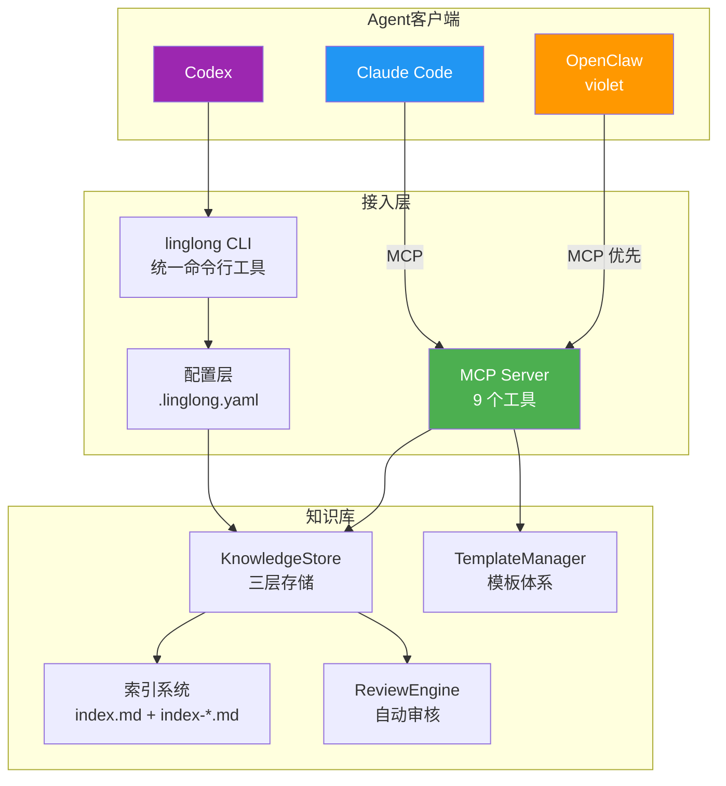
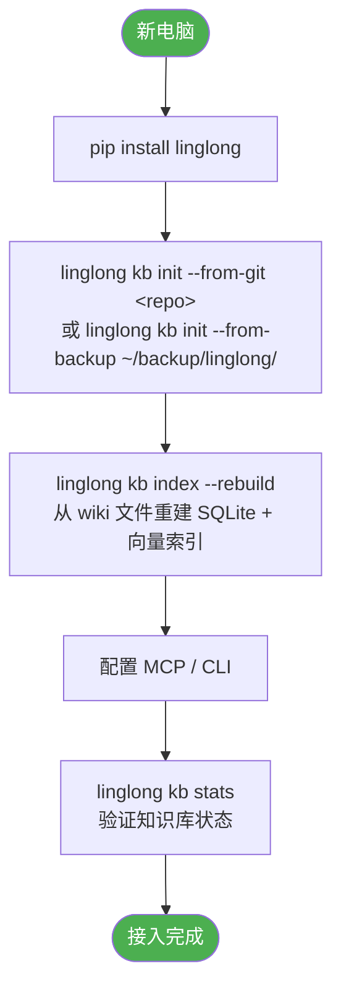

# Agent 接入设计

| 属性 | 值 |
|------|-----|
| 分类 | 接入层 |
| 状态 | ✅ 已实现 |
| 依赖 | [D-03 写入设计](03-write-path.md), [D-04 搜索设计](04-search.md) |
| 关联实现 | `src/linglong/cli.py`, `src/linglong/knowledge/sync/*.py`, `src/linglong/mcp/` |
| 最后更新 | 2026-05-21 |

**未实现项**: Agent hooks 自动同步（v2.0）

**详细接入方案**: 各 Agent 的现状、接入方案、已知问题见 [agents/](../agents/) 目录。

---

## Agent 状态总览

| Agent | 接入方式 | 状态 | 详细方案 |
|-------|----------|------|----------|
| OpenClaw (violet) | MCP | ✅ 已接入 | [agents/openclaw.md](../agents/openclaw.md) |
| Claude Code | MCP | ✅ 已接入 | [agents/claude-code.md](../agents/claude-code.md) |
| Codex CLI | CLI | ⚪ 预留 | [agents/codex.md](../agents/codex.md) |

---

## Agent 接入架构



---

## MCP 工具清单

所有 Agent 共享 9 个 MCP 工具：

| 工具 | 用途 |
|------|------|
| `search_wiki` | FTS5 全文搜索 |
| `search_similar` | 向量语义搜索 |
| `search_and_read` | 搜索+读取全文 |
| `read_entity` | 读取完整内容 |
| `write_entity` | 写入新知识 |
| `update_entity` | 更新已有条目 |
| `list_entities` | 浏览最近条目 |
| `get_template` | 获取写作模板 |
| `list_templates` | 列出所有模板 |

---

## CLI 命令总览

| 命令 | 用途 | 示例 |
|------|------|------|
| `search` | 搜索知识 | `linglong kb search "支付" --facet concept` |
| `read` | 读取详情 | `linglong kb read <id>` |
| `write` | 写入知识 | `linglong kb write --facet concept --title "..." --content "..."` |
| `update` | 更新知识 | `linglong kb update <id> --append "补充内容"` |
| `review` | 审核管理 | `linglong kb review --list-pending` |
| `lint` | 健康巡检 | `linglong kb lint` |
| `index` | 索引管理 | `linglong kb index --rebuild` |
| `migrate` | 迁移工具 | `linglong kb migrate --from ~/.openclaw/workspace/memory/wiki/` |
| `stats` | 统计信息 | `linglong kb stats` |
| `template` | 模板管理 | `linglong kb template list` |
| `archive` | 归档管理 | `linglong kb archive <id>` |

---

## 默认值 + CLI 覆盖模式

优先级：**CLI 参数 > 配置文件 > 硬编码默认值**

| 参数 | 默认值 | 配置文件 key | CLI 覆盖 |
|------|--------|-------------|----------|
| 写入模式 | `confirm` | `knowledge.write_mode` | `--yes` |
| 查询模式 | `on_demand` | `knowledge.search_mode` | `--deep` |
| 索引更新 | `auto` | `knowledge.auto_index` | `--no-index` |

```yaml
# .linglong.yaml
knowledge:
  wiki_path: ~/linglong/wiki
  db_path: ~/linglong/db/knowledge.db
  write_mode: confirm
  search_mode: on_demand
  auto_index: true
  vector_enabled: true
  embedding_url: http://localhost:7997
  embedding_model: nomic-embed-text-v1.5
```

---

## 触发时机规则

### 读取时机

| 触发点 | 时机 | 做什么 |
|--------|------|--------|
| 用户提问 | Agent 收到问题 | `search_wiki` / `search_and_read` |
| 遇到陌生话题 | Agent 不确定 | `search_wiki --facet concept` |
| 引用历史 | 提到过去决策 | `read_entity` |

### 写入时机

| 触发点 | 时机 | 写入什么 | Facet |
|--------|------|----------|-------|
| 用户说"记住" | 显式指令 | 用户指定内容 | 根据内容判断 |
| 解决 bug | 问题解决 | 问题 + 原因 + 方案 | `experience` |
| 学到新知识 | 对话中 | 概念 + 例子 | `concept` |
| 完成任务 | 任务完成 | 任务描述 + 结果 | `reference` |
| 发现新实体 | 提到新名词 | 实体卡片 | `concept` |

### 写入判断标准

```
✅ 值得写入：将来可能再次需要、跨项目通用、踩坑经验、用户要求
❌ 不值得写：一次性信息、代码本身、临时状态、已存在文档中
```

---

## 新电脑一键接入流程



### 关键设计：SQLite 可重建

```
~/linglong/wiki/          ← 真实数据源（Markdown 文件）
~/linglong/db/knowledge.db ← 索引，可从 wiki 文件重建
```

---

## 迁移工具

```bash
# 预览
linglong kb migrate --from ~/.openclaw/workspace/memory/wiki/ --dry-run

# 执行
linglong kb migrate --from ~/.openclaw/workspace/memory/wiki/

# 跳过索引更新（批量场景）
linglong kb migrate --from ~/.openclaw/workspace/memory/wiki/ --no-index
```

---

## 设计决策记录

| 编号 | 决策 | 选择 | 原因 | 替代方案 |
|------|------|------|------|----------|
| D-06a | 接入方式 | MCP 优先 + CLI 兜底 | MCP 原生协议，CLI 兜底 | 仅 CLI |
| D-06b | 配置优先级 | CLI > .linglong.yaml > 默认值 | 灵活覆盖 | 仅配置文件 |
| D-06c | 迁移策略 | 渐进式 | 降低迁移风险 | 一次性全量 |
| D-06d | Agent 文档 | 按 Agent 拆分到 agents/ | 各 Agent 差异大，独立演进 | 单文件 |

## 版本变动历史

| 版本 | 日期 | 变动摘要 | 影响范围 |
|------|------|----------|----------|
| v1.0 | 2026-05-14 | 初始设计 | 全文 |
| v1.1 | 2026-05-20 | 新增 MCP Server 接入方式，9 个 MCP 工具，模板体系 | Agent 接入、工具清单 |
| v1.2 | 2026-05-21 | 同步文档：MCP Server + mcp/ 模块已上线，关联实现补齐 | 元数据、关联实现 |
| v2.0 | 2026-05-21 | 重构为总入口 + agents/ 子目录，Agent 接入方案拆分 | 全文 |

## 关联文档

| 文档 | 关系 |
|------|------|
| [Agent 接入总览](../agents/00-overview.md) | 各 Agent 接入方案的统一入口 |
| [三方接入指南](../agents/01-onboarding.md) | 快速/深度/移除接入方案 |
| [D-03 写入设计](03-write-path.md) | 写入流程、确认模式 |
| [D-04 搜索设计](04-search.md) | 搜索命令、模式选择 |
| [D-05 巡检设计](05-lint.md) | lint 命令、报告格式 |
| [D-07 更新设计](07-update-path.md) | update 命令 |
| [D-08 初始化与并发](08-init-and-concurrency.md) | init 命令详解 |
