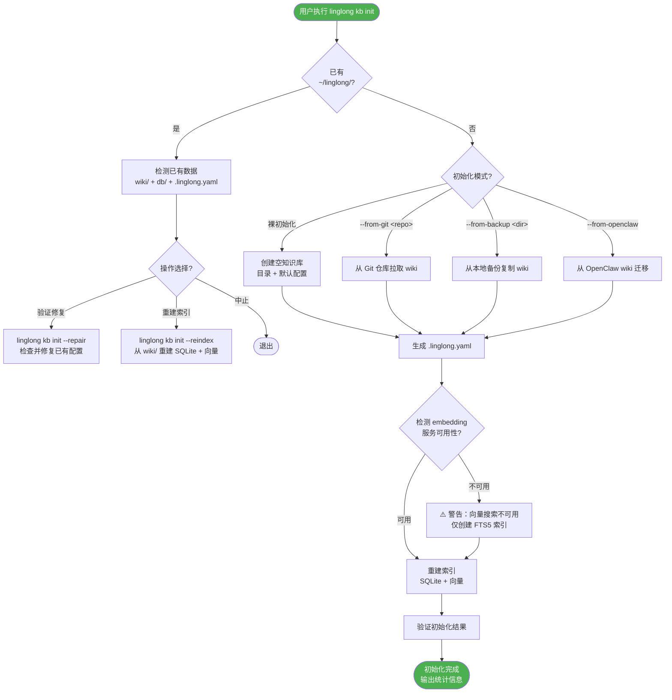
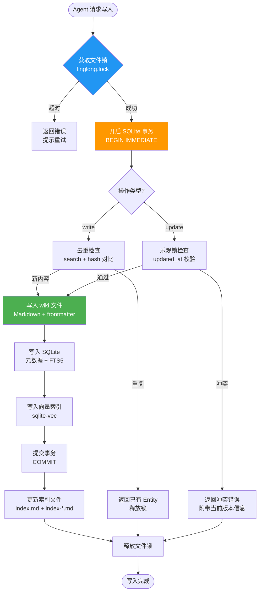

# 初始化与并发协调设计

| 属性 | 值 |
|------|-----|
| 分类 | 运维层 |
| 状态 | ✅ 已实现 |
| 依赖 | [D-03 写入设计](03-write-path.md), [D-07 更新设计](07-update-path.md) |
| 关联实现 | `src/linglong/knowledge/init.py`, `src/linglong/knowledge/store.py` |
| 最后更新 | 2026-05-18 |

---

## Part A：linglong kb init 初始化

### 问题背景

06-agent-integration 的"新电脑一键接入"流程提到了 `linglong kb init`，但没有详细设计。这是用户接触产品的**第一个命令**，必须可靠且清晰。

---

### 初始化流程



---

### 四种初始化模式

#### 模式 1：裸初始化

```bash
linglong kb init
```

创建空知识库，适合从零开始。

| 步骤 | 操作 | 产物 |
|------|------|------|
| 1. 创建目录 | `~/linglong/wiki/` 6 个 facet 子目录 + `archive/` | 目录结构 |
| 2. 生成配置 | 交互式问答 → `.linglong.yaml` | 配置文件 |
| 3. 创建索引文件 | `index.md` + `index-*.md` + `log.md` | 索引骨架 |
| 4. 初始化数据库 | `~/linglong/db/knowledge.db`（空表结构） | SQLite |
| 5. 验证 | 检查所有组件可访问 | 通过/失败 |

生成的目录结构：

```
~/linglong/
├── .linglong.yaml              # 配置文件
├── wiki/
│   ├── index.md                # 总索引（空骨架）
│   ├── index-concept.md        # Concept 索引（空）
│   ├── index-experience.md     # Experience 索引（空）
│   ├── index-methodology.md    # Methodology 索引（空）
│   ├── index-project.md        # Project 索引（空）
│   ├── index-reference.md      # Reference 索引（空）
│   ├── index-personal.md       # Personal 索引（空）
│   ├── log.md                  # 操作日志（空）
│   ├── concept/
│   ├── experience/
│   ├── methodology/
│   ├── project/
│   ├── reference/
│   ├── personal/
│   └── archive/
└── db/
    └── knowledge.db            # SQLite（空表结构）
```

#### 模式 2：从 Git 拉取

```bash
linglong kb init --from-git https://github.com/user/my-wiki.git
```

适用场景：已有 wiki 文件托管在 Git 仓库。

| 步骤 | 操作 |
|------|------|
| 1. 克隆仓库 | `git clone <repo> ~/linglong/wiki/` |
| 2. 检测配置 | 如果仓库中有 `.linglong.yaml`，直接使用；否则交互式生成 |
| 3. 重建索引 | 从 wiki 文件重建 SQLite + 向量索引 |

Git 仓库预期结构：

```
my-wiki.git/
├── .linglong.yaml    # 可选，配置文件
├── index.md
├── index-*.md
├── concept/
├── experience/
├── methodology/
├── project/
├── reference/
└── ...
```

#### 模式 3：从备份恢复

```bash
linglong kb init --from-backup ~/backup/linglong-2026-05-10/
```

适用场景：从 Time Machine / 手动备份恢复。

| 步骤 | 操作 |
|------|------|
| 1. 复制 wiki 目录 | `cp -r <backup>/wiki/ ~/linglong/wiki/` |
| 2. 复制配置 | `cp <backup>/.linglong.yaml ~/linglong/` |
| 3. 重建索引 | 从 wiki 文件重建 SQLite + 向量索引 |
| 4. 跳过 db/ | 不复制旧 SQLite，从 wiki 文件重建更安全 |

#### 模式 4：从 OpenClaw 迁移

```bash
linglong kb init --from-openclaw
# 自动检测 ~/.openclaw/workspace/memory/wiki/
```

等价于 `linglong kb migrate --from ~/.openclaw/workspace/memory/wiki/`。迁移逻辑见 06-agent-integration.md。

---

### 交互式配置向导

首次初始化且无配置文件时，进入交互式配置：

```bash
$ linglong kb init

🔧 Linglong 知识库初始化

? 知识库存储路径 [~/linglong]:
? embedding 服务地址 [http://localhost:7997]:
? embedding 模型 [nomic-embed-text-v1.5]:
? 默认写入模式 (confirm/auto) [confirm]:
? 默认搜索模式 (on_demand/deep) [on_demand]:
? 自动索引更新 (true/false) [true]:

✅ 配置已生成：~/linglong/.linglong.yaml
✅ 目录已创建：~/linglong/wiki/ (6 facet + archive)
✅ 数据库已初始化：~/linglong/db/knowledge.db
✅ embedding 服务连通性：可用
✅ 索引已构建：0 条知识

初始化完成。开始使用：
  linglong kb write --facet concept --title "第一条知识" --content "Hello Linglong"
```

### 默认配置模板

```yaml
# .linglong.yaml — Linglong 知识库配置
# 生成日期：2026-05-14

knowledge:
  wiki_path: ~/linglong/wiki
  db_path: ~/linglong/db/knowledge.db

  # 写入
  write_mode: confirm        # confirm | auto
  max_versions: 10

  # 搜索
  search_mode: on_demand     # on_demand | deep
  search_default_limit: 10

  # 索引
  auto_index: true

  # 向量
  vector_enabled: true
  embedding_url: http://localhost:7997
  embedding_model: nomic-embed-text-v1.5

  # 巡检
  lint_schedule: ""          # 空字符串 = 不自动巡检

  # 并发
  lock_timeout: 5            # 文件锁超时（秒）
  db_mode: wal               # SQLite journal 模式
```

---

### 初始化验证

```bash
$ linglong kb init --verify

✅ 目录结构：6 facet + archive
✅ 配置文件：~/linglong/.linglong.yaml
✅ SQLite 数据库：~/linglong/db/knowledge.db (WAL mode)
✅ embedding 服务：可达 (http://localhost:7997)
✅ 索引文件：index.md + 6 index-*.md
✅ 操作日志：log.md
```

---

## Part B：多 Agent 并发写入协调

### 问题背景

Linglong 的核心价值是多 Agent 共享知识库。多个 Agent 可能同时写入，需要协调机制保证数据一致性。

### 并发场景

| 场景 | 例子 | 风险 |
|------|------|------|
| 同时创建同主题 | Agent A 和 B 同时 `write` "微服务架构" | 重复条目 |
| 同时更新同一 Entity | Agent A 和 B 同时 `update` 同一条目 | 内容丢失 |
| 写入与搜索并发 | Agent A 写入时 Agent B 搜索 | 读到不完整数据 |
| 写入与 lint 并发 | Agent A 写入时 lint 执行修复 | 操作冲突 |

---

### 三层锁策略



---

### 层级 1：文件锁（进程间互斥）

使用 `fcntl.flock` 实现跨进程文件锁：

```python
import fcntl

LOCK_FILE = "~/linglong/.linglong.lock"

class LinglongLock:
    def __init__(self, timeout=5):
        self.timeout = timeout

    def __enter__(self):
        self.fd = open(os.path.expanduser(LOCK_FILE), "w")
        fcntl.flock(self.fd, fcntl.LOCK_EX)  # 阻塞等待
        return self

    def __exit__(self, *args):
        fcntl.flock(self.fd, fcntl.LOCK_UN)
        self.fd.close()
```

**设计决策**：

| 决策 | 选择 | 理由 |
|------|------|------|
| 锁粒度 | 全局锁（非单 Entity 锁） | 实现简单，避免死锁。多 Agent 并发写入频率低，全局锁开销可接受 |
| 锁范围 | 写入 + 更新 + 归档 | 读操作不加锁（SQLite WAL 允许并发读） |
| 超时策略 | 阻塞等待 + 可配置超时 | 默认 5 秒，超时返回错误 |

### 层级 2：SQLite 事务（数据库一致性）

```python
# SQLite 配置
conn.execute("PRAGMA journal_mode=WAL")     # WAL 模式，允许并发读
conn.execute("PRAGMA synchronous=NORMAL")    # 平衡性能和安全
conn.execute("PRAGMA busy_timeout=5000")     # 5 秒忙等待

# 写入事务
with conn:  # 自动 BEGIN + COMMIT
    conn.execute("INSERT INTO entities ...")
    conn.execute("INSERT INTO entity_fts ...")
    conn.execute("INSERT INTO entity_vec ...")
```

| 配置 | 值 | 说明 |
|------|-----|------|
| `journal_mode` | `WAL` | 写前日志，允许读写并发 |
| `synchronous` | `NORMAL` | 多数场景安全，性能优于 FULL |
| `busy_timeout` | `5000` | SQLite 内部锁等待 5 秒 |
| `isolation_level` | 默认（DEFERRED） | 读时不加锁，写时升级 |

### 层级 3：乐观锁（Entity 级版本控制）

针对 `update` 操作，使用 `updated_at` 作为版本戳：

```python
def update_entity(entity_id, new_content, expected_updated_at):
    current = store.get(entity_id)
    if current.updated_at != expected_updated_at:
        # 版本冲突
        return ConflictResult(
            expected=expected_updated_at,
            actual=current.updated_at,
            current_content=current.content
        )
    # 无冲突，执行更新
    store.update(entity_id, new_content)
```

Agent 工作流：

```
1. Agent A: linglong kb read <id>        → 获得 content + updated_at
2. Agent A: 基于内容生成更新
3. Agent A: linglong kb update <id> --content "..." --expected-at "2026-05-14T10:30:00"
4. 如果冲突 → 返回当前版本，Agent 决定合并或放弃
```

---

### 写入-索引一致性


**一致性保证**：

| 组件 | 崩溃恢复 | 策略 |
|------|----------|------|
| wiki 文件 | 写了一半 | 检测 frontmatter 完整性，不完整则视为写入失败 |
| SQLite | 事务回滚 | WAL 模式自动回滚未提交事务 |
| 向量索引 | 可能不一致 | `linglong kb init --reindex` 重建 |
| 索引文件 | 可能过时 | lint 检测不一致并修复 |

**降级处理**：如果索引更新失败（如进程中断），lint 会检测到"文件存在但未注册"的黄灯项，下次 `linglong kb lint --fix` 自动修复。

---

### CLI 命令

```bash
# 初始化（四种模式）
linglong kb init                              # 交互式裸初始化
linglong kb init --from-git <repo>            # 从 Git 拉取
linglong kb init --from-backup <dir>          # 从备份恢复
linglong kb init --from-openclaw              # 从 OpenClaw 迁移

# 验证/修复
linglong kb init --verify                     # 验证已有知识库状态
linglong kb init --reindex                    # 从 wiki 文件重建 SQLite + 向量
linglong kb init --repair                     # 修复损坏的配置/索引

# 并发相关配置
# .linglong.yaml
knowledge:
  lock_timeout: 5           # 文件锁超时（秒）
  db_mode: wal              # SQLite journal 模式
```

---

## 设计决策记录

| 编号 | 决策 | 选择 | 原因 | 替代方案 |
|------|------|------|------|----------|
| D-08a | 默认存储路径 | ~/linglong/ | 跨项目共享，防止覆盖项目配置 | 项目本地 ./linglong/ |
| D-08b | 锁粒度 | 全局文件锁 | 简单可靠，避免死锁 | 单 Entity 锁 |
| D-08c | SQLite 模式 | WAL | 允许并发读写 | DELETE 模式 |
| D-08d | DB 重建策略 | wiki 文件 → 重建 SQLite | wiki 是真相源，DB 是衍生索引 | DB 为主 |

## 版本变动历史

| 版本 | 日期 | 变动摘要 | 影响范围 |
|------|------|----------|----------|
| v1.0 | 2026-05-14 | 初始设计 | 全文 |
| v1.1 | 2026-05-18 | 默认路径改为 ~/linglong/，配置模板同步更新 | Part A 初始化 |

## 关联文档

| 文档 | 关系 |
|------|------|
| [D-06 Agent 接入](06-agent-integration.md) | 新电脑接入流程 |
| [D-03 写入设计](03-write-path.md) | 创建流程 + 并发写入 |
| [D-07 更新设计](07-update-path.md) | 更新流程 + 乐观锁 |
| [D-05 巡检设计](05-lint.md) | 索引不一致的检测和修复 |
