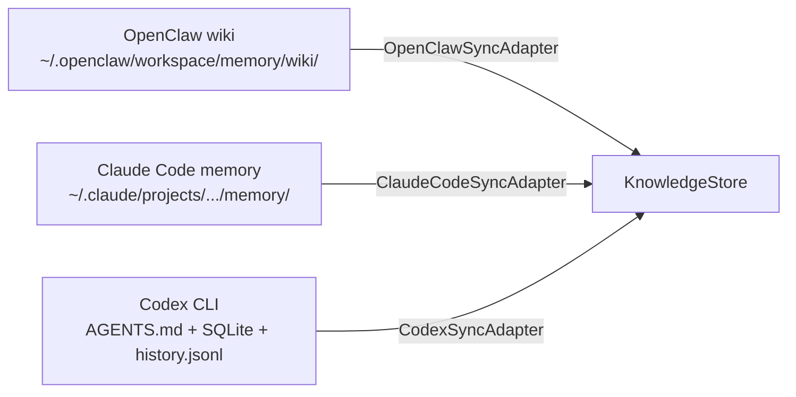

# 跨 Agent 同步协议

| 属性 | 值 |
|------|-----|
| 分类 | 接入层 |
| 状态 | ✅ 已实现 |
| 依赖 | [D-01 数据模型](01-data-model.md), [D-06 Agent 接入](06-agent-integration.md) |
| 关联实现 | `src/linglong/knowledge/sync/*.py` |
| 最后更新 | 2026-05-18 |

---

## 概述

Linglong 通过 SyncAdapter 将各 Agent 的知识库统一同步到 KnowledgeStore。每个 Agent 写入时带命名空间前缀（`openclaw:`、`claude:`、`codex:`）。

## 同步架构



## 内置适配器

### OpenClawSyncAdapter

同步 OpenClaw wiki 目录中的 Markdown 文件。

- 读取 `~/.openclaw/workspace/memory/wiki/` 下的 `.md` 文件
- 解析 YAML frontmatter 提取元数据
- 转换为 Entity 对象，`created_by="openclaw:{agent_name}"`
- 默认 confidence: 0.95

### ClaudeCodeSyncAdapter

同步 Claude Code 的 memory 目录。

- 读取 `~/.claude/projects/{project}/memory/` 下的 `.md` 文件
- 解析 frontmatter（name, description, type）
- 转换为 Entity 对象，`created_by="claude"`

### CodexSyncAdapter

同步 Codex CLI 的数据目录。

- 读取 `AGENTS.md`（agent 定义）
- 读取 SQLite 数据库（任务历史）
- 读取 `history.jsonl`（对话记录）
- 转换为 Entity 对象，`created_by="codex"`

## 使用方式

```bash
# CLI
linglong kb sync openclaw
linglong kb sync claude
linglong kb sync codex

# 指定路径
linglong kb sync openclaw --path ~/.openclaw/workspace/memory/wiki
```

```python
# Python
from linglong.knowledge.sync.openclaw import OpenClawSyncAdapter

adapter = OpenClawSyncAdapter(wiki_path="/path/to/wiki")
count = adapter.sync_to_linglong()
print(f"同步 {count} 条实体")
```

## 配置

```yaml
# .knowledge.yml
knowledge:
  sync_confidence: 0.95
  openclaw_wiki_path: ~/.openclaw/workspace/memory/wiki
  claude_memory_path: ~/.claude/projects/.../memory
  codex_path: ~/.codex/
```

## 新增适配器

继承 `BaseSyncAdapter` 实现 `sync_to_linglong()` 方法：

```python
from linglong.knowledge.sync.base import BaseSyncAdapter

class MyAgentSyncAdapter(BaseSyncAdapter):
    def sync_to_linglong(self) -> int:
        # 读取外部数据源
        # 转换为 Entity 对象
        # 调用 store.create()
        return count
```

---

## 设计决策记录

| 编号 | 决策 | 选择 | 原因 | 替代方案 |
|------|------|------|------|----------|
| D-10a | 同步方向 | Pull（Linglong 拉取）+ MCP 直写 | Agent 无需适配，MCP 支持主动写入 | Push（Agent 推送） |
| D-10b | 模式检测 | 仅 wiki 目录同步 | memory 模式已移除（短期记忆不属于知识库） | wiki + memory 双模式 |
| D-10c | 子目录分类 | metadata._subdir 透传到 store | 灵活扩展，不影响 store 接口 | 硬编码子目录规则 |

## 版本变动历史

| 版本 | 日期 | 变动摘要 | 影响范围 |
|------|------|----------|----------|
| v1.0 | 2026-05-14 | 初始设计 | 全文 |
| v1.1 | 2026-05-18 | 新增 memory 模式（diary/task-record），目录级 facet 覆盖 | OpenClawSyncAdapter |
| v1.2 | 2026-05-21 | 移除 memory 模式（短期记忆不属于知识库边界），OpenClaw 改为 MCP 直写 | OpenClawSyncAdapter、设计决策 |

## 关联文档

| 文档 | 关系 |
|------|------|
| [D-01 数据模型](01-data-model.md) | Entity 模型、Facet 分类 |
| [D-02 目录结构](02-directory-structure.md) | 子目录分类规范 |
| [D-06 Agent 接入](06-agent-integration.md) | CLI 命令、触发时机 |
