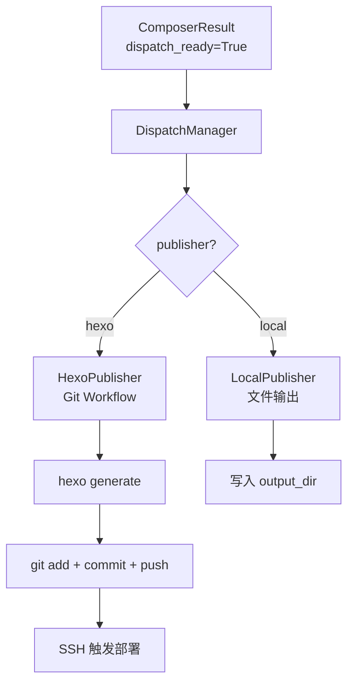

# Dispatch — 多平台分发模块

## 职责

- **内容路由**：根据内容类型自动分发到不同平台
- **发布队列**：待发布 / 发布中 / 已发布 / 失败（可重试）
- **反馈收集**：阅读量、点赞、评论回流到 knowledge

## 发布流程



## 核心组件

| 组件 | 路径 | 说明 |
|------|------|------|
| `DispatchManager` | `dispatch/manager.py` | 分发编排器 |
| `BasePublisher` | `dispatch/publishers/base.py` | 发布器基类 |
| `HexoPublisher` | `dispatch/publishers/hexo.py` | Hexo 博客发布（Git Workflow） |
| `LocalPublisher` | `dispatch/publishers/local.py` | 本地文件输出 |

## HexoPublisher 工作流

1. 将文章写入 `hexo_path/source/_posts/`
2. `hexo generate` 生成静态文件
3. `git add` → `git commit` → `git push`
4. 远程服务器 webhook 自动拉取部署

## 使用方式

```bash
# CLI
linglong publish <draft_id>    # 发布指定草稿

# 自动发布（在 .linglong.yaml 中开启）
composer:
  auto_publish: true
  default_publisher: hexo
```

```python
# Python
from linglong.dispatch.manager import DispatchManager

dispatch = DispatchManager()
result = dispatch.publish(article_info, publisher_name="hexo")
```

## 配置

```yaml
# .linglong.yaml
dispatch:
  enabled: true
  default_publisher: hexo
  publishers:
    - name: hexo
      type: hexo
      enabled: true
      config:
        hexo_path: ~/blog
        use_git_workflow: true
        site_url: https://www.linglong.wiki
    - name: local
      type: local
      enabled: false
      config:
        output_dir: ~/Downloads
```

## 相关文档

- [博客写作风格指南](blog-style.md)
