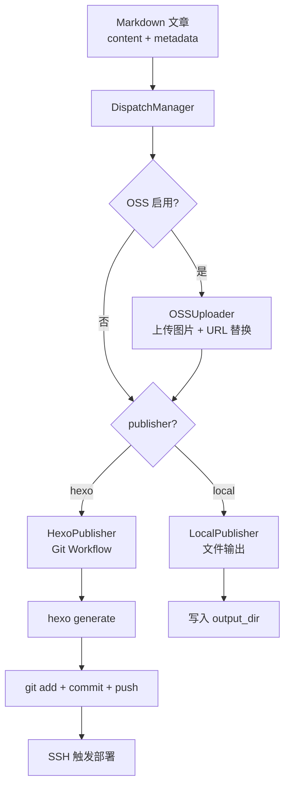

# Dispatch — 多平台分发模块

## 职责

- **内容路由**：将 Markdown 文章分发到配置的发布平台（Hexo / 本地文件）
- **OSS 图片 CDN**：发布前上传本地图片到阿里云 OSS，替换为 CDN URL（可选）
- **发布器注册**：从 `.linglong.yaml` 读取 publishers 配置，按需初始化

## 发布流程



## 核心组件

| 组件 | 路径 | 说明 |
|------|------|------|
| `DispatchManager` | `dispatch/manager.py` | 分发编排器，含 OSS 上传集成 |
| `BasePublisher` | `dispatch/publishers/base.py` | 发布器基类 |
| `HexoPublisher` | `dispatch/publishers/hexo.py` | Hexo 博客发布（Git Workflow） |
| `LocalPublisher` | `dispatch/publishers/local.py` | 本地文件输出 |
| `OSSUploader` | `dispatch/publishers/oss.py` | 阿里云 OSS 图片上传 + CDN URL 替换 |

## OSS 图片 CDN

发布前自动将文章中的本地图片路径上传到 OSS 并替换为 CDN URL。

### 工作流程

1. 遍历 metadata 中的图片路径（background、article_image 等）
2. 支持 dict 多尺寸变体和 str 单路径两种格式
3. 上传每个文件到 OSS bucket
4. 替换 content 和 metadata 中的本地路径为 CDN URL
5. 相同路径自动去重，只上传一次

### 依赖

```bash
pip install oss2
```

或安装可选依赖组：

```bash
pip install -e ".[oss]"
```

### 配置

```yaml
# .linglong.yaml
dispatch:
  oss:
    enabled: true
    bucket_name: linglong-blog
    endpoint: oss-cn-zhangjiakou.aliyuncs.com
    cdn_domain: linglong-blog.oss-cn-zhangjiakou.aliyuncs.com
    access_key_id: ""            # 建议用环境变量 LL_OSS_ACCESS_KEY_ID
    access_key_secret: ""        # 建议用环境变量 LL_OSS_ACCESS_KEY_SECRET
    prefix: images/              # OSS 对象前缀
```

密钥推荐通过环境变量注入：

```bash
export LL_OSS_ACCESS_KEY_ID=xxx
export LL_OSS_ACCESS_KEY_SECRET=xxx
```

### 阿里云 OSS Bucket 配置

1. 创建 Bucket（如 `linglong-blog`）
2. **权限控制 → 阻止公共访问** → 关闭所有开关
3. **权限控制 → 读写权限** → Bucket ACL 设为「公共读」

## HexoPublisher 工作流

1. 将文章写入 `hexo_path/source/_posts/`
2. `hexo generate` 生成静态文件
3. `git add` → `git commit` → `git push`
4. 远程服务器 webhook 自动拉取部署

## 使用方式

```bash
# CLI
linglong publish <file>    # 发布指定 Markdown 文件
```

```python
# Python
from linglong.dispatch.manager import DispatchManager

dispatch = DispatchManager()
result = dispatch.publish(
    {"content": "...", "metadata": {"title": "...", "date": "2026-05-27"}},
    publisher_name="hexo",
)
```

## 配置

```yaml
# .linglong.yaml
dispatch:
  enabled: true
  default_publisher: hexo
  publishers:
    - name: hexo
      type: hexo
      enabled: true
      config:
        hexo_path: ~/blog
        use_git_workflow: true
        site_url: https://www.linglong.wiki
    - name: local
      type: local
      enabled: false
      config:
        output_dir: ~/Downloads
```

## 相关文档

- [博客写作风格指南](blog-style.md)
- [Reviewer 模块](../api.md)
