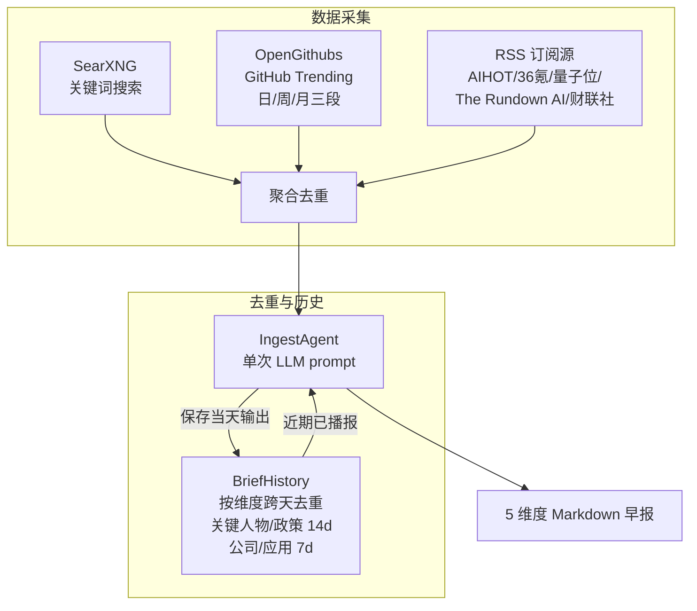

# Ingest — 信息采集助手

## 定位

**ingest 是用户的信息采集助手，不是知识库的数据入口。**

采集结果交给用户阅读和思考，有价值的内容在人与 Agent 的讨论中沉淀进知识库。未经思考的原始数据直接入库只是堆积，没有分量。

```
数据源 → ingest（采集+验证）→ 定制化信息 → 用户阅读思考 → 讨论 → 沉淀 → 知识库
                                              ↑
                                        ingest 到这里结束
```

## 信息维度

ingest 早报覆盖 AI 领域 5 个维度：

| 维度 | 典型内容 | 数据源 |
|------|---------|--------|
| 关键人物 | 观点/言论/人事变动 | SearXNG + RSS |
| 公司动态 | 产品发布、融资、股价 | SearXNG + RSS |
| 政策动态 | AI 监管、产业政策 | SearXNG + RSS |
| 开源趋势 | AI 新项目 Stars 增长 | OpenGithubs（日/周/月三段） |
| 应用落地 | 模型/Agent/机器人产品 | SearXNG + RSS |

详细的维度定义、信源实测、实现路线 → [设计总览](design/00-overview.md)

## 设计原则

1. **ingest 不写知识库** — 采集结果返回给调用方，写入由人决定
2. **ingest 不做调度** — 由调用方（OpenClaw cron / CLI / MCP）触发
3. **ingest 不做推送** — 采集后怎么展示是调用方的事
4. **LLM Agent 驱动** — 预搜索后单次 LLM prompt 直接输出 markdown（v2.0+）

## 架构（v2.0+）

v2.0 起早报生成从"代码流水线"重构为"LLM Agent 单 prompt"模式：



### 数据源

| 数据源 | 类型 | 条目/次 | 说明 |
|--------|------|---------|------|
| SearXNG | 自托管搜索 | ~160 | 38 个关键词组，中英文混合 |
| OpenGithubs | GitHub Contents API | 11 | 日 5 + 周 3 + 月 3，三级 fallback |
| AIHOT | RSS feed | ~30 | 编辑精选 AI 新闻聚合 |
| 36氪 | RSS feed | ~30 | 国内科技新闻 |
| 36氪快讯 | RSSHub | ~20 | 快讯 |
| 量子位 | RSS feed | ~10 | AI 垂直媒体 |
| The Rundown AI | RSS feed | ~20 | 英文 AI Newsletter |
| 财联社电报 | RSSHub | ~20 | 财经快讯 |

### 去重机制

| 层级 | 范围 | 方法 |
|------|------|------|
| SearXNG 内部 | URL 去重 | `seen_urls` 集合 |
| RSS 内部 | URL 去重 | `seen_urls` 集合 |
| SearXNG ↔ RSS 交叉 | URL 去重 | RSS 排除已出现在 SearXNG 中的 URL |
| BriefHistory | 跨天语义去重 | 历史输出注入 prompt，LLM 判断是否重复 |

## 核心组件

| 组件 | 路径 | 说明 |
|------|------|------|
| `IngestAgent` | `ingest/agent.py` | LLM Agent：预搜索 + 单 prompt → markdown |
| `BriefHistory` | `ingest/brief_history.py` | 按维度跨天去重 + 重叠检测 + fallback 输出 |
| `SourcePackage` | `ingest/package.py` | 采集包定义模型（内联在 .linglong.yaml） |
| `FeedbackStore` | `ingest/feedback.py` | 用户偏好存储 + 权重计算 |
| `SourceHealth` | `ingest/agent.py` | 信源健康监控（成功率 + 连续失败告警） |
| `company_snapshot.json` | `ingest/` | 中美 14 家 AI 公司融资/估值快照 |

## 调用方式

```bash
# CLI — 生成早报
linglong ingest

# MCP — Agent 在对话中按需采集
# execute_package(path) → 查看结果 → 讨论 → write_entity（手动写入）
# record_feedback(hash, feedback) → 记录偏好
```

## 配置

```yaml
# .linglong.yaml
ingest:
  search_engine: searxng
  searxng_url: http://localhost:8088

  # RSS 订阅源（v2.1 新增）
  rss_sources:
    - name: AIHOT
      url: https://aihot.virxact.com/feed
    - name: 36氪
      url: https://36kr.com/feed

  packages:
    - name: ai-morning-brief
      topic: AI 早报
      output:
        format: morning-brief
        persist: true
      sources:
        - id: aihot-daily
          type: aihot
          config:
            endpoint: daily
        - id: github-trending
          type: github
          config:
            topics: ["ai", "llm", "ai-agent"]
      search_queries:
        - keywords: ["OpenAI news May 2026"]
          max_results: 5
          max_age_days: 3
```

## 设计文档

- [设计总览](design/00-overview.md) — 定位、维度、信源实测、架构演进、实现路线
