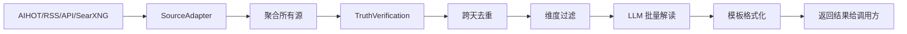

# Ingest — 信息采集助手

## 定位

**ingest 是用户的信息采集助手，不是知识库的数据入口。**

采集结果交给用户阅读和思考，有价值的内容在人与 Agent 的讨论中沉淀进知识库。未经思考的原始数据直接入库只是堆积，没有分量。

```
数据源 → ingest（采集+验证）→ 定制化信息 → 用户阅读思考 → 讨论 → 沉淀 → 知识库
                                              ↑
                                        ingest 到这里结束
```

## 信息维度

ingest 采集的信息覆盖 AI 领域 6 个维度：

| 维度 | 采集内容 | 数据源方式 |
|------|---------|-----------|
| 研究员观点 | 技术前沿方向、新范式 | 搜索引擎 |
| 公司决策 | 战略调整、产品发布、人事变动 | AIHOT + 搜索 |
| 资本决策 | 大额融资、投资机构动向 | AIHOT + 搜索 |
| 国家政策 | AI 监管、产业政策 | AIHOT + 搜索 |
| 开源趋势 | AI 新项目、Stars 爆发增长 | 搜索引擎 |
| 应用落地 | 模型/Agent/机器人产品更新 | AIHOT + 搜索 |

详细的维度定义、关注列表、精选标准 → [设计总览](design/00-overview.md)

## 设计原则

1. **ingest 不写知识库** — 采集结果返回给调用方，写入由人决定
2. **ingest 不做调度** — 由调用方（OpenClaw cron / CLI / MCP）触发
3. **ingest 不做推送** — 采集后怎么展示是调用方的事

## 数据流



ingest 的职责到 I 为止。后续用户阅读、讨论、决定是否写入知识库，都是独立环节。

## 核心组件

| 组件 | 路径 | 说明 |
|------|------|------|
| `SourceAdapter` | `ingest/adapter.py` | 抽象基类，所有源适配器实现 `fetch()` + `health_check()` |
| `SourcePackage` | `ingest/package.py` | YAML 采集包定义 |
| `TruthVerificationEngine` | `ingest/verification.py` | 5 层真实性验证 |
| `PackageExecutor` | `ingest/executor.py` | 并行执行引擎，聚合所有源后批量解读 |
| `RSSAdapter` | `ingest/adapters/rss.py` | RSS 源适配器 |
| `WebFetchAdapter` | `ingest/adapters/web_fetch.py` | HTTP 页面抓取 |
| `APIAdapter` | `ingest/adapters/api.py` | REST API 调用 |
| `WebSearchAdapter` | `ingest/adapters/web_search.py` | 搜索引擎采集（SearXNG/Bing CN/Google/ZhiPu） |
| `AIHOTAdapter` | `ingest/adapters/aihot.py` | AIHOT AI 新闻聚合（daily digest + items） |
| `IngestHistory` | `ingest/history.py` | SQLite 持久化，跨天去重 |
| `dedup_entities` | `ingest/dedup.py` | 内容哈希 + 标题关键词去重 |
| `filter_by_dimensions` | `ingest/filter.py` | 按维度过滤（max_results/max_age_days） |
| `interpret_dimension` | `ingest/interpreter.py` | LLM 批量解读（glm-5.1, Anthropic protocol） |
| `generate_top5` | `ingest/interpreter.py` | Top 5 四维精选（公司/战略/技术/启示） |
| `format_morning_brief` | `ingest/templates/morning_brief.py` | 晨报 Markdown 模板 |

## 调用方式

```bash
# CLI — 采集并查看结果
linglong ingest

# CLI — 采集并写入知识库（手动挡，你决定哪些值得保存）
linglong ingest --write

# MCP — Agent 在对话中按需采集
# fetch_rss(url) → 查看结果 → 讨论 → write_entity（手动写入）
# execute_package(path) → 查看结果 → 讨论 → write_entity（手动写入）
```

## 真实性验证（5 层）

| 层级 | 检查方法 | 示例 |
|------|----------|------|
| 多源交叉验证 | 同一事件在≥2个数据源出现 → 可信 | OpenAI 融资在财新+36kr都有报道 |
| 数字合理性 | 融资金额在历史合理范围内 | $40B 合理，$122B 异常 |
| 时间有效性 | 新闻日期在近 3 天内 | 过期内容静默跳过 |
| 源头权威性 | 优先官方渠道 | 工信部政策 > 自媒体解读 |
| 常识判断 | 事件是否符合行业逻辑 | 单周增长 172K stars → 异常 |

## 自定义 Adapter

```python
from linglong.core.models import Entity
from linglong.ingest.adapter import SourceAdapter, AdapterRegistry

class MyAdapter(SourceAdapter):
    adapter_type = "my_source"

    async def fetch(self) -> list[Entity]:
        return []

    def health_check(self) -> bool:
        return True

AdapterRegistry.register(MyAdapter)
```

## 配置

```yaml
# .linglong.yaml
ingest:
  fetch_interval_minutes: 30
  max_items_per_source: 50
  search_engine: searxng       # searxng | zhipu | google | bing_cn | auto
  searxng_url: http://localhost:8088  # SearXNG 实例地址
  search_timeout: 30.0
  packages:
    - name: ai-morning-brief
      topic: AI 早报
      output:
        format: morning-brief
        persist: true
      sources:
        - id: aihot-daily
          type: aihot
          config:
            endpoint: daily
      dimensions:
        - name: 公司决策
          search:
            keywords: ["OpenAI 最新", "Anthropic 最新"]
          filter:
            max_results: 5
```

## 搜索引擎

WebSearchAdapter 支持 4 个搜索后端：

| 后端 | 说明 | 适用场景 |
|------|------|---------|
| `searxng` | 自托管 SearXNG，JSON API | 推荐，结构化结果，无限流 |
| `zhipu` | 智谱 web_search，LLM 综合回答 | 综合解读，无来源链接 |
| `google` | Playwright 无头浏览器 | 需代理，质量好 |
| `bing_cn` | httpx 直接请求 | 兜底方案，结果质量一般 |

`auto` 模式优先级：searxng → zhipu → google（有代理）→ bing_cn

## Pipeline 阶段

PackageExecutor 执行 7 个阶段：

1. **Fetch all sources** — 采集所有源（AIHOT + SearXNG 搜索 + RSS），并行执行
2. **Verification** — 5 层真实性验证
3. **Dedup** — 跨天去重（内容哈希 + 标题关键词重叠）
4. **Filter** — 维度过滤（max_results + max_age_days）
5. **LLM interpret** — 聚合所有源后批量解读 + Top 5 精选
6. **Persist** — 写入 ingest_history
7. **Format** — 模板格式化输出

## 设计文档

- [设计总览](design/00-overview.md) — 定位、维度、差距分析、实现路线
