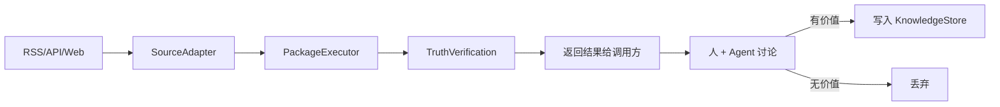

# Ingest — 信息获取模块

## 职责

- **RSS 源**：RSS feed 获取
- **API 调用**：GitHub API、自定义 REST API
- **Web Fetch**：并行抓取预定义网站列表
- **Web Search**：搜索引擎采集（placeholder）

## 设计原则

**ingest 是信息采集工具，不写知识库。**

ingest 采集的数据是原始信息，需要人和 Agent 讨论筛选后，才有价值的内容写入知识库。ingest 只负责获取和验证，不负责存储。

## 数据流



## 核心组件

| 组件 | 路径 | 说明 |
|------|------|------|
| `SourceAdapter` | `ingest/adapter.py` | 抽象基类，所有源适配器实现 `fetch()` + `health_check()` |
| `SourcePackage` | `ingest/package.py` | YAML 采集包定义 |
| `TruthVerificationEngine` | `ingest/verification.py` | 5 层真实性验证 |
| `PackageExecutor` | `ingest/executor.py` | 并行执行引擎 |
| `RSSAdapter` | `ingest/adapters/rss.py` | RSS 源适配器 |
| `WebFetchAdapter` | `ingest/adapters/web_fetch.py` | 并行 HTTP 抓取 |
| `APIAdapter` | `ingest/adapters/api.py` | REST API 调用 |

## 真实性验证（5 层）

| 层级 | 检查方法 | 示例 |
|------|----------|------|
| 多源交叉验证 | 同一事件在≥2个数据源出现 → 可信 | OpenAI 融资在财新+36kr都有报道 |
| 数字合理性 | 融资金额在历史合理范围内 | $40B 合理，$122B 异常 |
| 时间有效性 | 新闻日期在近 3 天内 | 过期内容静默跳过 |
| 源头权威性 | 优先官方渠道 | 工信部政策 > 自媒体解读 |
| 常识判断 | 事件是否符合行业逻辑 | 单周增长 172K stars → 异常 |

## 配置

```yaml
# .linglong.yaml
ingest:
  fetch_interval_minutes: 30
  max_items_per_source: 50
  package_paths:
    - ~/linglong/data/packages
  verification_enabled: true
  verification_pass_threshold: 0.6
```

## 使用示例

```bash
# CLI — 返回采集结果到终端
linglong ingest

# MCP 工具 — 在对话中调用，Agent 讨论后决定是否写入知识库
# search_wiki / search_and_read / write_entity
```

## 自定义 Adapter

```python
from linglong.core.models import Entity
from linglong.ingest.adapter import SourceAdapter, AdapterRegistry

class MyAdapter(SourceAdapter):
    adapter_type = "my_source"

    async def fetch(self) -> list[Entity]:
        return []

    def health_check(self) -> bool:
        return True

AdapterRegistry.register(MyAdapter)
```
