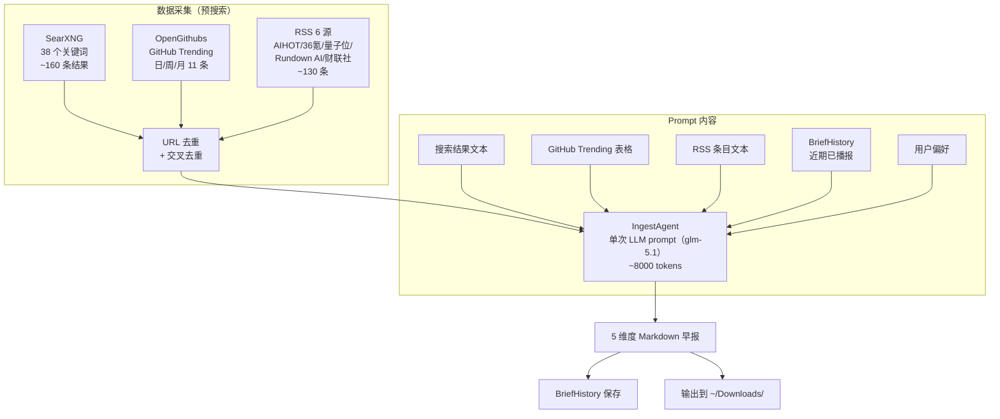

# Ingest 设计总览

> 版本：v2.1 | 更新：2026-05-25 | 状态：已实现

---

## 定位

**ingest 是用户的信息采集助手。**

采集结果交给用户阅读和思考，有价值的内容在讨论中沉淀进知识库。ingest 不是知识库的数据入口——知识库的入口是"人的思考"。

```
数据源 → ingest（采集+精选+去重+LLM 编排）→ 定制化早报 → 用户阅读思考 → 讨论 → 沉淀 → 知识库
```

ingest 负责从采集到格式化输出的完整链路。推送和调度由调用方处理。

---

## 架构演进

### v2.0：IngestAgent（LLM Agent 模式）

v2.0 将早报生成从"代码流水线（适配器→JSON→LLM 打标→模板拼接）"重构为"LLM Agent 单次 prompt"。

**根因**：v1.3 流水线把 LLM 切成碎片化 JSON 调用，auto_tag/interpret 超过 50 条时 JSON 解析频繁失败。LLM 在一个连贯思考流里做搜索+过滤+组织+写作，效果远优于工程化拆解。



### v2.1：RSS 数据源接入

v2.1 新增 RSS 预采集步骤，将 RSS 条目注入 prompt，和 SearXNG 搜索结果一起交给 LLM 处理。

**背景**：SearXNG 通用搜索对公司动态、政策动态、应用落地等细分维度覆盖不足（噪音多、相关结果少）。RSS 源经编辑筛选，信噪比更高。

---

## 信息维度（v2.0 调整）

v2.0 将维度从 6 个合并为 5 个（资本决策合并到公司动态）：

| # | 维度 | 典型内容 | 数据源 |
|---|------|---------|--------|
| 1 | 关键人物 | 观点/言论/人事变动 | SearXNG + RSS |
| 2 | 公司动态 | 产品发布、融资、股价、估值 | SearXNG + RSS |
| 3 | 政策动态 | AI 监管、产业政策 | SearXNG + RSS |
| 4 | 开源趋势 | AI 新项目 Stars 增长 | OpenGithubs（日/周/月三段） |
| 5 | 应用落地 | 模型/Agent/机器人产品更新 | SearXNG + RSS |

### 关键人物覆盖

**国外**：Yann LeCun、Geoffrey Hinton、Andrej Karpathy、Ilya Sutskever、Sam Altman、Dario Amodei、Jensen Huang

**国内**：梁文锋（DeepSeek）、周靖人（阿里）、相关 CEO/CTO 级别人物

### 公司覆盖

**美国**：OpenAI、Anthropic、Google、Meta、xAI

**中国**：DeepSeek、Kimi（月之暗面）、智谱AI、MiniMax、字节跳动（豆包）、阿里（通义千问）、腾讯（混元）

---

## 数据源架构

### RSS 订阅源（v2.1 新增）

| 源 | 类型 | 条目/次 | AI 相关 | 维度覆盖 |
|---|------|---------|---------|---------|
| AIHOT | RSS 直连 | ~30 | 30 | 全维度（编辑精选） |
| 36氪 | RSS 直连 | ~30 | ~12 | 公司动态、应用落地 |
| 36氪快讯 | RSSHub | ~20 | ~4 | 政策动态、应用落地 |
| 量子位 | RSS 直连 | ~10 | ~7 | 公司动态、应用落地 |
| The Rundown AI | RSS 直连 | ~20 | ~19 | 关键人物、公司动态 |
| 财联社电报 | RSSHub | ~20 | ~5 | 公司动态、政策动态 |

### 搜索引擎

| 后端 | 说明 | 适用场景 |
|------|------|---------|
| `searxng` | 自托管 SearXNG，JSON API | 推荐，结构化结果，无限流 |
| `zhipu` | 智谱 web_search | 综合解读，无来源链接 |
| `google` | Playwright 无头浏览器 | 需代理，质量好 |
| `bing_cn` | httpx 直接请求 | 兜底方案 |

### GitHub Trending（三级 fallback）

| 优先级 | 数据源 | 说明 |
|--------|--------|------|
| 1 | OpenGithubs | GitHub Contents API，日/周/月三段排行 |
| 2 | wangchujiang.com | HTML 解析，仅日榜，有缓存延迟 |
| 3 | GitHub Search API | `created:>30days stars:>500`，非趋势 |

---

## 去重机制

### 四层去重

| 层级 | 范围 | 方法 |
|------|------|------|
| SearXNG 内部 | URL 级 | `seen_urls` 集合，同 URL 不重复 |
| RSS 内部 | URL 级 | `seen_urls` 集合，同 URL 不重复 |
| SearXNG ↔ RSS 交叉 | URL 级 | RSS 排除已出现在 SearXNG 中的 URL |
| BriefHistory 跨天 | 语义级 | 历史输出注入 prompt"近期已播报"，LLM 判断是否重复 |

### BriefHistory 去重窗口

| 维度 | 窗口 | 原因 |
|------|------|------|
| 关键人物 | 14 天 | 人物观点通常不会短期内频繁变化 |
| 公司动态 | 7 天 | 公司事件更新频率较高 |
| 政策动态 | 14 天 | 政策事件周期较长 |
| 应用落地 | 7 天 | 产品更新频率较高 |
| 开源趋势 | 不去重 | 每天的 trending 项目自然变化 |

历史输出存储在 `~/linglong/brief_history/` 目录，每天一个 JSON 文件。

---

## Prompt 设计

### 外部化模板

Prompt 存储在 `src/linglong/ingest/prompts/morning_brief.md`，支持以下占位符：

| 占位符 | 内容 |
|--------|------|
| `{topic}` | 包主题（如"AI 早报"） |
| `{date}` | 今天日期 |
| `{search_results}` | SearXNG 搜索结果（编号文本） |
| `{github_data}` | GitHub Trending 表格 |
| `{rss_data}` | RSS 订阅源条目 |
| `{preference_section}` | 用户偏好文本 |
| `{history_section}` | BriefHistory 近期已播报 |

### Prompt 规则要点

1. 严格按 5 个维度组织，无新闻时写"近 3 天无重大动态"
2. 时效性：只保留近 7 天新闻，超过 7 天不报
3. 按日期由近及远排序（强制）
4. RSS 数据优先于搜索结果（信噪比更高）
5. 避免重复播报 BriefHistory 中的事件

---

## 输出格式

```
# AI 早报 · {date}

## 👤 关键人物
| 动态 | 人物 | 日期 | 解读 |

## 🏢 公司动态
| 事件 | 日期 | 融资 | 股价/估值变动 | 解读 |

## 📜 政策动态
| 政策/法规 | 发布部门 | 日期 | 解读 |

## ⭐ 开源趋势
| 项目名 | 分类 | Stars | 解读 | 链接 |

## 🚀 应用落地
| 产品/功能 | 公司 | 日期 | 解读 |

━━━━━━━━━━━━━━━━━━━━

## 🔥 今日最有价值信息（5 条，每条 4 维度分析）

━━━━━━━━━━━━━━━━━━━━
📌 数据来源：SearXNG + OpenGithubs + RSS（AIHOT/36氪/量子位/The Rundown AI/财联社）
```

---

## 关注列表

**研究员**：Karpathy、LeCun、Ilya、Hinton、何恺明、李飞飞、Andrew Ng、Harrison Chase、Lilian Weng、Jim Fan、Dario Amodei

**公司（国外）**：OpenAI、Anthropic、Google DeepMind、Meta、xAI、Mistral

**公司（国内）**：DeepSeek、月之暗面（Kimi）、智谱、MiniMax、字节跳动、阿里、腾讯

**政策来源**：工信部、科技部、发改委、NIST、EU AI Act、网信办

---

## 实现路线

| 阶段 | 内容 | 状态 |
|------|------|------|
| **Phase 1** | 架构清理（解耦 KnowledgeStore、MCP 工具、CLI 扁平化） | ✅ v1.1 |
| **Phase 2** | SearXNG 搜索 + LLM 解读 | ✅ v1.2 |
| **Phase 3** | 晨报模板 + ingest_history + 跨天去重 | ✅ v1.2 |
| **Phase 4** | AIHOT 适配器 + 多源聚合架构 | ✅ v1.2 |
| **Phase 5** | 包配置合并到 .linglong.yaml | ✅ v1.2 |
| **Phase 6** | 垂直信源（ArXiv + GitHub + RSS） | ✅ v1.3 |
| **Phase 7** | LLM 动态标签（auto_tag + search_queries） | ✅ v1.3 |
| **Phase 8** | 反馈闭环（FeedbackStore + 偏好注入） | ✅ v1.3 |
| **Phase 9** | IngestAgent 重构（LLM Agent 单 prompt） | ✅ v2.0 |
| **Phase 10** | BriefHistory 维度去重 + GitHub Trending 多源 | ✅ v2.0 |
| **Phase 11** | RSS 订阅源接入（6 源 + 交叉去重） | ✅ v2.1 |
| **Phase 12** | 公司融资快照（JSON 数据文件 + prompt 注入） | 🔴 v2.1+ |
| **Phase 13** | 更多 RSS 源（机器之心、TechCrunch 等） | 🔴 v2.1+ |

---

## 参考

- [Ingest README](../README.md) — 模块使用说明
- [版本路线图](../../roadmap.md) — 版本演进和 ADR
- [配置文档](../../core/config.md) — 配置字段说明
