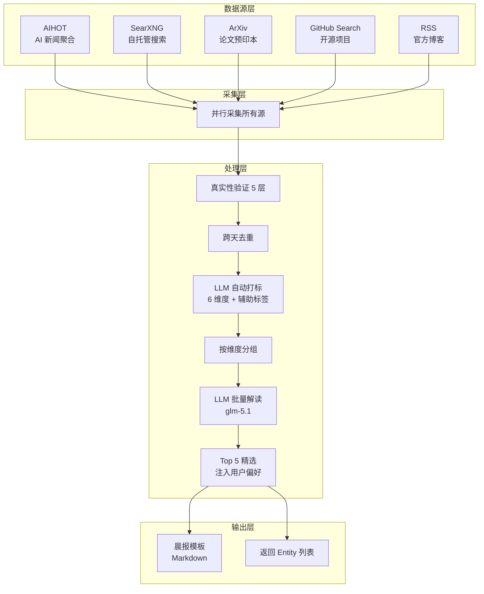
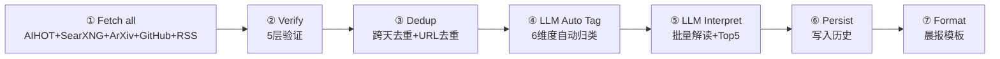
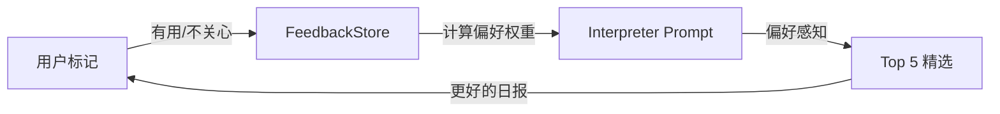

# Ingest 设计总览

> 版本：v1.3 | 更新：2026-05-23 | 状态：设计中

---

## 定位

**ingest 是用户的信息采集助手。**

采集结果交给用户阅读和思考，有价值的内容在讨论中沉淀进知识库。ingest 不是知识库的数据入口——知识库的入口是"人的思考"。

```
数据源 → ingest（采集+验证+精选+去重+格式化）→ 定制化信息 → 用户阅读思考 → 讨论 → 沉淀 → 知识库
```

ingest 负责从采集到格式化输出的完整链路。推送和调度由调用方处理。

---

## 信息维度

ingest 输出覆盖 AI 领域 6 个维度，服务于技术决策和战略判断。

**维度不再由搜索关键词预决定，而是由 LLM 根据内容自动归类。**

| # | 维度 | 典型内容 | v1.2 数据源 | v1.3 数据源 |
|---|------|---------|------------|------------|
| 1 | 研究员观点 | 技术前沿方向、新范式 | SearXNG 搜索 | ArXiv + SearXNG |
| 2 | 公司决策 | 战略调整、产品发布、人事变动 | AIHOT + SearXNG | AIHOT + SearXNG + OpenAI Blog |
| 3 | 资本决策 | 大额融资、投资机构动向 | AIHOT + SearXNG | AIHOT + SearXNG |
| 4 | 国家政策 | AI 监管、产业政策 | AIHOT + SearXNG | AIHOT + SearXNG |
| 5 | 开源趋势 | AI 新项目、Stars 爆发增长 | SearXNG 搜索 | GitHub + SearXNG |
| 6 | 应用落地 | 模型/Agent/机器人产品更新 | AIHOT + SearXNG | AIHOT + SearXNG |

### 关键变化（v1.2 → v1.3）

| 方面 | v1.2 | v1.3 |
|------|------|------|
| 维度归属 | 搜索关键词预决定（搜到什么维度就算什么） | LLM 根据内容自动判断 |
| 一条新闻 | 只能归一个维度 | 保留主维度 + 辅助标签 |
| 新信源 | AIHOT + SearXNG | +ArXiv + GitHub + 官方博客 RSS |

### 关注列表

**研究员**：Karpathy、LeCun、Ilya、Hinton、何恺明、李飞飞、姚顺雨、Andrew Ng、Harrison Chase、Lilian Weng、Jim Fan、Dario Amodei、Sergey Levine

**公司（国外）**：OpenAI、Anthropic、Google DeepMind、Meta FAIR、xAI、Mistral、Figure AI、Tesla

**公司（国内）**：字节、阿里、腾讯、百度、小米、DeepSeek、智谱、月之暗面、MiniMax、宇树、智元

**投资机构**：红杉、a16z、软银、Founders Fund、高瓴、IDG

**政策来源**：工信部、科技部、发改委、NIST、EU AI Act

---

## 数据源架构

### 多源聚合设计

ingest v1.3 在 v1.2 的基础上新增 3 个高信噪比垂直信源：



### 信源实测（2026-05-23）

| 信源 | API | 直连 | 免费 | 质量 | 说明 |
|------|-----|------|------|------|------|
| ArXiv | `export.arxiv.org/api/query` | 是 | 是 | 极高 | 研究前沿一手，Atom XML |
| OpenAI Blog | RSS (`openai.com/blog/rss.xml`) | 是 | 是 | 极高 | 967 篇，每日更新 |
| GitHub Search | `api.github.com/search/repositories` | 是 | 是(60/h) | 高 | 需 topic 筛选提升信噪比 |
| AIHOT | `aihot.virxact.com/api/public` | 是 | 是 | 高 | daily digest + items |
| SearXNG | 自托管 localhost:8088 | 是 | 是 | 中高 | 英文关键词效果远好于中文 |
| X/Twitter | — | 需代理 | $100+/月 | 极高 | 成本过高，暂不纳入 |
| Reddit | — | 需代理 | 是 | 中高 | 不稳定，暂不纳入 |

### 适配器

| 适配器 | 类型 | v1.3 新增 | 说明 |
|--------|------|----------|------|
| `ArXivAdapter` | arxiv | **新增** | ArXiv 论文采集（cs.AI/CL/RO） |
| `GitHubAdapter` | github | **新增** | GitHub Search API（topic + stars 筛选） |
| `AIHOTAdapter` | aihot | — | AIHOT AI 新闻聚合 |
| `WebSearchAdapter` | web_search | — | 搜索引擎（SearXNG/Bing CN/Google/ZhiPu） |
| `RSSAdapter` | rss | — | RSS feed（复用，新增 OpenAI Blog） |
| `APIAdapter` | api | — | REST API |
| `WebFetchAdapter` | web_fetch | — | HTTP 页面抓取 |

### 搜索引擎

WebSearchAdapter 支持 4 个搜索后端：

| 后端 | 说明 | 适用场景 |
|------|------|---------|
| `searxng` | 自托管 SearXNG，JSON API | **推荐**，结构化结果，无限流 |
| `zhipu` | 智谱 web_search，LLM 综合回答 | 综合解读，无来源链接 |
| `google` | Playwright 无头浏览器 | 需代理，质量好 |
| `bing_cn` | httpx 直接请求 | 兜底方案，结果质量一般 |

`auto` 模式优先级：searxng → zhipu → google（有代理）→ bing_cn

> **关键词建议**：SearXNG 底层走 Bing 引擎，英文关键词效果远好于中文。建议使用 `"OpenAI news May 2026"` 而非 `"OpenAI 最新 新闻"`。

---

## 执行 Pipeline

PackageExecutor 执行 7 个阶段（v1.3 更新）：



| 阶段 | 说明 | v1.2 | v1.3 变化 |
|------|------|------|----------|
| Fetch all sources | 并行采集所有源 | AIHOT + SearXNG | **+ArXiv + GitHub + RSS** |
| Verification | 5 层真实性验证 | 不变 | — |
| Dedup | 去重 | 内容哈希 + 标题关键词 | — |
| **Auto Tag** | **LLM 自动打标** | **无（按搜索关键词分组）** | **新增：LLM 判断维度** |
| LLM interpret | 批量解读 + Top 5 | 不变 | **Top 5 注入用户偏好** |
| Persist | 写入 ingest_history | 不变 | — |
| Format | 模板格式化 | 按维度分组表格 | **统一两列表格** |

### LLM 解读

使用智谱 glm-5.1（Anthropic Messages API 协议）：

```
https://open.bigmodel.cn/api/anthropic/v1/messages
```

**三步解读**（v1.3 从两步变为三步）：
1. **自动打标**：LLM 对每条新闻判断主维度（6 选 1）+ 辅助标签（0-2 个）
2. **批量解读**：所有聚合后的 Entity 一次性发送，LLM 返回每条的一句话解读（30 字以内）
3. **Top 5 精选**：从所有解读中选出最有价值的 5 条，生成四维分析（公司/战略/技术/启示），**注入用户偏好**

---

## LLM 动态标签（v1.3 新增）

### 设计动机

v1.2 的维度归属由搜索关键词预决定——搜"OpenAI news"的结果全部归到"公司决策"。问题：
- 同一条新闻可能跨维度（融资 = 公司决策 + 资本决策）
- 维度粒度固定，无法灵活调整
- 配置维护成本高（6 个维度 × N 个关键词）

### 方案

采集后由 LLM 根据内容自动打标，不再依赖搜索关键词分组。

**主维度**（6 选 1，必选）：

| 维度 | 识别特征 |
|------|---------|
| 研究员观点 | 研究前沿、论文发布、新范式提出 |
| 公司决策 | 战略调整、产品发布、人事变动、合作 |
| 资本决策 | 融资、投资、并购、IPO |
| 国家政策 | AI 监管、产业政策、合规、标准 |
| 开源趋势 | 开源项目、Stars 增长、社区动态、release |
| 应用落地 | 产品更新、场景应用、商业化、用户增长 |

**辅助标签**（0-2 个，可选）：`funding` / `release` / `personnel` / `research` / `policy` / `open_source` / `partnership` / `benchmark`

### Prompt 结构

```
对以下新闻逐条打 1 个主维度标签和 0-2 个辅助标签。

主维度（必选其一）：
- 研究员观点 / 公司决策 / 资本决策 / 国家政策 / 开源趋势 / 应用落地

辅助标签（可选）：funding / release / personnel / research / policy / open_source / partnership

返回 JSON：{"items": [{"index": 1, "dimension": "公司决策", "tags": ["release"], "entities": ["OpenAI"]}]}
```

### 配置变更

```yaml
# v1.2 — 按维度分组搜索（已移除）
dimensions:
  - name: 公司决策
    search:
      keywords: ["OpenAI news May 2026"]
    filter:
      max_results: 5

# v1.3 — 扁平搜索 + LLM 自动归类
search_queries:
  - keywords: ["OpenAI news May 2026", "Anthropic Claude latest"]
    max_results: 5
    max_age_days: 3
```

---

## 反馈闭环（v1.3 新增）

### 设计动机

v1.2 的 Top 5 精选是无状态的——每次都从零判断"什么重要"。用户无法告诉系统"这类信息有用/不关心"。

### 方案



### ingest_feedback 表

```sql
CREATE TABLE IF NOT EXISTS ingest_feedback (
    id INTEGER PRIMARY KEY AUTOINCREMENT,
    content_hash TEXT NOT NULL,
    feedback TEXT NOT NULL,     -- "useful" | "not_interested"
    tags TEXT,                  -- JSON: ["funding", "openai"]
    created_at TEXT NOT NULL
);
```

### 偏好注入

`generate_top5()` 的 prompt 增加用户偏好段：

```
用户历史偏好：
- funding 类型：3 次有用，0 次不关心
- policy 类型：0 次有用，2 次不关心
请根据偏好调整精选权重。
```

### 反馈入口

| 方式 | 说明 |
|------|------|
| MCP 工具 | `record_feedback(content_hash, feedback)` — Agent 在对话中记录 |
| 晨报标记 | Top 5 条目后追加 👍/👎 标记（视推送渠道能力） |

---

## 消息去重

### 跨天去重

同一事件在之前 N 天已经出现过 → 判断是否需要保留。

| 场景 | 示例 | 处理 |
|------|------|------|
| 旧闻重复 | OpenAI 融资昨天已报，今天无新信息 | 跳过 |
| 事件进展 | OpenAI 融资昨天报过，今天有新细节 | 保留，标记为"进展" |
| 全新事件 | 之前未出现过 | 保留 |

实现：`content_hash` 精确匹配 + 标题关键词重叠模糊匹配，历史记录存储在 `ingest_history` SQLite 表。

### ingest_history 表

```sql
CREATE TABLE ingest_history (
    id INTEGER PRIMARY KEY,
    title TEXT NOT NULL,
    url TEXT,
    summary TEXT,
    entities_mentioned TEXT,    -- JSON: ["OpenAI", "Sam Altman"]
    dimension TEXT NOT NULL,
    content_hash TEXT NOT NULL,
    collected_at TEXT NOT NULL
);
```

---

## 格式化输出

模板按包配置的 `output.format` 选择：

```
ingest/templates/
├── __init__.py
└── morning_brief.py    # 早报模板（按维度分组 + Top 5 精选）
```

v1.3 模板改动：
- 移除硬编码列名（`_DIMENSION_COLUMNS`），统一两列表格 `| 事件 | 解读 |`
- 保留 6 维度 emoji（🔬🏢💰📋⭐🚀）

---

## 真实性验证（5 层）

| 层级 | 检查方法 | 示例 |
|------|----------|------|
| 多源交叉验证 | 同一事件在≥2个数据源出现 → 可信 | OpenAI 融资在财新+36kr都有报道 |
| 数字合理性 | 融资金额在历史合理范围内 | $40B 合理，$122B 异常 |
| 时间有效性 | 新闻日期在近 N 天内 | 过期内容静默跳过 |
| 源头权威性 | 优先官方渠道 | 工信部政策 > 自媒体解读 |
| 常识判断 | 事件是否符合行业逻辑 | 单周增长 172K stars → 异常 |

---

## 包配置（inline）

包定义内联在 `.linglong.yaml` 的 `ingest.packages` 中：

```yaml
# .linglong.yaml
ingest:
  search_engine: searxng
  searxng_url: http://localhost:8088
  packages:
    - name: ai-morning-brief
      topic: AI 早报
      schedule: "0 7 * * *"
      output:
        format: morning-brief
        persist: true
      sources:                         # 顶级数据源（全量采集）
        - id: aihot-daily
          type: aihot
          config:
            endpoint: daily
        - id: openai-blog              # v1.3 新增
          type: rss
          config:
            url: https://openai.com/blog/rss.xml
            max_items: 10
        - id: arxiv-ai                 # v1.3 新增
          type: arxiv
          config:
            categories: ["cs.AI", "cs.CL", "cs.RO"]
            max_results: 10
        - id: github-trending          # v1.3 新增
          type: github
          config:
            topics: ["ai", "llm", "ai-agent"]
            min_stars: 50
            since_days: 7
            max_results: 10
      search_queries:                  # v1.3 替换 dimensions
        - keywords: ["OpenAI news May 2026", "Anthropic Claude latest"]
          max_results: 5
          max_age_days: 3
        - keywords: ["AI startup funding round 2026"]
          max_results: 3
          max_age_days: 5
        - keywords: ["open source AI model release 2026"]
          max_results: 5
          max_age_days: 3
      verification:
        enabled: true
```

**配置层级**：
- `sources`：顶级数据源，采集结果进入公共池
- `search_queries`：扁平搜索配置，结果同样进入公共池
- **维度归属不再配置**——由 LLM 自动判断

---

## 调用方集成

| 调用方 | 触发方式 | 场景 |
|--------|---------|------|
| CLI | `linglong ingest` | 手动测试/调试 |
| MCP | `execute_package(path)` | Agent 在对话中按需采集 |
| MCP | `fetch_rss(url)` | Agent 直接采集 RSS |
| MCP | `record_feedback(hash, feedback)` | Agent 记录偏好（v1.3 新增） |

---

## 实现路线

| 阶段 | 内容 | 状态 |
|------|------|------|
| **Phase 1** | 架构清理（解耦 KnowledgeStore、MCP 工具、CLI 扁平化） | ✅ v1.2 |
| **Phase 2** | SearXNG 搜索 + LLM 解读 | ✅ v1.2 |
| **Phase 3** | 晨报模板 + ingest_history + 跨天去重 | ✅ v1.2 |
| **Phase 4** | AIHOT 适配器 + 多源聚合架构 | ✅ v1.2 |
| **Phase 5** | 包配置合并到 .linglong.yaml | ✅ v1.2 |
| **Phase 6** | 垂直信源（ArXiv + GitHub + RSS） | 🔴 v1.3 |
| **Phase 7** | LLM 动态标签（auto_tag + search_queries） | 🔴 v1.3 |
| **Phase 8** | 反馈闭环（FeedbackStore + 偏好注入） | 🔴 v1.3 |
| **Phase 9** | 实体时间线（公司/人维度聚合） | 🔴 v2.0 |
| **Phase 10** | 个人化驱动（偏好从知识库读取） | 🔴 v2.0 |

---

## 参考

- [Ingest README](../README.md) — 模块使用说明
- [API 文档](../../api.md) — 接口定义
- [配置文档](../../core/config.md) — 配置字段说明
