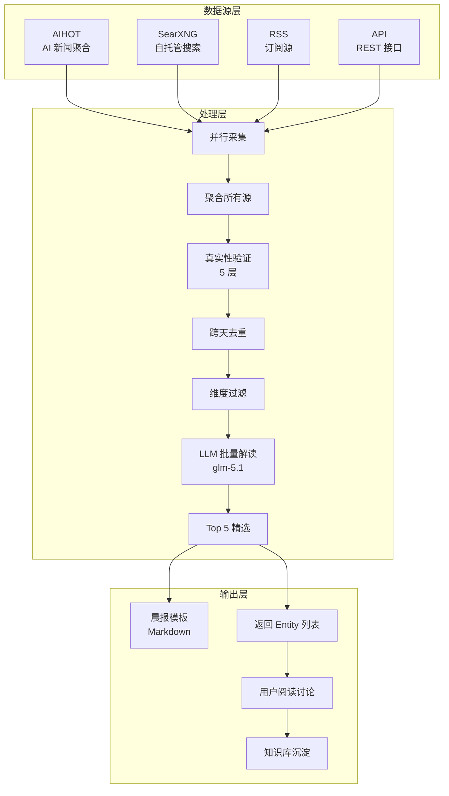
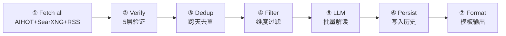

# Ingest 设计总览

> 版本：v1.2 | 更新：2026-05-22 | 状态：已实现

---

## 定位

**ingest 是用户的信息采集助手。**

采集结果交给用户阅读和思考，有价值的内容在讨论中沉淀进知识库。ingest 不是知识库的数据入口——知识库的入口是"人的思考"。

```
数据源 → ingest（采集+验证+精选+去重+格式化）→ 定制化信息 → 用户阅读思考 → 讨论 → 沉淀 → 知识库
```

ingest 负责从采集到格式化输出的完整链路。推送和调度由调用方处理。

---

## 信息维度

ingest 采集的信息覆盖 AI 领域 6 个维度，服务于技术决策和战略判断：

| # | 维度 | 采集内容 | 数据源 | 精选标准 |
|---|------|---------|--------|---------|
| 1 | 研究员观点 | 技术前沿方向、新范式 | SearXNG 搜索 | 提出新概念 → 关注；重复观点 → 跳过 |
| 2 | 公司决策 | 战略调整、产品发布、人事变动 | AIHOT + SearXNG | 战略级决策 → 关注；小版本 → 跳过 |
| 3 | 资本决策 | 大额融资、投资机构动向 | AIHOT + SearXNG | >$100M → 关注；小轮次 → 跳过 |
| 4 | 国家政策 | AI 监管、产业政策 | AIHOT + SearXNG | 国家级 → 关注；地方小政策 → 跳过 |
| 5 | 开源趋势 | AI 新项目、Stars 爆发增长 | SearXNG 搜索 | 近3天新增+Stars爆发 → 关注 |
| 6 | 应用落地 | 模型/Agent/机器人产品更新 | AIHOT + SearXNG | 新产品/重大更新 → 关注 |

维度可扩展——加维度就是在 `.linglong.yaml` 的 `ingest.packages[].dimensions` 中加配置段，不需要改代码。

### 关注列表

**研究员**：Karpathy、LeCun、Ilya、Hinton、何恺明、李飞飞、姚顺雨、Andrew Ng、Harrison Chase、Lilian Weng、Jim Fan、Dario Amodei、Sergey Levine

**公司（国外）**：OpenAI、Anthropic、Google DeepMind、Meta FAIR、xAI、Mistral、Figure AI、Tesla

**公司（国内）**：字节、阿里、腾讯、百度、小米、DeepSeek、智谱、月之暗面、MiniMax、宇树、智元

**投资机构**：红杉、a16z、软银、Founders Fund、高瓴、IDG

**政策来源**：工信部、科技部、发改委、NIST、EU AI Act

---

## 数据源架构

### 多源聚合设计

ingest v1.2 的核心架构是**多源聚合**：所有数据源（AIHOT、SearXNG、RSS 等）独立采集，汇聚到一个池子后统一处理。



### 适配器

| 适配器 | 类型 | 说明 |
|--------|------|------|
| `AIHOTAdapter` | aihot | AIHOT AI 新闻聚合，支持 daily digest 和 items API |
| `WebSearchAdapter` | web_search | 搜索引擎采集（SearXNG/Bing CN/Google/ZhiPu） |
| `RSSAdapter` | rss | RSS feed 采集 |
| `APIAdapter` | api | REST API 调用 |
| `WebFetchAdapter` | web_fetch | HTTP 页面抓取 |

### 搜索引擎

WebSearchAdapter 支持 4 个搜索后端：

| 后端 | 说明 | 适用场景 |
|------|------|---------|
| `searxng` | 自托管 SearXNG，JSON API | **推荐**，结构化结果，无限流 |
| `zhipu` | 智谱 web_search，LLM 综合回答 | 综合解读，无来源链接 |
| `google` | Playwright 无头浏览器 | 需代理，质量好 |
| `bing_cn` | httpx 直接请求 | 兜底方案，结果质量一般 |

`auto` 模式优先级：searxng → zhipu → google（有代理）→ bing_cn

### AIHOT 数据源

[AIHOT](https://aihot.virxact.com/agent) 是免费 AI 新闻聚合服务，提供两个端点：

| 端点 | 说明 | 返回 |
|------|------|------|
| `/api/public/daily` | 每日摘要，按板块分组 | sections（模型发布/产品更新/行业动态/技巧观点） |
| `/api/public/items` | 精选条目，支持分类过滤 | items（title/summary/url/category） |

- 免费，无需 token
- 支持 `?category=ai-models` 过滤
- 支持 `?q=关键词` 搜索

---

## 执行 Pipeline

PackageExecutor 执行 7 个阶段：



| 阶段 | 说明 | 输入 | 输出 |
|------|------|------|------|
| Fetch all sources | 并行采集所有源（AIHOT + 搜索 + RSS） | Package config | Entity 列表 |
| Verification | 5 层真实性验证 | Entity 列表 | 过滤后 Entity |
| Dedup | 跨天去重（内容哈希 + 标题关键词重叠） | Entity 列表 | 去重后 Entity |
| Filter | 维度过滤（max_results + max_age_days） | 分维 Entity | 精选 Entity |
| LLM interpret | 聚合所有源后批量解读 + Top 5 精选 | 全部 Entity | interpretations + top5 |
| Persist | 写入 ingest_history | Entity 列表 | — |
| Format | 模板格式化输出 | Entity + interpretations | Markdown |

### LLM 解读

使用智谱 glm-5.1（Anthropic Messages API 协议）：

```
https://open.bigmodel.cn/api/anthropic/v1/messages
```

**两步解读**：
1. **批量解读**：所有聚合后的 Entity 一次性发送，LLM 返回每条的一句话解读（30 字以内）
2. **Top 5 精选**：从所有解读中选出最有价值的 5 条，生成四维分析（公司/战略/技术/启示）

---

## 包配置（inline）

包定义内联在 `.linglong.yaml` 的 `ingest.packages` 中：

```yaml
# .linglong.yaml
ingest:
  search_engine: searxng
  searxng_url: http://localhost:8088
  packages:
    - name: ai-morning-brief
      topic: AI 早报
      schedule: "0 7 * * *"
      output:
        format: morning-brief
        persist: true
      sources:                    # 顶级数据源（全量采集，不限维度）
        - id: aihot-daily
          type: aihot
          config:
            endpoint: daily
      dimensions:                 # 维度搜索（按关键词分组）
        - name: 公司决策
          search:
            keywords: ["OpenAI 最新", "Anthropic 最新"]
            engine: auto
            concurrent: true
          filter:
            max_results: 5
            max_age_days: 3
      verification:
        enabled: true
```

**配置层级**：
- `sources`：顶级数据源，采集结果进入公共池，不限维度
- `dimensions`：按维度组织的搜索，结果同样进入公共池，但保留维度标签用于展示
- `verification`：真实性验证配置

---

## 消息去重

### 跨天去重

同一事件在之前 N 天已经出现过 → 判断是否需要保留。

| 场景 | 示例 | 处理 |
|------|------|------|
| 旧闻重复 | OpenAI 融资昨天已报，今天无新信息 | 跳过 |
| 事件进展 | OpenAI 融资昨天报过，今天有新细节 | 保留，标记为"进展" |
| 全新事件 | 之前未出现过 | 保留 |

实现：`content_hash` 精确匹配 + 标题关键词重叠模糊匹配，历史记录存储在 `ingest_history` SQLite 表。

### ingest_history 表

```sql
CREATE TABLE ingest_history (
    id INTEGER PRIMARY KEY,
    title TEXT NOT NULL,
    url TEXT,
    summary TEXT,
    entities_mentioned TEXT,    -- JSON: ["OpenAI", "Sam Altman"]
    dimension TEXT NOT NULL,
    content_hash TEXT NOT NULL,
    collected_at TEXT NOT NULL
);
```

---

## 格式化输出

模板按包配置的 `output.format` 选择：

```
ingest/templates/
├── __init__.py
└── morning_brief.py    # 早报模板（按维度分组表格 + Top 5 精选）
```

后续加模板（周报、摘要）就加新文件，不改采集逻辑。

---

## 真实性验证（5 层）

| 层级 | 检查方法 | 示例 |
|------|----------|------|
| 多源交叉验证 | 同一事件在≥2个数据源出现 → 可信 | OpenAI 融资在财新+36kr都有报道 |
| 数字合理性 | 融资金额在历史合理范围内 | $40B 合理，$122B 异常 |
| 时间有效性 | 新闻日期在近 N 天内 | 过期内容静默跳过 |
| 源头权威性 | 优先官方渠道 | 工信部政策 > 自媒体解读 |
| 常识判断 | 事件是否符合行业逻辑 | 单周增长 172K stars → 异常 |

---

## 调用方集成

| 调用方 | 触发方式 | 场景 |
|--------|---------|------|
| CLI | `linglong ingest` | 手动测试/调试 |
| MCP | `execute_package(path)` | Agent 在对话中按需采集 |
| MCP | `fetch_rss(url)` | Agent 直接采集 RSS |

---

## 实现路线

| 阶段 | 内容 | 状态 |
|------|------|------|
| **Phase 1** | 架构清理（解耦 KnowledgeStore、MCP 工具、CLI 扁平化） | ✅ 已完成 |
| **Phase 2** | SearXNG 搜索 + LLM 解读（glm-5.1 Anthropic protocol） | ✅ 已完成 |
| **Phase 3** | 晨报模板 + ingest_history 持久化 + 跨天去重 | ✅ 已完成 |
| **Phase 4** | AIHOT 适配器 + 多源聚合架构 | ✅ 已完成 |
| **Phase 5** | 包配置合并到 .linglong.yaml | ✅ 已完成 |
| **Phase 6** | 实体时间线（公司/人维度聚合） | 🔴 v2.0 |
| **Phase 7** | 个人化驱动（偏好从知识库读取） | 🔴 v2.0 |

---

## 参考

- [Ingest README](../README.md) — 模块使用说明
- [API 文档](../../api.md) — 接口定义
- [配置文档](../../core/config.md) — 配置字段说明
