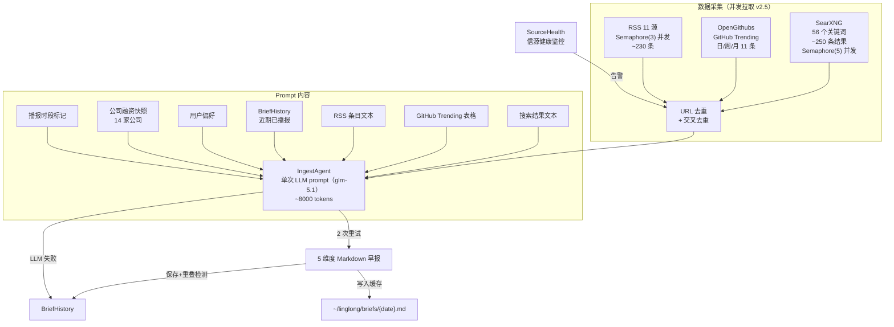

# Ingest 设计总览

> 版本：v2.5 | 更新：2026-05-26 | 状态：已实现

---

## 定位

**ingest 是用户的信息采集助手。**

采集结果交给用户阅读和思考，有价值的内容在讨论中沉淀进知识库。ingest 不是知识库的数据入口——知识库的入口是"人的思考"。

```
数据源 → ingest（采集+精选+去重+LLM 编排）→ 定制化早报 → 用户阅读思考 → 讨论 → 沉淀 → 知识库
```

ingest 负责从采集到格式化输出的完整链路。推送和调度由调用方处理。

---

## 架构演进

### v2.0：IngestAgent（LLM Agent 模式）

v2.0 将早报生成从"代码流水线"重构为"LLM Agent 单次 prompt"。

**根因**：v1.3 流水线把 LLM 切成碎片化 JSON 调用，auto_tag/interpret 超过 50 条时 JSON 解析频繁失败。



### v2.1：RSS 数据源接入

新增 RSS 预采集步骤，将 RSS 条目注入 prompt。

### v2.2：ingest 增强

新增公司融资快照、关键人物扩展、更多 RSS 源、信源健康监控、LLM 容错和去重效果量化。

### v2.3–v2.4：安全加固 + MCP 接入

- SearXNG/RSSHub API Key 认证
- MCP 14 工具暴露，Claude Code / OpenClaw 可调用
- LLM 配置对齐：glm-5.1 + Anthropic 兼容端点
- 配置外部化：brief_history_dir / dedup_windows / company_snapshot_path 移到 IngestConfig
- company_snapshot.json 从代码包移到 ~/linglong/

### v2.5：并发拉取 + 缓存 + Prompt 优化

- **三路并发**：SearXNG / GitHub / RSS 通过 `asyncio.gather` 并行拉取
- **SearXNG 内部并发**：56 次查询 `Semaphore(5)` 并发，数据采集 ~57s → **7.6s**
- **日内缓存**：`generate_brief()` 当天已生成直接返回（0.2ms vs 83s）
- **时段标记**：`> 播报时段：2026-05-25 07:30 → 2026-05-26 07:30`
- **Prompt 强化**：每个分类强制去重注释；开源趋势六列格式（类型/分类/链接）

---

## 信息维度（5 维度）

| # | 维度 | 典型内容 | 数据源 |
|---|------|---------|--------|
| 1 | 关键人物 | 观点/言论/人事变动 | SearXNG + RSS |
| 2 | 公司动态 | 产品发布、融资、股价、估值 | SearXNG + RSS |
| 3 | 政策动态 | AI 监管、产业政策 | SearXNG + RSS |
| 4 | 开源趋势 | AI 新项目 Stars 增长 | OpenGithubs（日/周/月三段） |
| 5 | 应用落地 | 模型/Agent/机器人产品更新 | SearXNG + RSS |

---

## 数据源架构

### RSS 订阅源（v2.5：11 源）

| 源 | 类型 | 条目/次 | 维度覆盖 |
|---|------|---------|---------|
| AIHOT | RSS 直连 | ~30 | 全维度（编辑精选） |
| 36氪 | RSS 直连 | ~30 | 公司动态、应用落地 |
| 36氪快讯 | RSSHub | ~20 | 政策动态、应用落地 |
| 量子位 | RSS 直连 | ~10 | 公司动态、应用落地 |
| The Rundown AI | RSS 直连 | ~20 | 关键人物、公司动态 |
| 财联社电报 | RSSHub | ~20 | 公司动态、政策动态 |
| 财联社深度 | RSSHub | ~10 | 公司动态、政策动态 |
| TechCrunch AI | RSS 直连 | ~20 | 关键人物、公司动态（英文） |
| The Verge AI | RSS 直连 | ~15 | 公司动态、应用落地（英文） |
| 工信部文件公示 | RSSHub (gov) | ~15 | 政策动态 |
| 发改委新闻动态 | RSSHub (gov) | ~25 | 政策动态 |

### GitHub Trending（三级 fallback）

| 优先级 | 数据源 | 说明 |
|--------|--------|------|
| 1 | OpenGithubs | GitHub Contents API，日/周/月三段排行 |
| 2 | wangchujiang.com | HTML 解析，仅日榜，有缓存延迟 |
| 3 | GitHub Search API | `created:>30days stars:>500`，非趋势 |

---

## 去重机制

| 层级 | 范围 | 方法 |
|------|------|------|
| SearXNG 内部 | URL 级 | `seen_urls` 集合 |
| RSS 内部 | URL 级 | `seen_urls` 集合 |
| SearXNG ↔ RSS 交叉 | URL 级 | RSS 排除已出现在 SearXNG 中的 URL |
| BriefHistory 跨天 | 语义级 | 历史输出注入 prompt，LLM 判断 + 去重注释 |

### BriefHistory 去重窗口（可配置）

| 维度 | 默认窗口 | 原因 |
|------|----------|------|
| 关键人物 | 14 天 | 人物观点短期不变 |
| 公司动态 | 7 天 | 事件更新频率高 |
| 政策动态 | 14 天 | 政策周期较长 |
| 应用落地 | 7 天 | 产品更新频率高 |
| 开源趋势 | 不去重 | trending 项目自然变化 |

配置路径：`ingest.dedup_windows`，历史文件存储在 `~/linglong/brief_history/`。

---

## 缓存机制（v2.5）

`generate_brief()` 支持日内缓存，避免重复 LLM 调用。

| 配置 | 默认值 | 说明 |
|------|--------|------|
| `brief_output_dir` | `~/linglong/briefs` | 缓存目录，按日期 `{YYYY-MM-DD}.md` |
| `brief_schedule_time` | `07:30` | 播报时段标记 |
| `brief_cache_days` | `14` | 缓存保留天数 |

---

## Prompt 设计

模板：`src/linglong/ingest/prompts/morning_brief.md`

| 占位符 | 内容 |
|--------|------|
| `{topic}` | 包主题（如"AI 早报"） |
| `{date}` | 今天日期 |
| `{time_range}` | 播报时段（如 `2026-05-25 07:30 → 2026-05-26 07:30`） |
| `{search_results}` | SearXNG 搜索结果 |
| `{github_data}` | GitHub Trending 表格 |
| `{rss_data}` | RSS 订阅源条目 |
| `{company_snapshot}` | 公司融资/估值快照 |
| `{preference_section}` | 用户偏好文本 |
| `{history_section}` | BriefHistory 近期已播报 |

---

## 输出格式

```
# AI 早报 · {date}
> 播报时段：{time_range}

## 👤 关键人物
| 动态 | 人物 | 日期 | 解读 |
> 注：xxx 等已在前期播报，不再重复。

## 🏢 公司动态
| 事件 | 日期 | 融资 | 股价/估值变动 | 解读 |
> 注：...

## 📜 政策动态
| 政策/法规 | 发布部门 | 日期 | 解读 |
> 注：...

## ⭐ 开源趋势
| 项目名 | 类型 | 分类 | Stars | 解读 | 链接 |
（日 5 + 周 3 + 月 3 = 11 项，全部列出）
> 注：...

## 🚀 应用落地
| 产品/功能 | 公司 | 日期 | 解读 |
> 注：...

━━━━━━━━━━━━━━━━━━━━
## 🔥 今日最有价值信息（5 条，每条 4 维度分析）
━━━━━━━━━━━━━━━━━━━━
```

---

## 外部配置（v2.5 全部外部化）

所有配置通过 `~/.linglong.yaml` 管理，无需改代码：

| 配置 | 路径 | 说明 |
|------|------|------|
| RSS 源 | `ingest.rss_sources` | 11 个订阅源 |
| 搜索关键词 | `ingest.packages[].search_queries` | 56 个关键词 |
| 去重窗口 | `ingest.dedup_windows` | 各维度回看天数 |
| 去重历史目录 | `ingest.brief_history_dir` | `~/linglong/brief_history/` |
| 公司快照 | `ingest.company_snapshot_path` | `~/linglong/company_snapshot.json` |
| 缓存目录 | `ingest.brief_output_dir` | `~/linglong/briefs/` |
| 播报时间 | `ingest.brief_schedule_time` | `07:30` |
| LLM | `composer.llm_model` / `composer.llm_base_url` | glm-5.1 + Anthropic 端点 |

---

## 实现路线

| 阶段 | 内容 | 状态 |
|------|------|------|
| Phase 1–8 | 架构清理→SearXNG→模板→多源→LLM 标签→反馈 | ✅ v1.x |
| Phase 9 | IngestAgent 重构（LLM Agent 单 prompt） | ✅ v2.0 |
| Phase 10 | BriefHistory 维度去重 + GitHub Trending 多源 | ✅ v2.0 |
| Phase 11 | RSS 订阅源接入 + 交叉去重 | ✅ v2.1 |
| Phase 12 | 公司融资快照 + 更多 RSS 源 + 健康监控 + 容错 | ✅ v2.2 |
| Phase 13 | API Key 认证 + MCP 14 工具 + Claude Code 接入 | ✅ v2.4 |
| Phase 14 | 配置外部化 + LLM 对齐 + company_snapshot 外部化 | ✅ v2.4 |
| Phase 15 | 三路并发拉取 + 日内缓存 + 时段标记 + Prompt 强化 | ✅ v2.5 |
| Phase 16 | 关键词质量优化 + 信源可信度权重 | 🔜 规划中 |

---

## 参考

- [Ingest README](../README.md) — 模块使用说明 + MCP 接入示例
- [版本路线图](../../roadmap.md) — 版本演进和 ADR
