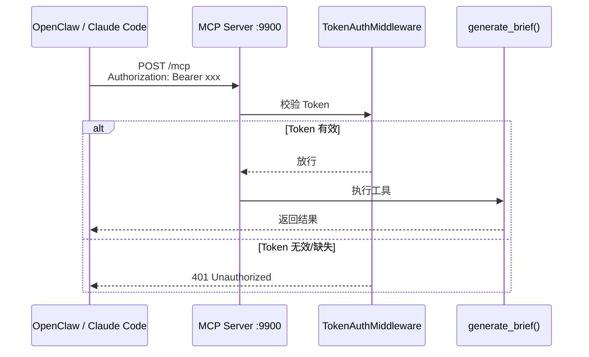
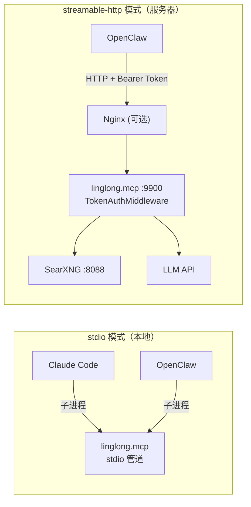

# D-06 MCP 接入

> 状态：✅ 已实现 | 最后更新：2026-05-26 | 依赖：[D-02 Agent 流水线](02-agent-pipeline.md)

---

## 概述

ingest 通过 MCP Server 暴露工具，支持本地（stdio）和远程（streamable-http）两种接入方式。

---

## 启动流程图

```mermaid
flowchart TD
    START(["python -m linglong.mcp"]) --> CONFIG["get_config()"]
    CONFIG --> CREATE["create_server()"]
    CREATE --> REGISTER["_register_tools(server, enabled_modules)"]
    REGISTER --> TRANSPORT{mcp.transport?}

    TRANSPORT -->|stdio| STDIO["server.run(transport='stdio')<br/>子进程 stdio 管道"]
    TRANSPORT -->|streamable-http| HTTP_CHECK{auth_token?}

    HTTP_CHECK -->|有| HTTP_AUTH["streamable_http_app()<br/>+ TokenAuthMiddleware<br/>+ uvicorn 监听"]
    HTTP_CHECK -->|无| HTTP_NOAUTH["server.run(transport='streamable-http')<br/>无认证"]

    STDIO --> RUNNING(["服务运行中"])
    HTTP_AUTH --> RUNNING
    HTTP_NOAUTH --> RUNNING

    style STDIO fill:#4CAF50,color:#fff
    style HTTP_AUTH fill:#2196F3,color:#fff
    style HTTP_NOAUTH fill:#FF9800,color:#fff
```



---

## HTTP 请求认证流程



---

## 工具列表

### ingest 模块（5 个）

| 工具 | 说明 |
|------|------|
| `generate_brief()` | 生成当天 AI 早报（有缓存） |
| `execute_package(path)` | 执行指定 YAML 采集包 |
| `fetch_rss(url)` | 采集单个 RSS feed |
| `search_web(query)` | SearXNG 搜索 |
| `record_feedback(hash, feedback)` | 记录用户偏好 |

### knowledge 模块（9 个）

| 工具 | 说明 |
|------|------|
| `search_wiki` | 知识库搜索 |
| `search_similar` | 向量搜索 |
| `search_and_read` | 搜索+读取全文 |
| `read_entity` | 按 ID 读取实体 |
| `write_entity` | 创建实体 |
| `update_entity` | 更新实体 |
| `list_entities` | 列出实体 |
| `get_template` | 获取写入模板 |
| `list_templates` | 列出可用模板 |

工具通过 `mcp.enabled_modules` 配置按需暴露。

---

## 双模式部署架构



---

## 模块工具控制

```yaml
mcp:
  enabled_modules:
    - ingest        # 只暴露 5 个 ingest 工具
    # - knowledge   # 取消注释启用 9 个知识库工具
```

`server.py` 的 `_register_tools()` 根据 `enabled_modules` 动态注册：

```python
_TOOL_GROUPS = {
    "ingest": [fetch_rss, generate_brief, execute_package, search_web, record_feedback],
    "knowledge": [search_wiki, search_similar, ...],
}
```

---

## 已知注意事项

- `generate_brief()` 内部用 `_run_async()` (ThreadPoolExecutor) 运行 async 函数，MCP server 有自己的事件循环
- RSSHub `ACCESS_KEY` 仅追加到 `:1200` 端口的 URL
- GitHub API 优先用 `gh auth token` 认证（5000 req/hr）
- MCP 子进程不继承 shell 环境变量，Claude Code 需通过 `env` 字段注入

---

## 关键文件

| 文件 | 说明 |
|------|------|
| `src/linglong/mcp/server.py` | FastMCP 工厂 + 按模块注册 |
| `src/linglong/mcp/__main__.py` | 按 transport 启动 |
| `src/linglong/mcp/_auth.py` | Token 认证中间件 |
| `src/linglong/mcp/tools.py` | 14 个 MCP 工具实现 |
| `deploy/linglong-mcp.service` | systemd 守护配置 |
