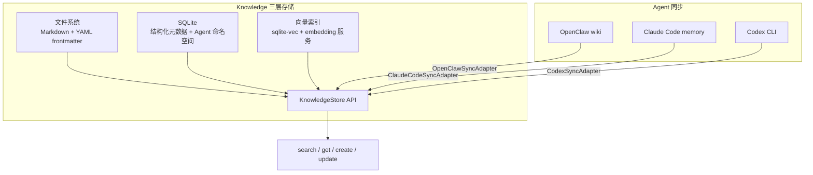

# Knowledge — 跨 Agent 知识库模块

## 职责

- **统一存储**：兼容 OpenClaw wiki + Claude Code memory + Codex 记忆
- **向量索引**：语义搜索（远程 embedding 服务 + 本地 sqlite-vec fallback）
- **混合搜索**：关键词 + 语义 + 时间衰减 + MMR
- **多 Agent 读写**：通过 API/文件同步接入
- **自动 Review 引擎**：规则驱动，自动确认/标记待审
- **WikiLinks 支持**：`[[概念名]]` 自动解析

## 存储架构



## 核心组件

| 组件 | 路径 | 说明 |
|------|------|------|
| `KnowledgeStore` | `knowledge/store.py` | 统一存储接口（SQLite + sqlite-vec） |
| `ReviewEngine` | `knowledge/review.py` | 自动审核引擎 |
| `EmbeddingService` | `knowledge/embeddings.py` | 向量嵌入服务 |
| `OpenClawSyncAdapter` | `knowledge/sync/openclaw.py` | OpenClaw wiki 同步 |
| `ClaudeCodeSyncAdapter` | `knowledge/sync/claude_code.py` | Claude Code memory 同步 |
| `CodexSyncAdapter` | `knowledge/sync/codex.py` | Codex CLI 同步 |

## Review 规则

| 规则 | 条件 | 动作 |
|------|------|------|
| 高置信度+可信来源 | confidence > 0.9 且来源在信任列表 | 自动确认 |
| 低置信度 | confidence < 0.6 | 标记待审 |
| 敏感内容 | 包含密码/API密钥 | 需人工确认 |
| 内容过短 | 长度 < 50 | 标记待审 |

## 使用示例

```python
from linglong.knowledge.store import KnowledgeStore
from linglong.core.models import Entity, EntityStatus

store = KnowledgeStore()

# 创建
entity = Entity(content="# Python 类型提示\n\nPython 3.11 引入了...", created_by="agent:claude")
store.create(entity)

# 检索
results = store.search(status=EntityStatus.AUTO_CONFIRMED, limit=100)

# 跨 Agent 同步
from linglong.knowledge.sync import OpenClawSyncAdapter
adapter = OpenClawSyncAdapter(wiki_path="~/.openclaw/workspace/memory/wiki")
adapter.sync_to_linglong()
```

## 配置

```yaml
# .linglong.yaml
knowledge:
  wiki_path: ~/linglong/wiki
  db_path: ~/linglong/db/knowledge.db
  vector_enabled: true
  embedding_url: http://localhost:7997
  embedding_model: nomic-embed-text-v1.5
  sync_confidence: 0.95
```

## 相关文档

- [跨 Agent 同步协议](sync-adapters.md)
- [LLM-Wiki 参考设计](references/llm-wiki-reference.md) — 四层架构、摄入/查询/巡检流程参考
- [差异化比对](references/gap-analysis.md) — 参考设计 vs Linglong 实现的逐项差距与待完善项
- [claude-mem 架构](references/claude-mem.md) — MCP 持久记忆插件：6 组件架构、3 层渐进式披露、生命周期钩子
- [MemGPT 范式](references/memgpt.md) — OS 级记忆管理：虚拟上下文、分层存储、自管理写回
- [LLM-Wiki 社区实现](references/llm-wiki-community.md) — 6 个社区项目：实体消解、候选暂存、权重衰减、Dream Cycle
- [行业趋势](references/industry-trends.md) — 4 大范式演进：RAG → 自治记忆 → 知识图谱 → 多 Agent
- [交叉验证汇总](references/convergence.md) — 全方案对比 + P2/P3 增强建议

### 设计文档

- [00 全局架构](design/00-overview.md) — 设计目标、分层架构、迁移路径
- [01 数据模型](design/01-data-model.md) — Entity 模型、7 Facet、生命周期
- [02 目录结构](design/02-directory-structure.md) — wiki/ 目录布局、命名规范
- [03 写入设计](design/03-write-path.md) — 写入流程、确认模式、去重、归档
- [04 搜索设计](design/04-search.md) — 三模式搜索、两步索引、降级策略
- [05 巡检设计](design/05-lint.md) — 健康检查、自动修复、报告格式
- [06 Agent 接入](design/06-agent-integration.md) — CLI 设计、接入配置、触发时机
- [07 更新设计](design/07-update-path.md) — Entity 更新、版本管理、冲突处理
- [08 初始化与并发](design/08-init-and-concurrency.md) — init 命令、并发写入协调
