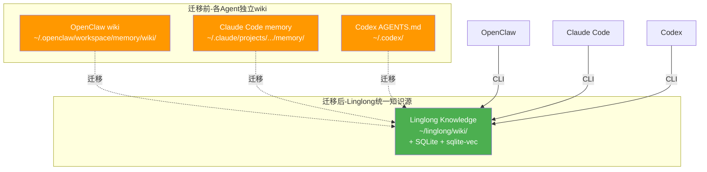
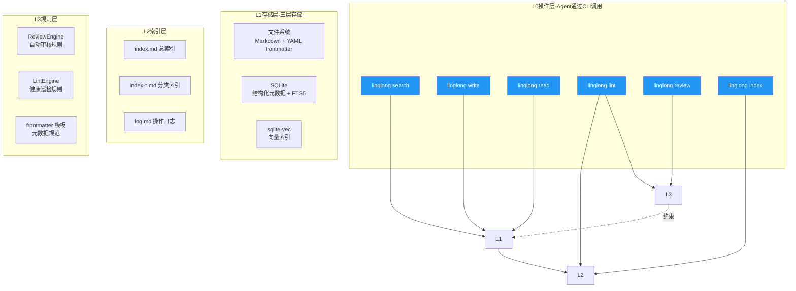

# 知识库全局架构设计

> 创建日期：2026-05-14
> 状态：设计阶段

---

## 设计目标

Linglong 知识库是所有 AI Agent 的**唯一知识源**（Single Source of Truth）。

**解决的核心问题**：OpenClaw、Claude Code、Codex 等 Agent 各自维护独立知识库，互不相通。同一个概念，OpenClaw 知道，Claude Code 不知道；Claude Code 记了，Codex 又记一遍。

**解决方案**：Linglong 知识库统一存储所有知识，Agent 通过 CLI 工具读写。

---

## 迁移前后对比



---

## 全局分层架构



---

## 核心设计原则

### 1. 单一知识源

所有知识只存在 `~/linglong/wiki/` 一处。Agent 不再维护自己的 wiki/memory，统一通过 CLI 读写 Linglong。

### 2. Agent 是客户端

Agent（OpenClaw、Claude Code、Codex）是知识库的**消费者**，不是管理者。Agent 的职责是：
- 读取知识（search + read）
- 写入知识（write，需确认）
- 不负责索引维护、巡检、归档（这些由 Linglong 内部处理）

### 3. Token 经济性

一切设计围绕"LLM 读取成本最小化"：
- 两步索引查询：先读 index.md（~500 tokens），再按需深入
- Facet 过滤：缩小搜索范围，避免全量扫描
- 轻量返回：默认只返回摘要，`--deep` 才加载全文

### 4. 渐进式迁移

不要求一次性迁移完成：
- 阶段 1：迁移 OpenClaw wiki 到 `~/linglong/wiki/`
- 阶段 2：OpenClaw 通过 CLI 接入 Linglong
- 阶段 3：Claude Code、Codex 接入
- 阶段 4：清理旧 wiki 目录

---

## 与 OpenClaw wiki 的关系

**Linglong 是 OpenClaw wiki 的超集**：

| OpenClaw wiki | Linglong knowledge |
|---------------|-------------------|
| 13 个目录 | 7 个 facet + 子目录 |
| 文件系统 wiki | 文件 + SQLite + 向量 |
| 手动维护 index.md | 自动生成索引 |
| 无审核机制 | ReviewEngine 自动审核 |
| 无巡检 | LintEngine 健康检查 |
| 单 Agent | 多 Agent CLI 接入 |

**迁移映射**：详见 `02-directory-structure.md`

---

## 与 LLM-Wiki 参考设计的关系

**借鉴**：
- 四层架构思想（L0 操作 → L1 存储 → L2 索引 → L3 规则）
- 两步索引查询（index.md → index-*.md → 目标文件）
- Lint 巡检机制（死链/孤儿/冲突检测）
- 归档机制（已处理文件的生命周期管理）

**不借鉴**：
- 纯文件系统存储（Linglong 用 SQLite + 向量，更强）
- 手动索引维护（Linglong 自动生成）
- 全量扫描（Linglong 用增量 + FTS5）

**改进**：
- 四分面 → 七分面（增加 experience / methodology / personal）
- 单 Agent → 多 Agent CLI 接入
- 无向量搜索 → sqlite-vec 语义搜索

---

## Agent 接入方式

**统一 CLI 工具**：`linglong`

```bash
# 搜索
linglong search "关键词" --facet concept --limit 5

# 写入（默认提示确认）
linglong write --facet experience --title "..." --content "..."

# 读取
linglong read <entity-id>

# 审核
linglong review --list-pending

# 巡检
linglong lint

# 索引管理
linglong index --rebuild

# 迁移
linglong migrate --from ~/.openclaw/workspace/memory/wiki/
```

**接入配置**：详见 `06-agent-integration.md`

---

## 默认值 + CLI 覆盖模式

优先级：CLI 参数 > 配置文件 (.linglong.yaml) > 硬编码默认值

| 参数 | 默认值 | 配置文件 key | CLI 覆盖 | 适用场景 |
|------|--------|-------------|----------|----------|
| 写入模式 | `confirm` | `knowledge.write_mode` | `--yes` | 批量导入时跳过确认 |
| 查询模式 | `on_demand` | `knowledge.search_mode` | `--deep` | 需要完整上下文时 |
| 索引更新 | `auto` | `knowledge.auto_index` | `--no-index` | 批量写入时跳过索引更新 |

---

## 相关文档

- [数据模型](01-data-model.md) — Entity 模型、Facet 分类、生命周期
- [目录结构](02-directory-structure.md) — wiki/ 目录布局、命名规范
- [写入设计](03-write-path.md) — 写入流程、确认模式、去重
- [搜索设计](04-search.md) — 三模式搜索、两步索引
- [巡检设计](05-lint.md) — 健康检查、自动修复
- [Agent 接入](06-agent-integration.md) — CLI 设计、接入配置
- [更新设计](07-update-path.md) — Entity 更新、版本管理、冲突处理
- [初始化与并发](08-init-and-concurrency.md) — init 命令、并发写入协调
