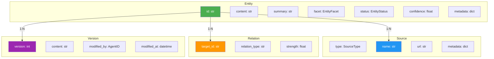
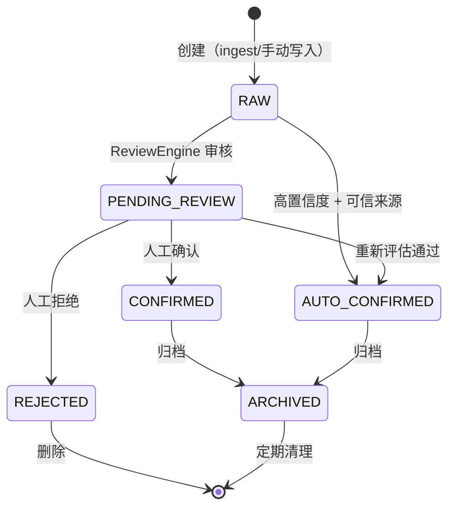

# 知识库数据模型设计


| 属性 | 值 |
|------|-----|
| 分类 | 数据层 |
| 状态 | ✅ 已实现 |
| 依赖 | 无 |
| 关联实现 | `src/linglong/core/models.py` |
| 最后更新 | 2026-05-16 |

---

## Entity 模型

Entity 是知识库的核心数据单元。每条知识都是一个 Entity。

### 字段定义

| 字段 | 类型 | 必填 | 说明 |
|------|------|------|------|
| `id` | `str` | 自动生成 | UUID，文件系统路径基于此 |
| `content` | `str` | ✅ | Markdown 正文 |
| `summary` | `str` | - | AI 生成的摘要 |
| `facet` | `EntityFacet` | ✅ | 分类（7 选 1） |
| `status` | `EntityStatus` | 自动 | 审核状态 |
| `created_by` | `AgentID` | ✅ | 创建者（如 `agent:openclaw`） |
| `confirmed_by` | `HumanID` | - | 人工确认者 |
| `confidence` | `float` | 默认 0.5 | 置信度 0.0-1.0 |
| `sources` | `list[Source]` | - | 来源信息 |
| `relations` | `list[Relation]` | - | 实体间关系 |
| `versions` | `list[Version]` | - | 版本历史 |
| `current_version` | `int` | 默认 1 | 当前版本号 |
| `created_at` | `datetime` | 自动 | 创建时间 |
| `updated_at` | `datetime` | 自动 | 更新时间 |
| `archived_at` | `datetime` | - | 归档时间（未归档为 None） |
| `embedding_id` | `str` | 自动生成 | 向量索引关联 ID |
| `metadata` | `dict` | - | 扩展元数据 |

### 新增字段：facet

```python
class EntityFacet(StrEnum):
    SOURCE = "source"           # 原始资料汇编
    ENTITY = "entity"           # 专有名词
    CONCEPT = "concept"         # 抽象知识
    SYNTHESIS = "synthesis"     # 跨源综合
    EXPERIENCE = "experience"   # 实战经验
    METHODOLOGY = "methodology" # 方法论
    PERSONAL = "personal"       # 个人数据
```

---

## 七分面体系

### 分面定义

| 分面 | 英文 | 定义 | 典型内容 | 文件规模 |
|------|------|------|----------|----------|
| **Source** | source | 原始资料的主题汇编 | 项目文档、技术博客、论文摘要 | 大量 |
| **Entity** | entity | 专有名词卡片 | 产品（OpenClaw）、工具（sqlite-vec）、人物 | 中等 |
| **Concept** | concept | 抽象知识/理论 | 架构模式、设计原则、技术概念 | 大量 |
| **Synthesis** | synthesis | 跨源综合分析 | 多篇文章的交叉洞察 | 少量 |
| **Experience** | experience | 实战经验 | 踩坑记录、最佳实践、调试经验 | 中等 |
| **Methodology** | methodology | 方法论/工作流 | 分析框架、执行流程、工作规范 | 少量 |
| **Personal** | personal | 个人数据 | 用户画像、偏好、情感记忆 | 少量 |

### 分面边界判断

```
问：这个东西是 entity 还是 concept？

entity = "这是什么"（名词卡片，3-10 行属性）
  例：OpenClaw、sqlite-vec、Stripe、Pydantic

concept = "这怎么理解"（理论文章，1-3 页）
  例：微服务架构、事件驱动设计、LLM Wiki 模式

问：这个东西是 source 还是 experience？

source = "这从哪来的"（资料汇编，原始内容）
  例：一篇 RSS 文章的整理、一个项目的设计文档

experience = "这踩过什么坑"（实战记录，问题→原因→解决）
  例：sqlite-vec 维度不匹配的修复、Hexo 部署失败排查
```

---

## Entity 关系图



---

## Entity 生命周期



| 状态 | 含义 | 触发条件 |
|------|------|----------|
| `RAW` | 刚采集，未审核 | Entity 创建时默认 |
| `PENDING_REVIEW` | 等待审核 | 低置信度 / 敏感内容 / 内容过短 |
| `CONFIRMED` | 人工确认 | 用户执行 `linglong kb review --approve` |
| `AUTO_CONFIRMED` | 自动确认 | 高置信度 + 可信来源 |
| `REJECTED` | 拒绝 | 用户执行 `linglong kb review --reject` |
| `ARCHIVED` | 已归档 | 执行 `linglong kb archive` |

---

## Frontmatter 规范

每个 wiki 文件必须包含 YAML frontmatter：

```yaml
---
type: concept                    # 对应 facet（兼容 OpenClaw 现有 type 字段）
description: 微服务架构设计原则   # 简短描述
created: 2026-05-14              # 创建日期
updated: 2026-05-14              # 更新日期
status: auto_confirmed           # 审核状态
confidence: 0.9                  # 置信度
created_by: agent:claude         # 创建者
tags: [架构, 微服务]              # 标签（可选）
sources:                         # 来源（可选）
  - name: RSS-ai-hot
    url: https://...
relations:                       # 关联实体（可选）
  - target: entities/openclaw.md
    type: related
---
```

---

## OpenClaw type → Linglong facet 映射

| OpenClaw type | Linglong facet | 说明 |
|---------------|----------------|------|
| `concept` | `concept` | 直接映射 |
| `project` | `source` | 项目资料归入 source |
| `experience` | `experience` | 直接映射 |
| `methodology` | `methodology` | 直接映射 |
| `reference` | `source` | 外部引用归入 source |
| `user` | `personal` | 用户画像归入 personal |
| `problem` | `source` | 问题解决记录归入 source |
| `emotion` | `personal` | 情感记忆归入 personal |
| `soul` | `personal` | 灵魂日记归入 personal |
| `dashboard` | （不迁移） | 仪表盘是视图，不是知识 |
| `template` | （不迁移） | 模板是工具，不是知识 |
| `todo` | （不迁移） | 待办是临时状态，不是知识 |
| `infra` | `personal` | 基础设施配置归入 personal |

---

## Relation 模型

实体间关系通过 WikiLinks 和 Relation 字段表达。

### WikiLinks

在 Markdown 正文中使用 `[[target]]` 或 `[[target|display]]` 语法：

```markdown
这是一篇关于 [[openclaw]] 的分析，
参考了 [[concepts/llm-wiki|LLM Wiki 模式]] 的设计。
```

解析规则：
- `[[openclaw]]` → 指向 `entities/openclaw.md`
- `[[concepts/llm-wiki|LLM Wiki 模式]]` → 指向 `concepts/llm-wiki.md`，显示为 "LLM Wiki 模式"
- 代码块内的 `[[...]]` 不解析（避免误匹配）

### Relation 字段

```python
class Relation(BaseModel):
    target_id: str          # 目标 Entity ID
    relation_type: str      # 关系类型：related / depends_on / contradicts / extends
    strength: float         # 关系强度 0.0-1.0
    metadata: dict          # 扩展信息
```

---

## 设计决策记录

| 编号 | 决策 | 选择 | 原因 | 替代方案 |
|------|------|------|------|----------|
| D-01a | 分类体系 | 七分面（7 Facet） | 覆盖原始资料到个人数据全场景 | 四分面（LLM-Wiki） |
| D-01b | ID 生成 | SHA-256 路径哈希前 16 位 | 稳定、确定性、无冲突 | UUID v4 |
| D-01c | 关系表达 | WikiLinks + Relation 字段 | 兼顾人类可读和机器查询 | 仅 Relation 字段 |
| D-01d | Frontmatter 格式 | YAML key-value | 兼容 OpenClaw、人类可读 | JSON |

## 版本变动历史

| 版本 | 日期 | 变动摘要 | 影响范围 |
|------|------|----------|----------|
| v1.0 | 2026-05-14 | 初始设计 | 全文 |
| v1.1 | 2026-05-16 | type→facet 映射扩展至 33 种类型，新增 _subdir 子目录支持 | 映射表、Frontmatter 规范 |

## 关联文档

| 文档 | 关系 |
|------|------|
| [D-02 目录结构](02-directory-structure.md) | 使用 facet 定义目录分类 |
| [D-03 写入设计](03-write-path.md) | 使用 Entity 模型 + 生命周期 |
| [D-04 搜索设计](04-search.md) | 使用 facet 过滤 + FTS5 |
| [D-07 更新设计](07-update-path.md) | 使用 Version 模型 + 乐观锁 |
