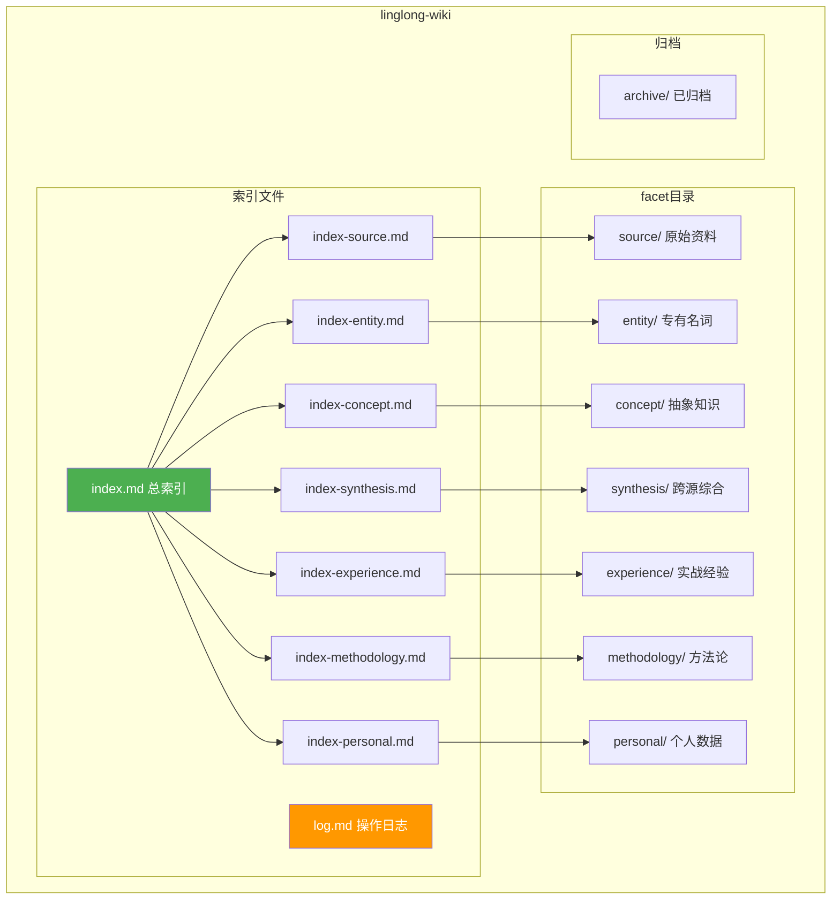

# 知识库目录结构设计

> 创建日期：2026-05-14
> 状态：设计阶段

---

## 目录全景图



---

## 顶层布局

```
~/linglong/wiki/
├── index.md                    # 总索引（~500 tokens，LLM 入口）
├── index-source.md             # source 分类索引
├── index-entity.md             # entity 分类索引
├── index-concept.md            # concept 分类索引
├── index-synthesis.md          # synthesis 分类索引
├── index-experience.md         # experience 分类索引
├── index-methodology.md        # methodology 分类索引
├── index-personal.md           # personal 分类索引
├── log.md                      # 操作日志
│
├── source/                     # 原始资料汇编
├── entity/                     # 专有名词
├── concept/                    # 抽象知识
├── synthesis/                  # 跨源综合
├── experience/                 # 实战经验
├── methodology/                # 方法论
├── personal/                   # 个人数据
│
└── archive/                    # 已归档文件
    └── YYYY-MM/                # 按月归档
```

---

## Facet 目录结构

### source/ — 原始资料

```
source/
├── projects/                   # 项目资料（保留 OpenClaw 子目录名）
│   ├── linglong/
│   │   ├── index.md
│   │   ├── pipeline.md
│   │   └── ...
│   ├── agent-mastery/
│   │   ├── index.md
│   │   └── ...
│   └── ...
├── references/                 # 外部引用（保留 OpenClaw 子目录名）
│   ├── llm-wiki-pattern.md
│   └── ...
└── problems/                   # 问题解决（保留 OpenClaw 子目录名）
    └── design-agent-system.md
```

**来源**：OpenClaw 的 `projects/` + `references/` + `problems/`

### entity/ — 专有名词

```
entity/
├── openclaw.md                 # 产品
├── claude-code.md              # Agent
├── codex.md                    # Agent
├── sqlite-vec.md               # 工具
├── nomic-embed-text.md         # 模型
├── hexo.md                     # 框架
├── stripe.md                   # 公司
└── ...
```

**特点**：扁平目录，每个文件是一个实体卡片（3-10 行属性）

### concept/ — 抽象知识

```
concept/
├── llm-wiki.md
├── knowledge-compiler.md
├── agent-architecture.md
├── blog-post-format.md
├── truth-verification.md
├── multi-agent-sync.md
├── skills/                     # 技能记录（保留 OpenClaw 子目录名）
│   ├── growth-track.md
│   └── ...
└── ...
```

**来源**：OpenClaw 的 `concepts/`

### synthesis/ — 跨源综合

```
synthesis/
├── embedding-兼容性风险.md
├── agent-协作成本分析.md
└── ...
```

**特点**：数量少，每篇必须有 `sources` 字段引用来源

### experience/ — 实战经验

```
experience/
├── vector-search-sqlite.md
├── module-migration.md
├── claude-code-efficiency.md
├── best-practices/             # 最佳实践（保留 OpenClaw 子目录名）
│   ├── search.md
│   └── search-tools.md
├── pitfalls/                   # 踩坑记录（保留 OpenClaw 子目录名）
│   └── skill-trigger.md
└── ...
```

**来源**：OpenClaw 的 `experiences/`

### methodology/ — 方法论

```
methodology/
├── problem-understanding.md
├── problem-decomposition.md
├── source-code-analysis-workflow.md
├── visualization-standards.md
├── long-task-execution-framework.md
└── ...
```

**来源**：OpenClaw 的 `methodologies/`

### personal/ — 个人数据

```
personal/
├── profile.md                  # 用户画像（原 user/profile.md）
├── communication-style.md      # 沟通风格（原 user/communication-style.md）
├── preferences.md              # 工作偏好（原 user/preferences.md）
├── growth-auto-log.md          # 成长日志（原 user/growth-auto-log.md）
├── emotion-memory.md           # 情感记忆（原 emotion/emotion-memory.md）
├── infra/                      # 基础设施（原 infra/）
│   └── passwords.md
└── diary/                      # 灵魂日记（原 soul/diary/）
    └── 2026-04-11.md
```

**来源**：OpenClaw 的 `user/` + `emotion/` + `soul/` + `infra/`

---

## OpenClaw 13 目录 → 7 Facet 映射

| OpenClaw 目录 | 文件数 | → Linglong facet | 路径变化 |
|---------------|--------|-----------------|----------|
| `concepts/` | 9 | `concept/` | 不变 |
| `concepts/skills/` | 4 | `concept/skills/` | 不变 |
| `projects/` | 12 | `source/projects/` | 多一层 |
| `references/` | 4 | `source/references/` | 多一层 |
| `problems/` | 1 | `source/problems/` | 多一层 |
| `experiences/` | 14 | `experience/` | 不变 |
| `methodologies/` | 7 | `methodology/` | 不变 |
| `user/` | 4 | `personal/` | 目录名变了 |
| `emotion/` | 1 | `personal/` | 合并 |
| `soul/` | 1 | `personal/diary/` | 合并 |
| `infra/` | 1 | `personal/infra/` | 合并 |
| `dashboards/` | 2 | （不迁移） | - |
| `templates/` | 3 | （不迁移） | - |
| `todo/` | 3 | （不迁移） | - |

---

## 索引文件规范

### index.md — 总索引

```markdown
# 知识库索引

> 最后更新：2026-05-14

## 按分类

- [[index-source|Source]] — 原始资料汇编（N 篇）
- [[index-entity|Entity]] — 专有名词（N 个）
- [[index-concept|Concept]] — 抽象知识（N 篇）
- [[index-synthesis|Synthesis]] — 跨源综合（N 篇）
- [[index-experience|Experience]] — 实战经验（N 篇）
- [[index-methodology|Methodology]] — 方法论（N 篇）
- [[index-personal|Personal]] — 个人数据（N 篇）

## 最近更新

| 日期 | 分类 | 文章 | 说明 |
|------|------|------|------|
| 2026-05-14 | concept | xxx | xxx |
```

### index-*.md — 分类索引

```markdown
# Source 索引

## projects/
- [[source/projects/linglong|Linglong 项目]] — 个人知识管理平台
- [[source/projects/agent-mastery|Agent Mastery]] — 智能体系统学习

## references/
- [[source/references/llm-wiki-pattern|LLM Wiki Pattern]] — Karpathy 知识库理念
```

---

## 归档目录

```
archive/
├── 2026-04/                    # 按月归档
│   ├── old-article-1.md
│   └── old-article-2.md
└── 2026-05/
    └── ...
```

归档条件：
- Entity 状态为 ARCHIVED
- 超过 N 天未被引用（可配置）

---

## 命名规范

### 文件名

| Facet | 命名规则 | 示例 |
|-------|----------|------|
| source | 项目名/主题名 | `linglong-pipeline.md`、`llm-wiki-pattern.md` |
| entity | 小写连字符 | `openclaw.md`、`sqlite-vec.md` |
| concept | 小写连字符 | `llm-wiki.md`、`agent-architecture.md` |
| synthesis | 描述性名称 | `embedding-兼容性风险.md` |
| experience | 描述性名称 | `vector-search-sqlite.md` |
| methodology | 描述性名称 | `problem-understanding.md` |
| profile | 描述性名称 | `profile.md`、`preferences.md` |

### 目录名

- 全小写
- 连字符分隔（`best-practices`）
- 保留 OpenClaw 原有目录名（`projects/`、`references/`）

---

## 相关文档

- [全局架构](00-overview.md) — 设计目标、分层架构
- [数据模型](01-data-model.md) — Entity 模型、Facet 分类
- [写入设计](03-write-path.md) — 写入流程、归档机制
