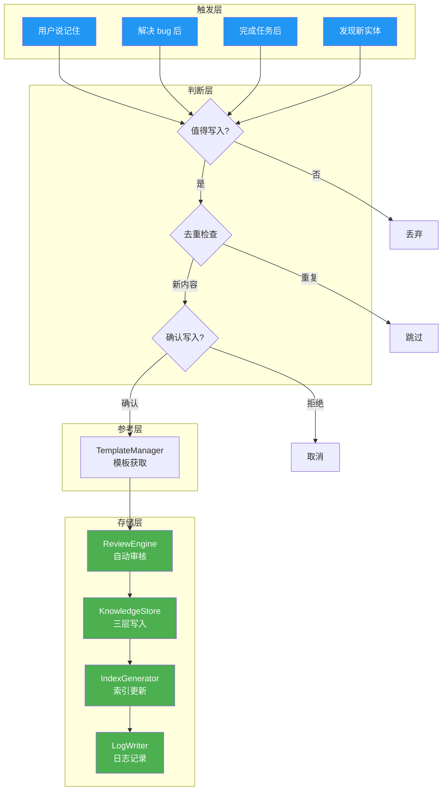
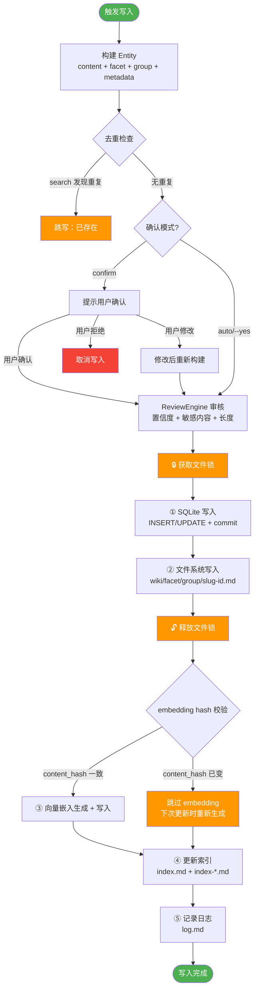
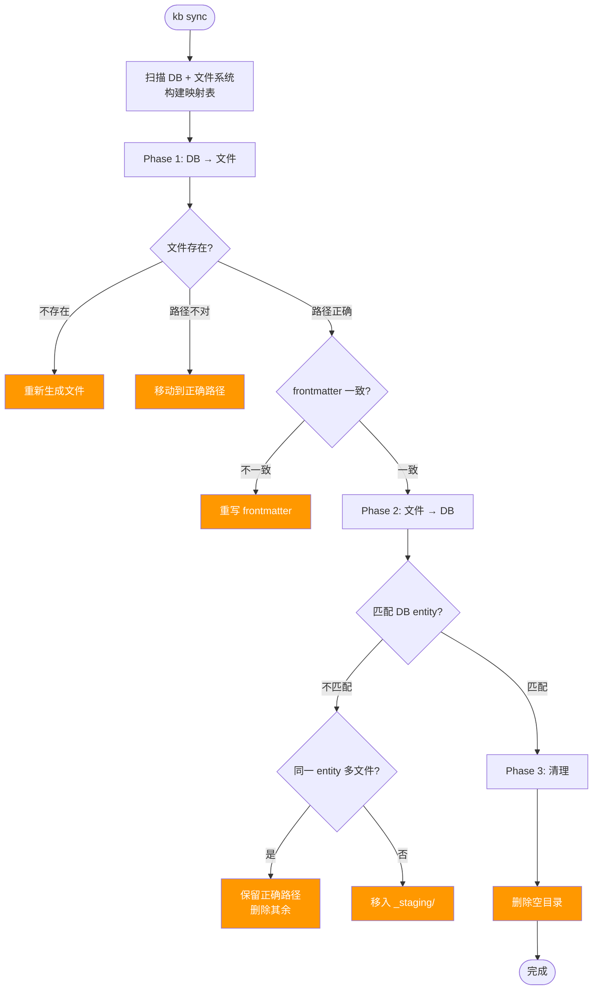

# 知识库写入设计


| 属性 | 值 |
|------|-----|
| 分类 | 写入层 |
| 状态 | ✅ 已实现 |
| 依赖 | [D-01 数据模型](01-data-model.md), [D-04 搜索设计](04-search.md) |
| 关联实现 | `src/linglong/knowledge/store.py`, `src/linglong/knowledge/review.py`, `src/linglong/knowledge/lint.py` |
| 最后更新 | 2026-05-21 |

**未实现项**: 多 Agent 更新合并（v2.0）

---

## 写入数据流架构



---

## 写入触发时机

| 触发点 | 时机 | 写入什么 | Facet |
|--------|------|----------|-------|
| 用户说"记住" | 显式指令 | 用户指定的内容 | 根据内容判断 |
| 解决 bug 后 | 问题解决 | 问题 + 原因 + 解决方案 | `experience` |
| 学到新知识 | 对话中获得新认知 | 概念解释 + 例子 | `concept` |
| 完成项目任务 | 任务完成 | 任务描述 + 结果 | `project` |
| 发现新实体 | 提到新产品/工具/人物 | 实体卡片 | `concept` |
| 做出架构决策 | ADR 时刻 | 决策 + 原因 + 备选 | `concept` |
| 踩坑记录 | 遇到并解决技术问题 | 坑 → 原因 → 解决 | `experience` |

---

## 写入判断标准

### 值得写入

```
✅ 将来可能再次需要的信息
✅ 跨项目的通用知识
✅ 踩坑经验（错误 → 原因 → 解决方案）
✅ 用户明确要求记住的
✅ 架构决策和设计原则
✅ 反复提到的专有名词（应创建 entity）
```

### 不值得写入

```
❌ 一次性调试信息
❌ 代码本身（那是 Git 的事）
❌ 临时性的中间状态
❌ 已经在文档里的信息（避免重复）
❌ 太通用的概念（"Python"、"Linux"、"API"）
```

---

## 提示确认模式

### 默认行为（write_mode=confirm）

```
Agent: 这个问题的解决方案值得记录到知识库吗？

       分类：experience
       标题：sqlite-vec 向量维度不匹配的修复
       内容：当 embedding 模型返回的维度与配置不匹配时，
             sqlite-vec 不会报错但搜索结果全部失效。
             解决方法：在存储前校验维度。

       [是] [否] [修改后再保存]
```

### 跳过确认（--yes）

```bash
linglong kb write --facet experience --title "..." --content "..." --yes
```

适用于批量导入场景。

### 配置文件

```yaml
# .linglong.yaml
knowledge:
  write_mode: confirm    # confirm | auto
```

---

## 写入完整流程



### 写入顺序原则

**DB 先行**：SQLite → 文件系统。DB 写入失败不留痕，文件系统无事务无法回滚。锁内只做 DB + 文件操作，embedding 在锁外用 content hash 守卫。

### Embedding Content Hash 守卫

embedding 生成是网络请求（调用远程 embedding 服务），耗时长。如果在锁内执行会阻塞并发写入。采用 hash 守卫方案：

1. 生成 embedding 前，记录当前 `content_hash`
2. 生成完成后（锁外），读 DB 检查 `content_hash` 是否变化
3. 未变化 → 写入 embedding_id 安全
4. 已变化 → 跳过，下次 update 时基于新内容重新生成

---

## 去重策略

写入前必须检查是否已存在：

```bash
# 1. 标题去重
linglong kb search "sqlite-vec 维度" --facet experience

# 2. 内容去重（MD5 hash）
# ComposerState.filter_new() 已有 content hash 去重逻辑

# 3. 来源去重
# 同一 URL 的 RSS 文章不应重复写入
```

去重优先级：
1. **ID 去重** — Entity ID 相同（同一条知识）
2. **内容去重** — MD5 hash 相同（内容完全一致）
3. **标题去重** — 标题相似度 > 阈值（可能重复）
4. **语义去重** — 向量相似度 > 0.95（`lint --check conflicts` 检测，embedding 不可用时降级为标题去重）

---

## 归档机制

### 归档条件

- Entity 状态为 CONFIRMED 或 AUTO_CONFIRMED
- 超过 N 天未被任何其他 Entity 引用（可配置）
- 用户手动执行 `linglong kb archive <id>`

### 归档操作

```bash
# 手动归档
linglong kb archive <entity-id>

# 批量归档（超过 90 天未引用的）
linglong kb archive --older-than 90d
```

归档后：
- Entity 状态变为 ARCHIVED
- `archived_at` 字段设为当前时间
- 文件移入 `archive/YYYY-MM/` 目录
- 索引中移除该条目
- SQLite 记录保留（可恢复）

---

## 多 Agent 写入冲突预防

### 命名空间隔离

每个 Agent 写入时带 `created_by` 前缀：
- `agent:openclaw`
- `agent:claude`
- `agent:codex`

### 冲突检测

```bash
# 写入前检查同 facet 同标题
linglong kb search "支付系统架构" --facet concept --created-by agent:openclaw

# 如果已存在
# → 返回已有 Entity，提示用户是更新还是新建
```

### 更新策略

- **同 Agent 更新**：直接更新 Entity 内容，versions 追加历史
- **不同 Agent 更新**：提示用户确认是否合并，保留两个 Agent 的 attribution

---

## 数据一致性校验（kb sync）

当 Agent 直接操作文件系统（移动/重命名/删除文件）导致 DB 与文件不一致时，用 `kb sync` 修复。

### 原则

**DB 是唯一真相源，文件系统是 DB 的投影。**

### 执行流程



### CLI

```bash
# 预览差异（不执行）
linglong kb sync

# 执行修复
linglong kb sync --fix
```

### 修复动作

| 问题 | 检测方式 | --fix 动作 |
|------|---------|-----------|
| DB 有，文件不存在 | entity ID 递归查找无文件 | `_save_to_filesystem()` 重新生成 |
| 文件路径不对 | 实际路径 ≠ 预期路径（facet/group/slug） | `rename` 到正确路径 |
| 同 entity 多文件 | 同一 short ID 多个文件 | 保留正确路径的，删其余 |
| frontmatter 过期 | 文件内 facet/group ≠ DB | 用 DB 数据重写文件 |
| 孤儿文件 | 文件存在但 DB 无对应 | 移入 `wiki/_staging/` |
| 空目录 | 子目录无文件 | `rmdir` |

### 孤儿文件处理

不直接删除也不自动导入，放入 `_staging/`：
- 直接删可能丢数据（Agent 手写的重要文件）
- 自动导入需要确定 facet/group，信息不足会分错
- 用户可手动审查 `_staging/` 后决定导入或删除

---

## CLI 命令

```bash
# 写入（默认提示确认）
linglong kb write --facet concept --title "微服务架构" --content "..."

# 写入（跳过确认）
linglong kb write --facet experience --title "..." --content "..." --yes

# 写入（跳过索引更新，批量场景）
linglong kb write --facet concept --group openclaw --title "..." --content "..." --no-index

# 从文件写入
linglong kb write --facet reference --from-file article.md

# 模板
linglong kb template list              # 列出所有模板
linglong kb template get concept       # 查看 concept 模板

# 归档
linglong kb archive <entity-id>
linglong kb archive --older-than 90d

# 一致性校验
linglong kb sync                    # 预览差异
linglong kb sync --fix              # 执行修复
```

---

## 设计决策记录

| 编号 | 决策 | 选择 | 原因 | 替代方案 |
|------|------|------|------|----------|
| D-03a | 确认模式 | confirm/auto 双模式 | 批量导入跳过确认，日常使用保留 | 仅 confirm |
| D-03b | 去重优先级 | ID > 内容hash > 标题 > 语义 | 多层防护 | 仅标题去重 |
| D-03c | 同步方向 | Pull（Linglong 拉取） | Agent 无需适配 API | Push（Agent 推送） |
| D-03d | 写入顺序 | DB 先行（SQLite → 文件系统） | DB 事务有原子性，文件系统没有 | 文件先行（旧版） |
| D-03e | embedding 一致性 | content hash 守卫（锁外） | 不延长锁时间，hash 不匹配则跳过 | embedding 移入锁内（持锁时间长） |
| D-03f | DB↔文件同步 | kb sync 双向校验 | Agent 直接操作文件系统后修复不一致 | 仅 index --rebuild（不修路径） |

## 版本变动历史

| 版本 | 日期 | 变动摘要 | 影响范围 |
|------|------|----------|----------|
| v1.0 | 2026-05-14 | 初始设计 | 全文 |
| v1.1 | 2026-05-21 | 语义去重已实现（向量相似度 >0.95），归档批量操作已实现（`--older-than`），未实现项缩减为多 Agent 更新合并 | 去重策略、归档机制、未实现项 |
| v1.2 | 2026-05-22 | 写入顺序改为 DB 先行；embedding content hash 守卫；新增 kb sync 双向校验设计 | 写入流程、embedding 守卫、sync 设计 |

## 关联文档

| 文档 | 关系 |
|------|------|
| [D-01 数据模型](01-data-model.md) | Entity 模型、生命周期 |
| [D-04 搜索设计](04-search.md) | 去重时的搜索策略 |
| [D-05 巡检设计](05-lint.md) | 写入时的一致性检查 |
| [D-07 更新设计](07-update-path.md) | 已有 Entity 的更新流程 |
| [D-08 初始化与并发](08-init-and-concurrency.md) | 并发写入协调 |
