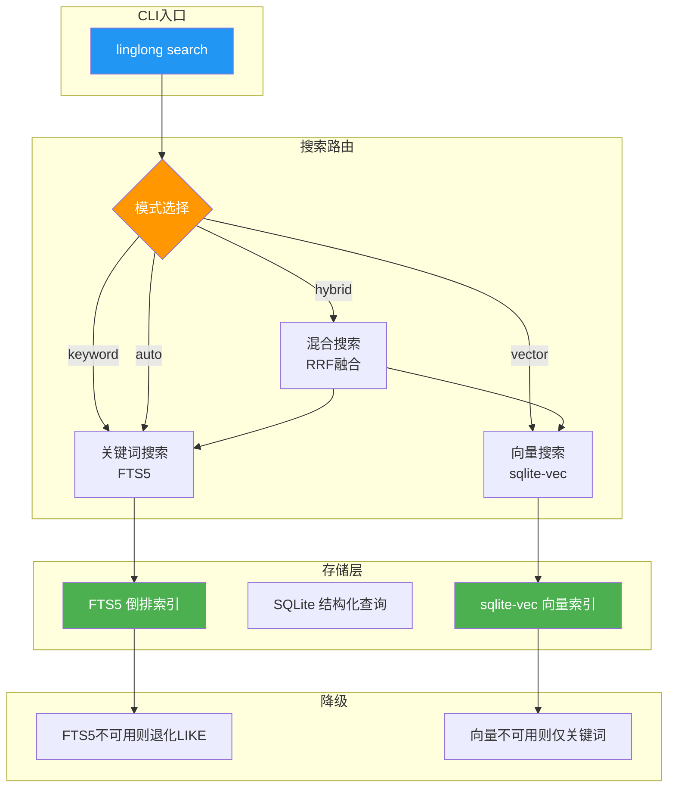
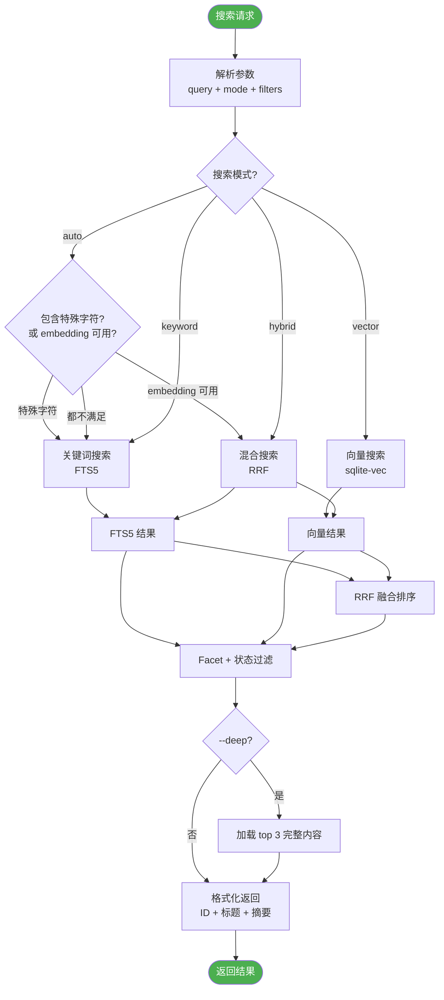

# 知识库搜索设计


| 属性 | 值 |
|------|-----|
| 分类 | 查询层 |
| 状态 | 🟡 部分实现 |
| 依赖 | [D-01 数据模型](01-data-model.md) |
| 关联实现 | `src/linglong/knowledge/store.py`, `src/linglong/knowledge/embeddings.py` |
| 最后更新 | 2026-05-14 |

**未实现项**: 混合搜索（RRF）、两步索引查询、自动模式

---

## 搜索组件架构



---

## 三模式搜索

### 模式 1：关键词搜索（默认）

```bash
linglong search "支付系统"
```

- **引擎**：SQLite FTS5
- **优势**：精确匹配、离线可用、无外部依赖
- **劣势**：无语义理解（搜"支付"不会匹配"结算"）
- **降级**：FTS5 不可用时退化为 LIKE 查询

### 模式 2：向量搜索

```bash
linglong search "支付系统" --mode vector
```

- **引擎**：sqlite-vec + 远程 embedding 服务
- **优势**：语义理解（搜"支付"能匹配"结算"、"交易"）
- **劣势**：依赖远程服务、无法精确匹配
- **降级**：embedding 服务不可用时退化为关键词搜索

### 模式 3：混合搜索

```bash
linglong search "支付系统" --mode hybrid
```

- **引擎**：FTS5 + sqlite-vec + RRF (Reciprocal Rank Fusion)
- **优势**：兼顾精确匹配和语义理解
- **劣势**：性能开销最大（两次搜索 + 融合排序）
- **降级**：任一引擎不可用时退化为另一引擎

### 自动模式（默认）

```bash
linglong search "支付系统" --mode auto
```

逻辑：
1. 如果查询包含特殊字符（ID、路径）→ 关键词搜索
2. 如果 embedding 服务可用 → 混合搜索
3. 否则 → 关键词搜索

---

## Facet 过滤

```bash
# 只搜概念
linglong search "架构" --facet concept

# 只搜实体
linglong search "OpenClaw" --facet entity

# 只搜经验
linglong search "sqlite-vec" --facet experience

# 组合过滤
linglong search "支付" --facet concept --status auto_confirmed --created-by agent:openclaw
```

支持的过滤条件：

| 参数 | 说明 | 示例 |
|------|------|------|
| `--facet` | 分类过滤 | `--facet concept` |
| `--status` | 状态过滤 | `--status auto_confirmed` |
| `--created-by` | 创建者过滤 | `--created-by agent:claude` |
| `--limit` | 结果数量 | `--limit 10` |
| `--since` | 时间过滤 | `--since 2026-05-01` |

---

## 两步索引查询

### 设计思想

参考 LLM-Wiki 的两步定位设计，降低 LLM 读取成本：

```
步骤 1：读 index.md（~500 tokens）→ 定位到分类
步骤 2：读 index-*.md（2-5 条）→ 定位到具体文件
步骤 3：读目标文件 → 获取完整内容
```

### Token 成本对比

| 方案 | 步骤 1 | 步骤 2 | 总成本 |
|------|--------|--------|--------|
| 全量读取 | 读所有文件 | - | ~40K tokens |
| **两步索引** | 读 index.md | 读 2-5 条目标 | **~2-3K tokens** |

### 实现方式

```bash
# 步骤 1：查看索引
linglong index
# → 返回 index.md 内容（各分类文件数 + 最近更新）

# 步骤 2：查看分类索引
linglong index --facet concept
# → 返回 index-concept.md 内容（概念列表 + 摘要）

# 步骤 3：读取具体内容
linglong read <entity-id>
# → 返回完整 Entity 内容
```

---

## 查询模式

### 默认模式（on_demand）

```bash
linglong search "支付系统"
# → 返回：ID + 标题 + 摘要 + facet + 更新时间
# 不自动加载完整内容
```

### 深度模式（--deep）

```bash
linglong search "支付系统" --deep
# → 返回：ID + 标题 + 摘要 + facet + 更新时间
# + 自动加载 top 3 的完整内容
```

### 配置文件

```yaml
# .linglong.yaml
knowledge:
  search_mode: on_demand    # on_demand | deep
```

---

## 搜索决策流程



---

## 降级策略

| 场景 | 降级行为 |
|------|----------|
| FTS5 不可用 | 退化为 LIKE 查询（性能差但可用） |
| embedding 服务不可用 | 退化为关键词搜索 |
| sqlite-vec 不可用 | 退化为仅关键词搜索 |
| 网络完全断开 | 仅 FTS5 + SQLite（本地可用） |

降级时输出警告：

```
⚠️ embedding 服务不可用，退化为关键词搜索
```

---

## CLI 命令

```bash
# 基本搜索
linglong search "关键词"

# 指定 facet
linglong search "架构" --facet concept

# 指定模式
linglong search "支付" --mode hybrid

# 深度搜索（自动加载 top 3 完整内容）
linglong search "支付" --deep

# 组合过滤
linglong search "sqlite" --facet experience --status auto_confirmed --limit 5

# 查看索引
linglong index
linglong index --facet concept
```

---

## 设计决策记录

| 编号 | 决策 | 选择 | 原因 | 替代方案 |
|------|------|------|------|----------|
| D-04a | 全文搜索 | SQLite FTS5 | 内置、离线、无依赖 | Whoosh / Elasticsearch |
| D-04b | 向量搜索 | sqlite-vec + 远程 embedding | 无需本地 GPU | 本地模型 |
| D-04c | 查询模式 | on_demand 默认 + --deep 可选 | 降低 token 成本 | 总是返回全文 |
| D-04d | 降级策略 | FTS5 → LIKE，向量 → 关键词 | 保证离线可用 | 失败即报错 |

## 版本变动历史

| 版本 | 日期 | 变动摘要 | 影响范围 |
|------|------|----------|----------|
| v1.0 | 2026-05-14 | 初始设计 | 全文 |

## 关联文档

| 文档 | 关系 |
|------|------|
| [D-01 数据模型](01-data-model.md) | facet 过滤基于 EntityFacet |
| [D-03 写入设计](03-write-path.md) | 去重时的搜索策略 |
| [D-06 Agent 接入](06-agent-integration.md) | search CLI 命令 |
