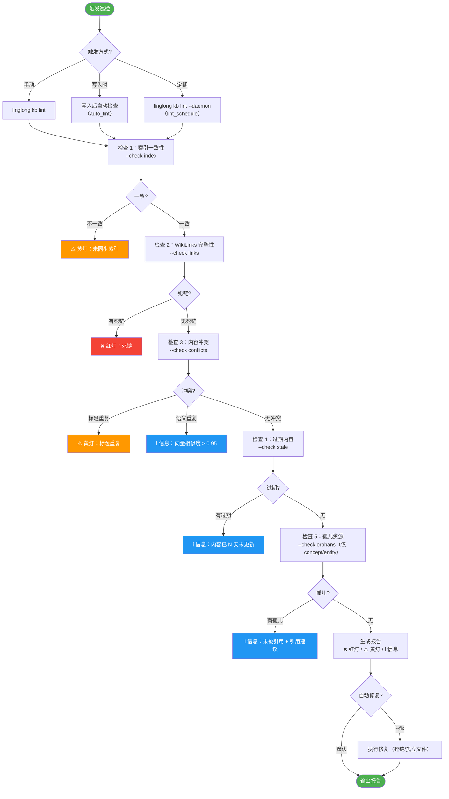

# 知识库巡检设计

| 属性 | 值 |
|------|-----|
| 分类 | 质量层 |
| 状态 | ✅ 已实现 |
| 依赖 | [D-02 目录结构](02-directory-structure.md), [D-03 写入设计](03-write-path.md) |
| 关联实现 | `src/linglong/knowledge/lint.py`, `src/linglong/knowledge/lint_schedule.py` |
| 最后更新 | 2026-05-21 |

**未实现项**: 无

---

## 巡检完整流程



---

## 检测项清单

### 检查 1：索引一致性

| 问题 | 定义 | 严重度 |
|------|------|--------|
| 未同步索引 | wiki/ 下文件存在，但未在 `index-*.md` 中注册 | ⚠️ 黄灯 |
| 索引指向缺失 | `index-*.md` 指向的文件不存在 | ❌ 红灯 |
| Facet 不匹配 | 文件 frontmatter 的 type 与所在目录不一致 | ⚠️ 黄灯 |

### 检查 2：WikiLinks 完整性

| 问题 | 定义 | 严重度 |
|------|------|--------|
| 死链 | `[[target]]` 指向的文件不存在 | ❌ 红灯 |
| 孤儿资源 | 文件存在但无任何其他页面引用 | ⚠️ 黄灯 |
| 代码块内链接 | `[[...]]` 出现在代码块中（误匹配） | 跳过 |

### 检查 3：内容冲突

| 问题 | 定义 | 严重度 |
|------|------|--------|
| 标题重复 | 两个 Entity 的标题相同（`diary`、`task-record` 目录豁免） | ⚠️ 黄灯 |

### 检查 4：过期内容

| 问题 | 定义 | 严重度 |
|------|------|--------|
| 长期未更新 | Entity 超过 N 天未更新（可配置，默认 90 天） | ℹ️ 信息 |

---

## 严重度分级

| 等级 | 标记 | 含义 | 处理方式 |
|------|------|------|----------|
| ❌ 红灯 | `ERROR` | 数据完整性问题 | 必须修复 |
| ⚠️ 黄灯 | `WARNING` | 质量问题 | 建议修复 |
| ℹ️ 信息 | `INFO` | 提示信息 | 无需处理 |
| ✅ 绿灯 | `OK` | 正常 | 无需处理 |

---

## 修复优先级

| 优先级 | 条件 | 处理方式 |
|--------|------|----------|
| **P0** | 红灯（死链/索引缺失/冲突） | 立即修复 |
| **P1** | 黄灯（未同步索引/孤儿） | 建议修复 |
| **P2** | 黄灯（过期内容/重复） | 可延后 |

---

## 自动修复 vs 人工确认

### 可自动修复（--fix）

- **孤立文件** → 删除 wiki/ 下存在但数据库无记录的 `.md` 文件
- **死链** → 将 `[[target]]` 转换为纯文本（保留显示文本）

### 需要人工确认

- **标题重复** → 需要决定：合并 / 保留一个 / 标记为不同角度
- **过期内容** → 需要人工判断内容是否仍有效，或触发归档

### 修复前备份

硬约束：**修复前必须先备份，禁止直接覆盖、删除、重命名任何文件**

---

## 触发方式

### 手动触发

```bash
linglong kb lint                              # 完整巡检
linglong kb lint --rule index_consistency     # 只检查索引一致性
linglong kb lint --rule wikilinks             # 只检查 WikiLinks
linglong kb lint --rule content_conflict      # 只检查内容冲突
linglong kb lint --rule stale_content         # 只检查过期内容
linglong kb lint --fix                        # 巡检 + 自动修复
linglong kb lint --stale-days 30              # 自定义过期阈值（默认 90 天）
```

### 写入时触发

通过 `.linglong.yaml` 开启写入后自动检查（默认关闭）：

```yaml
knowledge:
  auto_lint: true
```

开启后，每次 `linglong kb write` / `linglong kb update` 后会自动执行完整巡检，发现的问题通过日志输出。

### 定期巡检

支持两种定时执行方式：

```bash
# 方式 1：守护进程模式（常驻后台，按 lint_schedule 执行）
linglong kb lint --daemon

# 方式 2：系统 cron 直接调用（执行一次后退出）
linglong kb lint --run-scheduled
```

```yaml
# .linglong.yaml
knowledge:
  lint_schedule: "0 2 * * *"  # 每天凌晨 2 点（仅 --daemon 模式使用）
```

---

## 报告格式

```markdown
# 知识库巡检报告

> 时间：2026-05-14 10:30
> 范围：全量检查

## 摘要

| 等级 | 数量 |
|------|------|
| ✅ 绿灯 | 65 |
| ⚠️ 黄灯 | 3 |
| ❌ 红灯 | 1 |

## ❌ 红灯项

### 1. 死链：[[xxx]] 指向不存在的文件
- 来源：concepts/llm-wiki.md 第 15 行
- 建议：创建 stub 或删除引用
- 优先级：P0

## ⚠️ 黄灯项

### 1. 孤儿资源：entities/old-tool.md
- 无任何页面引用
- 建议：检查是否还有价值，无价值则归档
- 优先级：P2

## ✅ 绿灯项
- 索引一致性：通过
- WikiLinks 完整性：通过
- 内容冲突：无
```

---

## CLI 命令

```bash
# 完整巡检
linglong kb lint

# 只检查特定规则
linglong kb lint --rule index_consistency  # 只检查索引一致性
linglong kb lint --rule wikilinks          # 只检查 WikiLinks
linglong kb lint --rule content_conflict   # 只检查内容冲突
linglong kb lint --rule stale_content      # 只检查过期内容

# 巡检 + 自动修复
linglong kb lint --fix

# 自定义过期阈值（默认 90 天）
linglong kb lint --stale-days 30
```

---

## 设计决策记录

| 编号 | 决策 | 选择 | 原因 | 替代方案 |
|------|------|------|------|----------|
| D-05a | 严重度分级 | 红灯/黄灯/绿灯三级 | 明确处理优先级 | 二级（问题/正常） |
| D-05b | 修复策略 | 自动修复需 --fix，手动确认默认 | 防止误操作 | 全自动 |
| D-05c | 触发方式 | 手动 + 写入时 + 定期（可选） | 灵活控制检查频率 | 仅手动 |

## 版本变动历史

| 版本 | 日期 | 变动摘要 | 影响范围 |
|------|------|----------|----------|
| v1.0 | 2026-05-14 | 初始设计 | 全文 |
| v1.1 | 2026-05-20 | 同步代码实现：补充 stale_content、更新 --fix / --rule / --stale-days CLI、auto_lint 配置 | 检测项、CLI、触发方式、修复策略 |
| v1.2 | 2026-05-21 | 全部设计项已实现：孤儿资源检测（concept/entity）、向量语义去重、定期巡检（--daemon）、--check 子项过滤。状态升级为✅已实现 | 全文 |

## 关联文档

| 文档 | 关系 |
|------|------|
| [D-02 目录结构](02-directory-structure.md) | 索引文件规范 |
| [D-03 写入设计](03-write-path.md) | 写入时一致性检查 |
| [D-06 Agent 接入](06-agent-integration.md) | lint CLI 命令 |
| [D-08 初始化与并发](08-init-and-concurrency.md) | 写入-索引一致性保证 |
