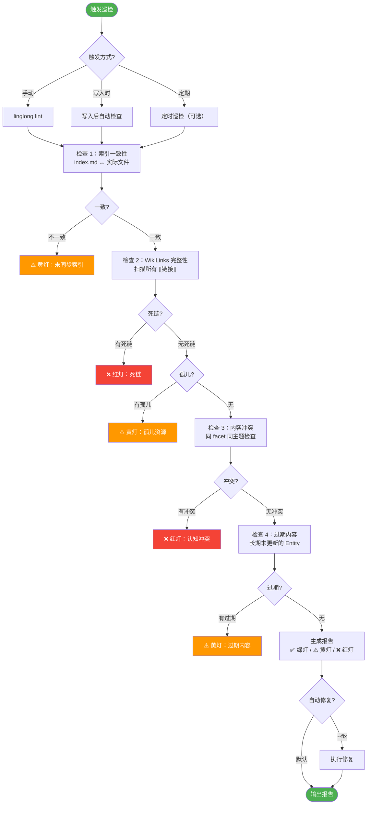

# 知识库巡检设计

| 属性 | 值 |
|------|-----|
| 分类 | 质量层 |
| 状态 | 🟡 部分实现 |
| 依赖 | [D-02 目录结构](02-directory-structure.md), [D-03 写入设计](03-write-path.md) |
| 关联实现 | `src/linglong/knowledge/lint.py` |
| 最后更新 | 2026-05-14 |

**未实现项**: 自动修复（--fix）、定期巡检、内容冲突检测

---

## 巡检完整流程



---

## 检测项清单

### 检查 1：索引一致性

| 问题 | 定义 | 严重度 |
|------|------|--------|
| 未同步索引 | wiki/ 下文件存在，但未在 `index-*.md` 中注册 | ⚠️ 黄灯 |
| 索引指向缺失 | `index-*.md` 指向的文件不存在 | ❌ 红灯 |
| Facet 不匹配 | 文件 frontmatter 的 type 与所在目录不一致 | ⚠️ 黄灯 |

### 检查 2：WikiLinks 完整性

| 问题 | 定义 | 严重度 |
|------|------|--------|
| 死链 | `[[target]]` 指向的文件不存在 | ❌ 红灯 |
| 孤儿资源 | 文件存在但无任何其他页面引用 | ⚠️ 黄灯 |
| 代码块内链接 | `[[...]]` 出现在代码块中（误匹配） | 跳过 |

### 检查 3：内容冲突

| 问题 | 定义 | 严重度 |
|------|------|--------|
| 认知冲突 | 同 facet 同主题的两个 Entity 内容矛盾 | ❌ 红灯 |
| 重复内容 | 两个 Entity 的向量相似度 > 0.95 | ⚠️ 黄灯 |

### 检查 4：过期内容

| 问题 | 定义 | 严重度 |
|------|------|--------|
| 长期未更新 | Entity 超过 N 天未更新（可配置） | ⚠️ 黄灯 |
| 未确认内容 | PENDING_REVIEW 状态超过 N 天 | ⚠️ 黄灯 |

---

## 严重度分级

| 等级 | 标记 | 含义 | 处理方式 |
|------|------|------|----------|
| ❌ 红灯 | `CRITICAL` | 数据完整性问题 | 必须修复 |
| ⚠️ 黄灯 | `WARNING` | 质量问题 | 建议修复 |
| ✅ 绿灯 | `OK` | 正常 | 无需处理 |

---

## 修复优先级

| 优先级 | 条件 | 处理方式 |
|--------|------|----------|
| **P0** | 红灯（死链/索引缺失/冲突） | 立即修复 |
| **P1** | 黄灯（未同步索引/孤儿） | 建议修复 |
| **P2** | 黄灯（过期内容/重复） | 可延后 |

---

## 自动修复 vs 人工确认

### 可自动修复（--fix）

- **未同步索引** → 自动重建索引
- **索引指向缺失** → 从索引中移除无效条目
- **孤儿资源** → 添加到相关索引（如果有匹配的 facet）

### 需要人工确认

- **死链** → 需要决定：创建 stub / 重新映射 / 删除引用
- **认知冲突** → 需要决定：保留哪个版本 / 合并 / 保留两者
- **重复内容** → 需要决定：合并 / 保留一个 / 标记为不同角度

### 修复前备份

硬约束：**修复前必须先备份，禁止直接覆盖、删除、重命名任何文件**

---

## 触发方式

### 手动触发

```bash
linglong lint                  # 完整巡检
linglong lint --facet concept  # 只检查 concept
linglong lint --fix            # 巡检 + 自动修复
```

### 写入时触发

每次 `linglong write` 后自动执行轻量检查：
- 新 Entity 的 WikiLinks 是否指向有效目标
- 新 Entity 是否与已有 Entity 重复

### 定期巡检（可选）

```yaml
# .linglong.yaml
knowledge:
  lint_schedule: "0 2 * * *"  # 每天凌晨 2 点
```

---

## 报告格式

```markdown
# 知识库巡检报告

> 时间：2026-05-14 10:30
> 范围：全量检查

## 摘要

| 等级 | 数量 |
|------|------|
| ✅ 绿灯 | 65 |
| ⚠️ 黄灯 | 3 |
| ❌ 红灯 | 1 |

## ❌ 红灯项

### 1. 死链：[[xxx]] 指向不存在的文件
- 来源：concepts/llm-wiki.md 第 15 行
- 建议：创建 stub 或删除引用
- 优先级：P0

## ⚠️ 黄灯项

### 1. 孤儿资源：entities/old-tool.md
- 无任何页面引用
- 建议：检查是否还有价值，无价值则归档
- 优先级：P2

## ✅ 绿灯项
- 索引一致性：通过
- WikiLinks 完整性：通过
- 内容冲突：无
```

---

## CLI 命令

```bash
# 完整巡检
linglong lint

# 只检查特定 facet
linglong lint --facet concept

# 巡检 + 自动修复
linglong lint --fix

# 输出 JSON 格式（供程序消费）
linglong lint --format json

# 只检查特定检测项
linglong lint --check index        # 只检查索引一致性
linglong lint --check links        # 只检查 WikiLinks
linglong lint --check conflicts    # 只检查内容冲突
```

---

## 设计决策记录

| 编号 | 决策 | 选择 | 原因 | 替代方案 |
|------|------|------|------|----------|
| D-05a | 严重度分级 | 红灯/黄灯/绿灯三级 | 明确处理优先级 | 二级（问题/正常） |
| D-05b | 修复策略 | 自动修复需 --fix，手动确认默认 | 防止误操作 | 全自动 |
| D-05c | 触发方式 | 手动 + 写入时 + 定期（可选） | 灵活控制检查频率 | 仅手动 |

## 版本变动历史

| 版本 | 日期 | 变动摘要 | 影响范围 |
|------|------|----------|----------|
| v1.0 | 2026-05-14 | 初始设计 | 全文 |

## 关联文档

| 文档 | 关系 |
|------|------|
| [D-02 目录结构](02-directory-structure.md) | 索引文件规范 |
| [D-03 写入设计](03-write-path.md) | 写入时一致性检查 |
| [D-06 Agent 接入](06-agent-integration.md) | lint CLI 命令 |
| [D-08 初始化与并发](08-init-and-concurrency.md) | 写入-索引一致性保证 |
