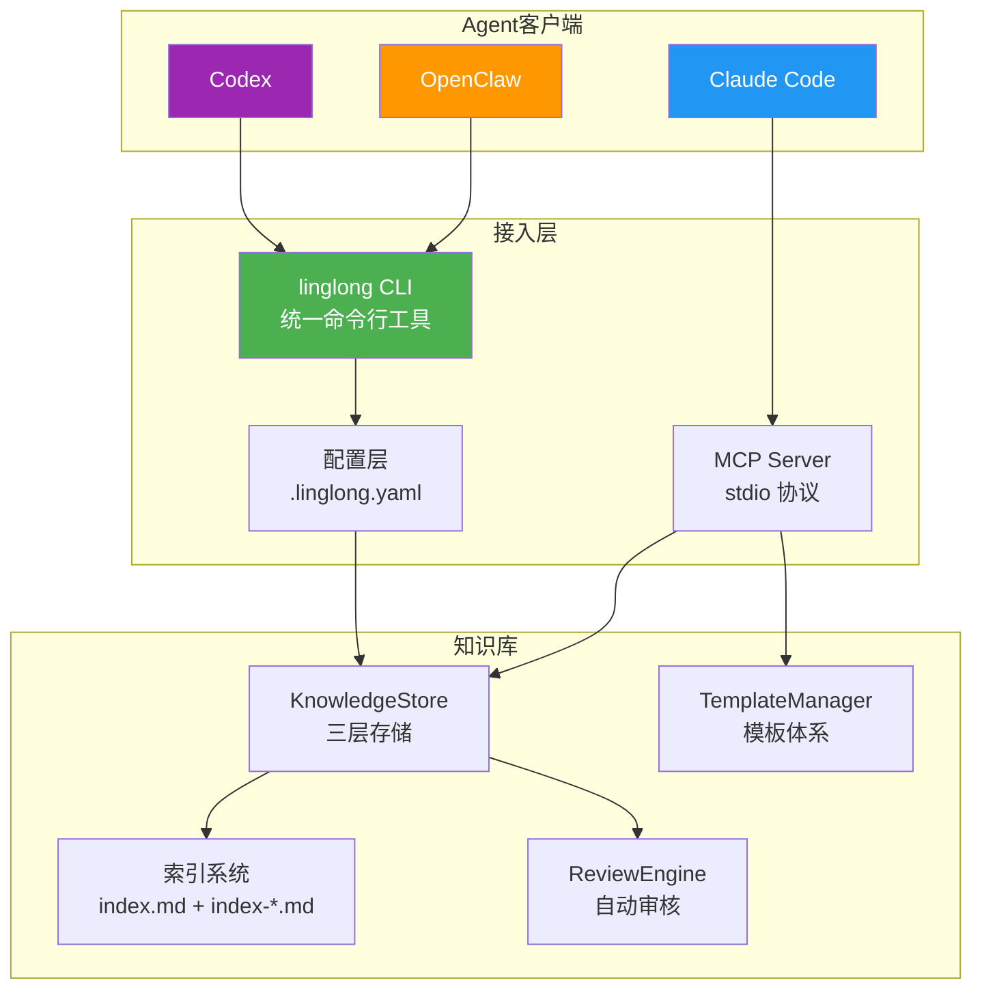
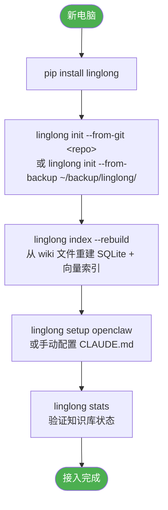

# Agent 接入设计

| 属性 | 值 |
|------|-----|
| 分类 | 接入层 |
| 状态 | 🟡 部分实现 |
| 依赖 | [D-03 写入设计](03-write-path.md), [D-04 搜索设计](04-search.md) |
| 关联实现 | `src/linglong/cli.py`, `src/linglong/knowledge/sync/*.py` |
| 最后更新 | 2026-05-14 |

**未实现项**: OpenClaw 默认 wiki 路径支持（见 D-09 BACKLOG-002）、Agent hooks 自动同步

---

## Agent 接入架构



---

## CLI 工具设计

### 命令总览

| 命令 | 用途 | 示例 |
|------|------|------|
| `search` | 搜索知识 | `linglong search "支付" --facet concept` |
| `read` | 读取详情 | `linglong read <id>` |
| `write` | 写入知识 | `linglong write --facet concept --title "..." --content "..."` |
| `review` | 审核管理 | `linglong review --list-pending` |
| `lint` | 健康巡检 | `linglong lint` |
| `index` | 索引管理 | `linglong index --rebuild` |
| `migrate` | 迁移工具 | `linglong migrate --from ~/.openclaw/workspace/memory/wiki/` |
| `stats` | 统计信息 | `linglong stats` |
| `template` | 模板管理 | `linglong template list` / `linglong template get concept` |
| `archive` | 归档管理 | `linglong archive <id>` |

### search — 搜索

```bash
linglong search "关键词"
linglong search "关键词" --facet concept
linglong search "关键词" --mode keyword|vector|hybrid
linglong search "关键词" --deep
linglong search "关键词" --status auto_confirmed
linglong search "关键词" --created-by agent:claude
linglong search "关键词" --limit 10
linglong search "关键词" --since 2026-05-01
```

### read — 读取

```bash
linglong read <entity-id>
linglong read --path concepts/llm-wiki.md
linglong read <entity-id> --format json
linglong read <entity-id> --format markdown
```

### write — 写入

```bash
linglong write --facet concept --title "标题" --content "内容"
linglong write --facet experience --from-file article.md
linglong write --facet entity --title "OpenClaw" --content "..." --yes
linglong write --facet source --title "..." --content "..." --no-index
```

### review — 审核

```bash
linglong review --list-pending
linglong review --approve <entity-id>
linglong review --reject <entity-id>
linglong review --list-pending --facet concept
```

### lint — 巡检

```bash
linglong lint
linglong lint --fix
linglong lint --facet concept
linglong lint --check index|links|conflicts
linglong lint --format json
```

### index — 索引

```bash
linglong index                     # 查看索引概览
linglong index --facet concept     # 查看分类索引
linglong index --rebuild           # 重建所有索引
linglong index --rebuild --facet concept  # 重建分类索引
```

### migrate — 迁移

```bash
linglong migrate --from ~/.openclaw/workspace/memory/wiki/
linglong migrate --from ~/.openclaw/workspace/memory/wiki/ --dry-run
linglong migrate --from ~/.openclaw/workspace/memory/wiki/ --no-index
```

### stats — 统计

```bash
linglong stats
# → 各 facet 文件数、总大小、最近更新时间、索引状态
```

---

## 默认值 + CLI 覆盖模式

优先级：**CLI 参数 > 配置文件 > 硬编码默认值**

| 参数 | 默认值 | 配置文件 key | CLI 覆盖 | 适用场景 |
|------|--------|-------------|----------|----------|
| 写入模式 | `confirm` | `knowledge.write_mode` | `--yes` | 批量导入时跳过确认 |
| 查询模式 | `on_demand` | `knowledge.search_mode` | `--deep` | 需要完整上下文时 |
| 索引更新 | `auto` | `knowledge.auto_index` | `--no-index` | 批量写入时跳过索引更新 |

### 配置文件示例

```yaml
# .linglong.yaml
knowledge:
  wiki_path: ~/linglong/wiki
  db_path: ~/linglong/db/knowledge.db
  write_mode: confirm        # confirm | auto
  search_mode: on_demand     # on_demand | deep
  auto_index: true           # true | false
  vector_enabled: true
  embedding_url: http://localhost:7997
  embedding_model: nomic-embed-text-v1.5
```

---

## Agent 接入配置

### OpenClaw 接入

在 OpenClaw 的 agent.md 或 heartbeat.md 中配置：

```yaml
tools:
  - name: linglong-search
    command: linglong search "{query}" --facet {facet} --limit {limit}
    description: 搜索 Linglong 知识库
    
  - name: linglong-read
    command: linglong read {id}
    description: 读取知识条目
    
  - name: linglong-write
    command: linglong write --facet {facet} --title "{title}" --content "{content}"
    description: 写入知识条目（默认提示确认）
```

### Claude Code 接入

Claude Code 通过 **MCP Server** 接入 Linglong，实现原生工具调用。

#### MCP 配置

在 `~/.claude/mcp.json` 中添加：

```json
{
  "mcpServers": {
    "linglong": {
      "command": "bash",
      "args": [
        "-c",
        "source /path/to/linglong/venv/bin/activate && python -m linglong.mcp"
      ]
    }
  }
}
```

#### MCP 工具清单

| 工具 | 用途 | 示例场景 |
|------|------|----------|
| `search_wiki` | FTS5 全文搜索 | 用户提问时检索相关知识 |
| `search_similar` | 向量语义搜索 | 找语义相近的内容 |
| `search_and_read` | 搜索+读取全文 | 详细讲解某个主题 |
| `read_entity` | 读取完整内容 | 查看某条知识的详情 |
| `write_entity` | 写入新知识 | 记录踩坑经验、架构决策 |
| `update_entity` | 更新已有条目 | 追加内容或修正错误 |
| `list_entities` | 浏览最近条目 | 查看最近更新的知识 |
| `get_template` | 获取写作模板 | 写入前参考格式 |
| `list_templates` | 列出所有模板 | 了解可用模板 |

#### 读取时机

- 当用户提问时，调用 `search_wiki` 或 `search_and_read` 检索知识库
- 当遇到不确定的概念，搜索 `--facet concept`
- 当引用历史决策时，调用 `read_entity`

#### 写入时机

- 当用户说"记住"、"记录"、"保存到知识库"时
- 当解决了一个非 trivial 的问题后
- 当做出架构决策时
- **写入前调用 `get_template(facet)` 获取模板，确保格式一致**

#### 写入最佳实践

```
1. get_template(facet) → 获取模板结构
2. search_wiki(facet) → 搜索同类文档参考格式
3. write_entity(title, content, facet, tags) → 写入
```

### Codex 接入

与 Claude Code 类似，在 Codex 配置中注册 CLI 工具。

---

## 触发时机规则

### 读取时机

| 触发点 | 时机 | 做什么 |
|--------|------|--------|
| 用户提问 | Agent 收到问题 | `linglong search "关键词"` |
| 遇到陌生话题 | Agent 不确定 | `linglong search "概念" --facet concept` |
| 引用历史 | 提到过去决策 | `linglong read <id>` |

### 写入时机

| 触发点 | 时机 | 写入什么 | Facet |
|--------|------|----------|-------|
| 用户说"记住" | 显式指令 | 用户指定内容 | 根据内容判断 |
| 解决 bug | 问题解决 | 问题 + 原因 + 方案 | `experience` |
| 学到新知识 | 对话中 | 概念 + 例子 | `concept` |
| 完成任务 | 任务完成 | 任务描述 + 结果 | `source` |
| 发现新实体 | 提到新名词 | 实体卡片 | `entity` |

### 写入判断标准

```
✅ 值得写入：将来可能再次需要、跨项目通用、踩坑经验、用户要求
❌ 不值得写：一次性信息、代码本身、临时状态、已存在文档中
```

---

## 新电脑一键接入流程



### 关键设计：SQLite 可重建

```
~/linglong/wiki/          ← 真实数据源（Markdown 文件）
~/linglong/db/knowledge.db ← 索引，可从 wiki 文件重建
```

新机器只需：
1. 拉取 wiki 文件（Git clone 或备份恢复）
2. `linglong index --rebuild` 从 wiki 文件重建 SQLite + 向量索引
3. 完成

SQLite 数据库不需要同步/分发，它是 wiki 文件的衍生索引。

---

## 迁移工具

### 从 OpenClaw wiki 迁移

```bash
# 预览迁移（不实际执行）
linglong migrate --from ~/.openclaw/workspace/memory/wiki/ --dry-run

# 执行迁移
linglong migrate --from ~/.openclaw/workspace/memory/wiki/

# 迁移 + 跳过索引更新（批量场景）
linglong migrate --from ~/.openclaw/workspace/memory/wiki/ --no-index
```

迁移逻辑：
1. 扫描源目录下所有 .md 文件
2. 解析 frontmatter 的 `type` 字段，映射到 Linglong facet
3. 计算 Entity ID（基于文件路径的 SHA-256）
4. 调用 `linglong write` 写入（支持去重）
5. 更新索引

---

## 设计决策记录

| 编号 | 决策 | 选择 | 原因 | 替代方案 |
|------|------|------|------|----------|
| D-06a | 接入方式 | CLI 命令行 | Agent 无需代码集成 | SDK/API |
| D-06b | 配置优先级 | CLI > .linglong.yaml > 默认值 | 灵活覆盖 | 仅配置文件 |
| D-06c | 迁移策略 | 渐进式四阶段 | 降低迁移风险 | 一次性全量 |

## 版本变动历史

| 版本 | 日期 | 变动摘要 | 影响范围 |
|------|------|----------|----------|
| v1.0 | 2026-05-14 | 初始设计 | 全文 |
| v1.1 | 2026-05-20 | 新增 MCP Server 接入方式，9 个 MCP 工具，模板体系 | Agent 接入、工具清单 |

## 关联文档

| 文档 | 关系 |
|------|------|
| [D-03 写入设计](03-write-path.md) | 写入流程、确认模式 |
| [D-04 搜索设计](04-search.md) | 搜索命令、模式选择 |
| [D-05 巡检设计](05-lint.md) | lint 命令、报告格式 |
| [D-07 更新设计](07-update-path.md) | update 命令 |
| [D-08 初始化与并发](08-init-and-concurrency.md) | init 命令详解 |
