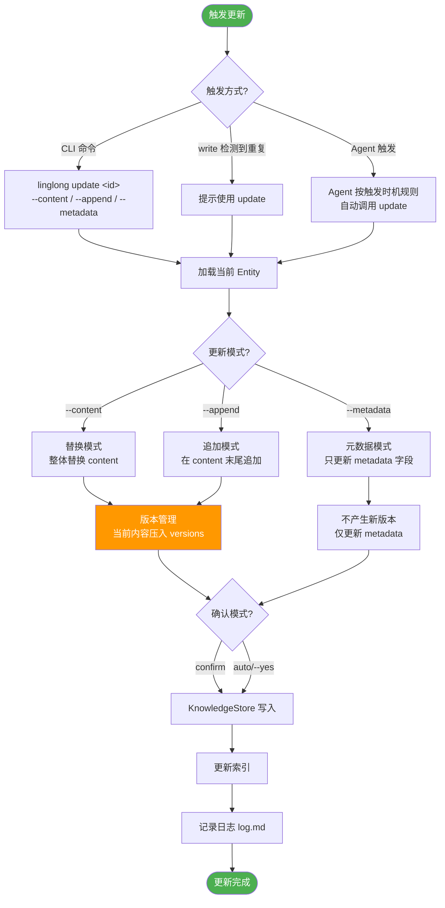
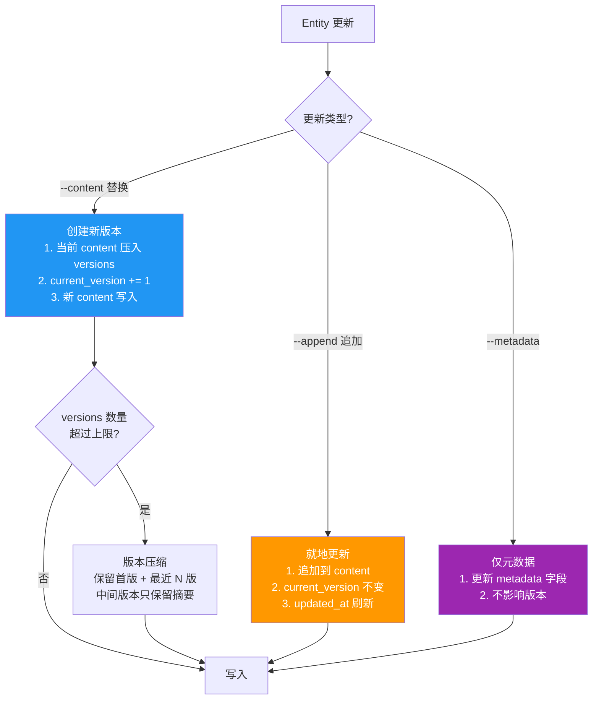

# 知识库更新设计

| 属性 | 值 |
|------|-----|
| 分类 | 写入层 |
| 状态 | ✅ 已实现 |
| 依赖 | [D-01 数据模型](01-data-model.md), [D-03 写入设计](03-write-path.md) |
| 关联实现 | `src/linglong/knowledge/store.py` |
| 最后更新 | 2026-05-14 |

---

## 问题背景

03-write-path 覆盖了 Entity 的**创建**和**归档**，但**更新已有 Entity** 缺失。实际场景中，Agent 更新已有知识的频率不低于新建：

- 架构决策变更 → 更新 concept
- 工具版本升级 → 更新 entity
- 经验补充新发现 → 更新 experience
- 多 Agent 对同一主题补充信息 → 合并更新

如果没有明确的更新流程，Agent 只能"新建然后内容重复"，或者"覆盖然后丢失历史"。

---

## 更新 vs 创建 — 命令设计

### 设计决策：write 检测重复时引导 update

`linglong write` 保持**创建语义**。当检测到已存在相似 Entity 时，引导用户使用 `linglong update`：

```bash
# 尝试写入
linglong write --facet concept --title "微服务架构" --content "..."

# 如果检测到同名/相似 Entity，输出提示：
⚠️ 已存在相似条目：
  [concepts/microservice-arch.md] 微服务架构 (updated: 2026-05-10)
  建议：linglong update concepts/microservice-arch.md --append "补充内容"

# 如果确认要新建（不同角度）：
linglong write --facet concept --title "微服务架构" --content "..." --force
```

### 命令对比

| 命令 | 语义 | 使用场景 |
|------|------|----------|
| `linglong write` | 创建新 Entity | 新知识、新主题 |
| `linglong update` | 更新已有 Entity | 补充信息、修正内容、版本升级 |
| `linglong write --force` | 强制创建（即使重复） | 同一主题的不同角度/来源 |

---

## 更新数据流



---

## 更新模式详解

### 模式 1：替换（--content）

整体替换 Entity 的 content 字段。适用于内容重写、重大修订。

```bash
linglong update concepts/microservice-arch.md --content "# 微服务架构

## 更新后的完整内容
..."
```

行为：
- 当前 `content` 压入 `versions` 列表
- `current_version` +1
- 新 content 写入文件和 SQLite
- 向量索引重建

### 模式 2：追加（--append）

在现有 content 末尾追加内容。适用于补充信息、添加章节。

```bash
linglong update concepts/microservice-arch.md --append "

## 2026-05-14 补充

服务间通信推荐 gRPC 而非 REST，原因：性能 + 类型安全。"
```

行为：
- 当前 `content` 不压入 versions（追加属于增量修改）
- 追加内容写入文件
- SQLite 和向量索引更新
- `updated_at` 刷新

### 模式 3：元数据更新（--metadata）

只更新 Entity 的元数据字段，不修改 content。

```bash
# 更新置信度
linglong update <id> --metadata confidence=0.95

# 添加标签
linglong update <id> --metadata tags+=架构

# 修改状态
linglong update <id> --metadata status=confirmed
```

### 版本策略对比

| 操作 | 产生新版本 | 理由 |
|------|-----------|------|
| `--content` 替换 | ✅ 是 | 旧内容被完全覆盖，需保留历史 |
| `--append` 追加 | ❌ 否 | 旧内容仍然存在，只是增加了新内容 |
| `--metadata` | ❌ 否 | 内容未变，仅元数据更新 |

---

## 版本管理

### 版本数据结构

```python
class Version(BaseModel):
    version: int              # 版本号（递增）
    content: str              # 该版本的完整内容
    modified_by: str          # 修改者（如 agent:claude）
    modified_at: datetime     # 修改时间
    change_summary: str       # 变更摘要（可选）
```

### 版本生命周期



### 版本上限

| 参数 | 默认值 | 配置 key | 说明 |
|------|--------|----------|------|
| `max_versions` | 10 | `knowledge.max_versions` | 每个 Entity 保留的最大版本数 |

超出上限时执行压缩：
- **始终保留**：首版（v1）+ 最新版（current）
- **中间版本**：只保留 `change_summary`，content 丢弃
- **目的**：防止 versions 列表无限膨胀

### 版本查询

```bash
# 查看版本历史
linglong update <id> --history

# 输出：
# v1 | 2026-05-10 | agent:openclaw | 初始创建
# v2 | 2026-05-12 | agent:claude   | 补充设计原则
# v3 | 2026-05-14 | agent:openclaw | 更新架构图（当前版本）

# 查看特定版本内容
linglong update <id> --show-version 2
```

---

## Wiki 文件更新

### Frontmatter 同步

更新时 frontmatter 自动更新：

```yaml
---
type: concept
description: 微服务架构设计原则
created: 2026-05-10
updated: 2026-05-14          # ← 更新时间
status: auto_confirmed
confidence: 0.9
current_version: 3           # ← 版本号
created_by: agent:openclaw
---
```

### 存储职责划分

```
~/linglong/wiki/concepts/microservice-arch.md    ← 当前版本 content（真相源）
~/linglong/db/knowledge.db                        ← versions 表（历史版本，增值数据）
```

`linglong index --rebuild` 时：
- wiki 文件 → 重建 SQLite 主表 + 向量索引 ✅
- versions 历史丢失 ⚠️（可接受，版本历史是增值数据，非核心）

---

## 多 Agent 更新冲突

### 同 Agent 更新

```bash
# Agent A 创建 → Agent A 更新：直接更新，无需额外确认
```

### 不同 Agent 更新

```bash
# Agent A 创建 → Agent B 更新：提示确认
⚠️ 此条目由 agent:openclaw 创建，你（agent:claude）即将更新。
   当前版本：v2 (2026-05-12)
   更新模式：追加
   [确认更新] [取消] [查看差异]
```

### 乐观锁

使用 `updated_at` 作为版本戳，更新时检查：

```python
def update(entity_id, new_content, expected_updated_at):
    current = store.get(entity_id)
    if current.updated_at != expected_updated_at:
        raise ConflictError(
            f"版本冲突：基于 {expected_updated_at}，"
            f"当前已是 {current.updated_at}"
        )
    # 应用更新...
```

---

## 索引同步

| 操作 | index.md | index-*.md | 向量索引 | FTS5 |
|------|----------|------------|----------|------|
| `--content` 替换 | 更新 updated_at | 更新摘要 | 重建 | 重建 |
| `--append` 追加 | 更新 updated_at | 不变 | 重建 | 增量更新 |
| `--metadata` | 可能更新 | 不变 | 不变 | 不变 |

---

## CLI 命令汇总

```bash
# 替换内容（产生新版本）
linglong update <id> --content "新内容"
linglong update <id> --from-file updated.md

# 追加内容（不产生新版本）
linglong update <id> --append "补充内容"

# 更新元数据
linglong update <id> --metadata confidence=0.95
linglong update <id> --metadata tags+=架构
linglong update <id> --metadata status=confirmed

# 查看版本历史
linglong update <id> --history
linglong update <id> --show-version 2

# 跳过确认
linglong update <id> --content "..." --yes

# 跳过索引更新
linglong update <id> --content "..." --no-index
```

---

## 更新触发时机

| 触发点 | 时机 | 使用模式 | Facet |
|--------|------|----------|-------|
| 架构决策变更 | 原则/方案变化 | `--content` 替换 | `concept` |
| 工具版本升级 | 新版本发布 | `--append` 追加 | `entity` |
| 经验补充 | 发现新信息 | `--append` 追加 | `experience` |
| 置信度调整 | 验证后提升/降低 | `--metadata` | 所有 |
| 状态变更 | 人工审核后 | `--metadata` | 所有 |

---

## 设计决策记录

| 编号 | 决策 | 选择 | 原因 | 替代方案 |
|------|------|------|------|----------|
| D-07a | write vs update | write 创建 + update 更新 + --force 覆盖 | 语义清晰 | 统一 write 命令 |
| D-07b | 追加不产生新版本 | --append 只更新不压栈 | 旧内容仍在，无需版本化 | 所有更新都产生版本 |
| D-07c | 版本压缩策略 | 保留首版 + 最近 N 版，中间仅摘要 | 防止无限膨胀 | 保留全部 |
| D-07d | 冲突检测 | 乐观锁（updated_at 校验） | 简单可靠 | 悲观锁 |

## 版本变动历史

| 版本 | 日期 | 变动摘要 | 影响范围 |
|------|------|----------|----------|
| v1.0 | 2026-05-14 | 初始设计 | 全文 |

## 关联文档

| 文档 | 关系 |
|------|------|
| [D-03 写入设计](03-write-path.md) | 创建流程（与本篇对称） |
| [D-01 数据模型](01-data-model.md) | Entity 模型、versions 字段 |
| [D-04 搜索设计](04-search.md) | 去重时的搜索策略 |
| [D-08 初始化与并发](08-init-and-concurrency.md) | 并发写入协调 |
