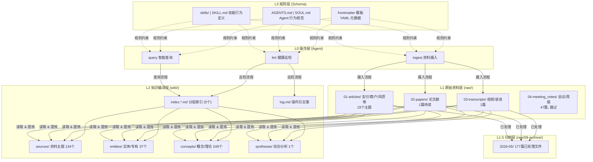
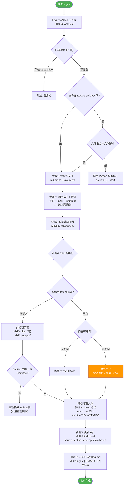
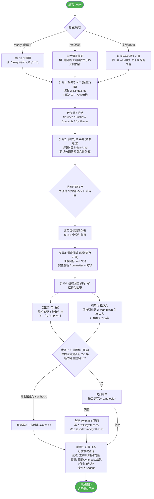

# LLM-Wiki 参考设计

> 本文件记录 LLM-Wiki 知识库架构设计，作为 Linglong knowledge 模块演进的参考。
> 来源：知识库设计流程图（2026-05-14）。

---

## 四层架构总览



**关键指标**：Sources 134 | Entities 37 | Concepts 249 | Syntheses 1 | 共 433 个文件

---

## 分面分类（Facet Taxonomy）

| 分类 | 定义 | 路径 | 当前规模 |
|------|------|------|----------|
| Sources | 原始资料的分主题汇编，每源对应一篇 raw/ 文章 | `wiki/sources/` | 134 |
| Entities | 人物、公司、产品、地点等专有名词 | `wiki/entities/` | 37 |
| Concepts | 框架、模型、理论、方法论等抽象知识 | `wiki/concepts/` | 249 |
| Syntheses | 跨源综合分析（由多次 query 聚合而成） | `wiki/syntheses/` | 1 |

---

## Ingest 摄入流程



### 摄入关键决策

| 决策 | 当前方案 | 备选 |
|------|----------|------|
| **去重策略** | 已归档: 存在 `raw/01-articles/` 下 → 跳过 | 09-archive/ 检查 |
| **特殊文件处理** | 中文/特殊字符 → Python 脚本修正 | os.listdir() + 转译 |
| **Stub 自动替换** | 创建 source 时自动检测并替换占位链接 | 手动维护 |

### 原始资料库存 (raw/)

| 类型 | 内容 | 待处理 |
|------|------|--------|
| 01-articles/ | 支付/商户/风控等 19 个主题 | 192 篇 |
| 02-papers/ | 论文献 | 1 篇待读 |
| 03-transcripts/ | 视频/语音/直播 | 1 篇 |
| 04-meeting_notes/ | 会议/周报（跳过） | 47 篇 |

---

## Query 查询流程



### 两步定位设计（关键决策）

**为什么不是直接查全部索引？**

| 方案 | 步骤1 读 index.md | 步骤2 读 index-*.md | 总成本 |
|------|-------------------|---------------------|--------|
| 旧方案（读全部） | 直接读 | 读全部文件 | ~40K tokens 全部文件 |
| **新方案（两步）** | 仅 5 条索引 | 仅 2-5 条目标 | **~1.5K 输入 + ~2K 部分文件** |

**优势**：
- `index.md` 保持轻量，无论 wiki 多大，入口仅 ~500 tokens
- 步骤1 足够判断 entities / syntheses 的精确搜索范围
- 步骤2 只读目标范围（2-5 条），再按需深入
- **Token 成本大幅降低**：从 ~40K → 平均每查询 ~2-3K

### 双链引用规范（硬约束）

- 每篇引用 ≤ Wiki 更多信息，仅作为摘要信息（不超过引用内容）
- 整篇回答中同一段落只用一次引用
- 引用非正文内容：一般引用 Markdown 的引用格式 ≥ 引用原文内容

### 降级策略

- 如果知识库没有通知知识库 wiki 中无相关内容：可引用本地笔记内容或自行组织（直接回答）

---

## Lint 巡检流程

```mermaid
flowchart TD
    Start([触发 lint]) --> Trigger{"触发方式?"}
    Trigger -->|用户主动执行| UserLint["检查知识库状态"]
    Trigger -->|定时巡检| AutoLint["自动巡检"]

    UserLint --> Step1
    AutoLint --> Step1

    Step1["步骤1: 索引一致性<br/>扫描所有 index-*.md"]

    Step1 --> FileVsIdx{"文件 vs 索引<br/>是否一致?"}
    FileVsIdx -->|文件存在但未注册| WarnIdx["⚠️ 未同步索引 (黄灯)"]
    FileVsIdx -->|索引存在但文件不存在| RedIdx["❌ 索引指向条目 (红灯)"]
    FileVsIdx -->|一致| Step2

    Step2["步骤2: 双向链接检查<br/>扫描 wiki/ 所有 .md 文件<br/>提取所有双向链接"]

    Step2 --> LinkCheck{"链接在<br/>代码块内?"}
    LinkCheck -->|是| SkipLink["跳过 (代码示例)"]
    LinkCheck -->|否| TargetExist{"目标文件是否存在?"}
    TargetExist -->|不存在| DeadLink["❌ 死链 (红灯)"]
    TargetExist -->|存在| CountRef["统计被引用次数"]
    CountRef --> RefZero{"被引用数 = 0?"}
    RefZero -->|是| Orphan["⚠️ 孤儿资源 (黄灯)<br/>标记"]
    RefZero -->|否| Normal["✅ 正常 (绿灯)"]

    Step2 --> Step3

    Step3["步骤3: 认知冲突<br/>全量搜索 wiki 知识库<br/>匹配: 技术名词/术语"]

    Step3 --> ConflictCheck{"找到冲突?"}
    ConflictCheck -->|是| ConflictRed["❌ 认知冲突 (红灯)"]
    ConflictCheck -->|否| NoConflict["✅ 无冲突 (绿灯)"]

    Step3 --> Step4

    Step4["生成结构化报告"]

    Step4 --> Report["报告输出<br/>✅ 绿灯项: 正常项<br/>⚠️ 黄灯项: 孤儿/未同步索引<br/>❌ 红灯项: 死链/未解决冲突<br/>🔧 修复建议"]

    Report --> AskUser{"用户确认修复?"}
    AskUser -->|确认| ExecuteFix["执行修复操作<br/>修复是否?"
        "按 P0-P2 优先级自动修复"
        "P0 (红灯): 死链→创建 stub 或重新映射"
        "P1 (黄灯): 常规缺链→检查是否要关联"
        "P2 (黄灯): 孤儿→添加到相关索引"
    ]
    AskUser -->|暂不修复| SkipFix["跳过"]

    ExecuteFix --> FixResult{"修复完成?"}
    FixResult -->|是| PartialFix["同步<br/>注册到<br/>index.md"]
    FixResult -->|否| ManualFix["通知用户<br/>提供手动修复方式"]

    PartialFix --> Log["添加 log.md<br/>lint | 修复了 N 个问题"]
    ManualFix --> Log
    SkipFix --> Log

    Log --> Done([完成])

    style Start fill:#4CAF50,color:#fff
    style Done fill:#4CAF50,color:#fff
    style DeadLink fill:#F44336,color:#fff
    style ConflictRed fill:#F44336,color:#fff
    style WarnIdx fill:#FF9800,color:#fff
    style Orphan fill:#FF9800,color:#fff
```

### 检测项目详解

| 问题类型 | 定义 | 严重度 |
|----------|------|--------|
| 未同步索引 | wiki/ 下文件存在，但未在 `index-*.md` 中注册 | 黄灯 |
| 索引指向条目 | `index.md` 或 `index-*.md` 存在指向，但实际文件不存在 | 红灯 |
| 死链 | Markdown 中的 `[[链接]]` 目标文件不存在 | 红灯 |
| 孤儿资源 | 文件存在但无任何其他页面引用（排除 self） | 黄灯 |
| 认知冲突 | 代码层面：`## 冲突块` 存在，发现内容矛盾 | 红灯 |
| 内容冲突 | 页面内容有 `# 认知冲突` 但页面其他文件也有类似描述 | 红灯 |

### 死链修复优先级

| 优先级 | 条件 | 处理方式 |
|--------|------|----------|
| **P0** | 被引用 ≥ 5 次的核心概念 | 立即修复：创建 stub 或重新映射 |
| **P1** | 被引用 2-4 次的常用术语 | 检查是否要关联 |
| **P2** | 被引用 1 次的边缘词 | 添加到相关索引 |

### 硬约束（必须遵守）

- 修复前必须先备份，禁止直接覆盖、删除、重命名或任何文件
- 修复涉及 index.md 用户应与用户进行交互确认
- 修复操作完成后记录在 `wiki/log.md` 且 `lint | 修复了 N 个问题`

---

## 与 Linglong knowledge 模块的映射

| LLM-Wiki 概念 | Linglong 对应 | 差距 |
|---------------|---------------|------|
| L1 raw/ 原始资料层 | ingest 模块输出 | Linglong ingest 产出 Entity，但无 raw/ 目录结构 |
| L1.5 archive/ 归档 | 无 | **可引入**：已处理文件归档 |
| L2 wiki/ 知识编译层 | KnowledgeStore (SQLite) | Linglong 是数据库，非文件系统 wiki |
| Sources/Entities/Concepts/Syntheses 分类 | Entity.status 区分 | **可引入**：四分面分类更语义化 |
| index.md / index-*.md 两步索引 | search() 方法 | **可引入**：分层索引降低查询成本 |
| L3 Schema 规则层 | 无 | **可引入**：技能定义 + Agent 行为规范 |
| Lint 巡检 | 无 | **可引入**：知识库健康检查能力 |
| log.md 操作日志 | 无 | **可引入**：可审计的操作日志 |

### 建议优先借鉴

1. **四分面分类** — Sources/Entities/Concepts/Syntheses 替代平铺 Entity
2. **两步索引** — index.md 入口 + 分类索引，降低查询 Token 消耗
3. **Lint 巡检** — 死链检测、冲突审查、索引一致性
4. **归档层** — raw/ → archive/ 的已处理文件管理
