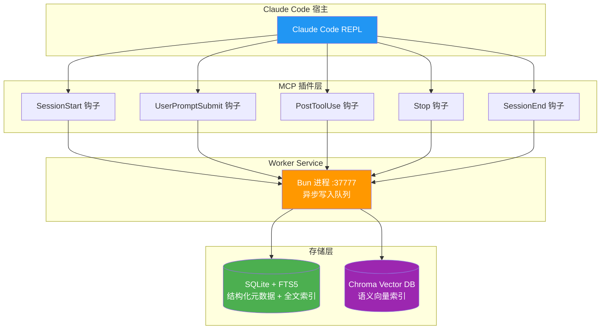
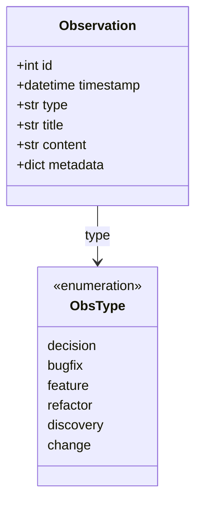
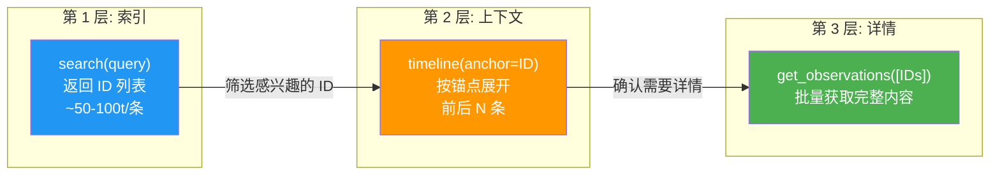
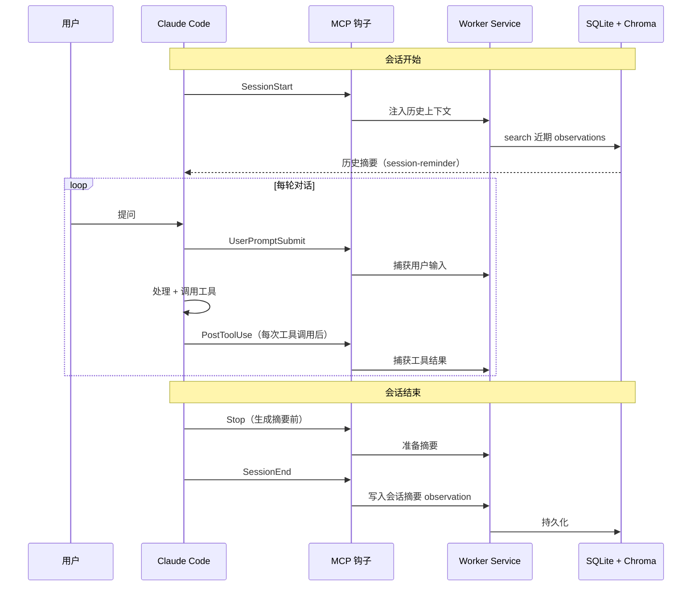
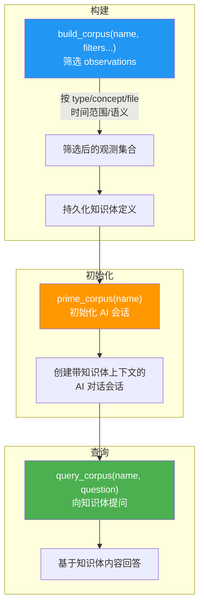

# claude-mem 架构详解

> 来源：[thedotmack/claude-mem](https://github.com/thedotmack/claude-mem) v12.1.0
> 整理日期：2026-05-14
> 用途：交叉验证 Linglong 知识库设计完备性

---

## 1. 定位

claude-mem 是 Claude Code 的 **MCP 持久记忆插件**。它通过 5 个生命周期钩子（SessionStart / UserPromptSubmit / PostToolUse / Stop / SessionEnd）自动捕获对话中的关键事件，持久化到本地 SQLite + Chroma 向量数据库，在后续会话中通过 3 层渐进式披露工作流提供上下文。

---

## 2. 系统架构



### 核心组件说明

| 组件 | 技术栈 | 职责 |
|------|--------|------|
| **MCP 钩子层** | TypeScript (MCP SDK) | 拦截 Claude Code 生命周期事件 |
| **Worker Service** | Bun (端口 37777) | 异步写入队列，避免阻塞主流程 |
| **SQLite + FTS5** | SQLite 全文检索扩展 | 结构化元数据存储 + 关键词搜索 |
| **Chroma Vector DB** | Python 向量数据库 | 语义向量索引 + 相似度搜索 |

---

## 3. 数据模型 — Observation



| 字段 | 类型 | 说明 |
|------|------|------|
| `id` | 自增整数 | 唯一标识 |
| `timestamp` | ISO datetime | 记录时间 |
| `type` | enum（6 种） | 事件分类 |
| `title` | str | 简短标题（用于索引展示） |
| `content` | str | 完整内容 |
| `metadata` | dict | 扩展元数据 |

### 6 种 type 语义

```
decision  — 架构/设计决策（为什么这么做）
bugfix    — 问题修复（什么问题、根因、方案）
feature   — 新功能交付（做了什么）
refactor  — 代码重构（改了什么、为什么）
discovery — 探索发现（代码结构、依赖关系、模式识别）
change    — 杂项变更（配置、文档、流程）
```

---

## 4. 3 层渐进式披露工作流



**设计哲学**：先返回轻量索引，再按需获取完整详情。实现约 **10 倍 token 节省**。

| 层级 | 工具 | 返回内容 | 典型 Token 消耗 |
|------|------|----------|----------------|
| 第 1 层 | `search` | ID + 标题 + 时间戳 | ~50-100/条 |
| 第 2 层 | `timeline` | 锚点前后上下文 | ~200-400 |
| 第 3 层 | `get_observations` | 完整内容 | ~500+/条 |

---

## 5. 生命周期钩子时序



### 5 个钩子触发时机

| 钩子 | 触发时机 | 作用 |
|------|----------|------|
| `SessionStart` | 会话启动 | 从 DB 加载历史上下文，注入 system-reminder |
| `UserPromptSubmit` | 用户提交 prompt | 捕获用户输入，可做预处理 |
| `PostToolUse` | 每次工具调用后 | 捕获工具执行结果 |
| `Stop` | 生成摘要前 | 准备会话级摘要 |
| `SessionEnd` | 会话结束 | 写入会话摘要到 observation |

---

## 6. Corpus 知识体机制



**Corpus 的本质**：从 observation 海量数据中提取的结构化知识子集，通过 prime + query 提供针对性的问答能力。

支持的过滤维度：

| 过滤器 | 说明 |
|--------|------|
| `types` | 按 observation type 过滤（decision/bugfix/...） |
| `concepts` | 按概念标签过滤 |
| `files` | 按关联文件路径过滤 |
| `dateStart/dateEnd` | 按时间范围过滤 |
| `query` | 语义搜索过滤 |
| `project` | 按项目过滤 |
| `limit` | 限制条数（默认 500） |

---

## 7. 辅助工具

| 工具 | 用途 | Linglong 是否需要 |
|------|------|-------------------|
| `smart_outline` | 文件结构大纲（折叠函数体） | ❌ Linglong 是知识库不是代码库 |
| `smart_search` | AST 级代码符号搜索 | ❌ 同上 |
| `smart_unfold` | 展开特定符号的完整源码 | ❌ 同上 |
| `rebuild_corpus` | 重建知识体（从存储的 filter） | 🟡 可参考 |
| `reprime_corpus` | 重置知识体会话 | 🟡 可参考 |

---

## 8. 与 Linglong 的交叉对比

| 维度 | claude-mem | Linglong | 评价 |
|------|-----------|----------|------|
| **数据模型** | Observation（6 种 type） | Entity（7 种 facet） | ✅ Linglong 更丰富 |
| **ID 策略** | 自增整数 | UUID | ✅ Linglong 适合分布式 |
| **存储方案** | SQLite + Chroma | SQLite + sqlite-vec | ✅ sqlite-vec 更轻量 |
| **搜索** | 关键词 + corpus 语义 | FTS5 + sqlite-vec + RRF | ✅ Linglong 更强 |
| **时间线** | timeline 工具按 anchor 展开 | 无 | 🟡 **可考虑引入** |
| **知识体** | build/prime/query corpus | 无 | 🟡 **可考虑引入** |
| **Token 经济** | 3 层工作流 | 两步索引 | ✅ 思路一致 |
| **审核机制** | 无 | ReviewEngine + 状态机 | ✅ Linglong 独有 |
| **多 Agent** | 单 Agent | CLI 统一接入 | ✅ Linglong 独有 |
| **生命周期** | 5 钩子自动捕获 | CLI 手动触发 | 不同设计哲学，各有优势 |

### 可借鉴点

1. **Timeline 视图**：按锚点 ID 展开前后上下文，帮助 Agent 理解决策演进。可在 CLI 增加 `linglong timeline <id> --before 3 --after 3`。
2. **Corpus 知识体**：从观测中构建专题知识集合并提供问答能力。Linglong 可在 `linglong search --deep` 中实现类似聚合效果，不建议引入独立 corpus 概念。

---

## 参考来源

- [claude-mem GitHub](https://github.com/thedotmack/claude-mem) — 源码
- [claude-mem 官方文档](https://thedotmack.github.io/claude-mem/) — 架构说明
- [Antigravity Codes 详解](https://www.antigravitycodes.com/blog/claude-mem-the-ultimate-persistent-memory-plugin-for-claude-code) — 社区深度分析
- [LLM-Wiki 参考设计](llm-wiki-reference.md) — Linglong 设计基线
- [差异化比对](gap-analysis.md) — 逐项差距分析
