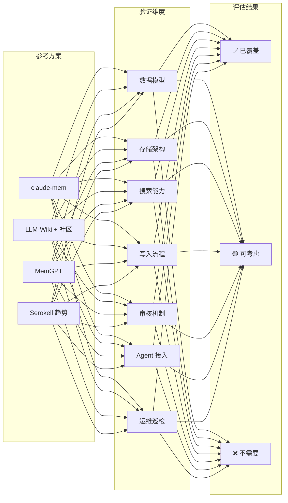
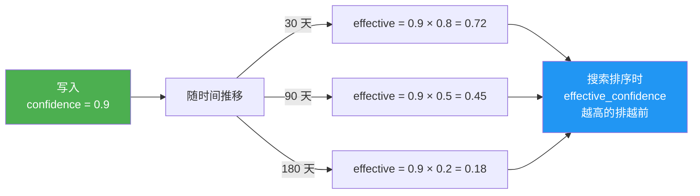
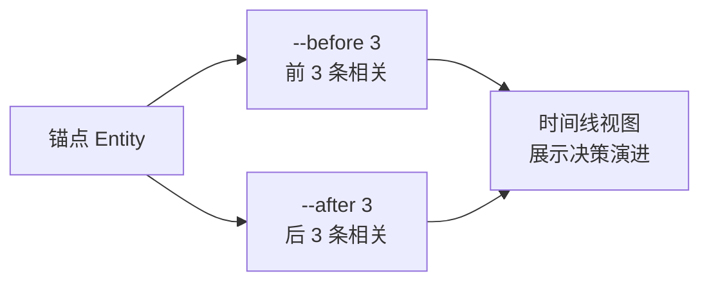
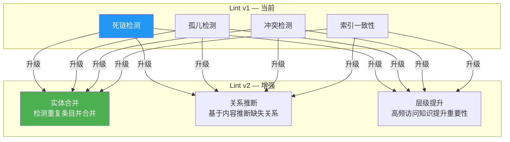
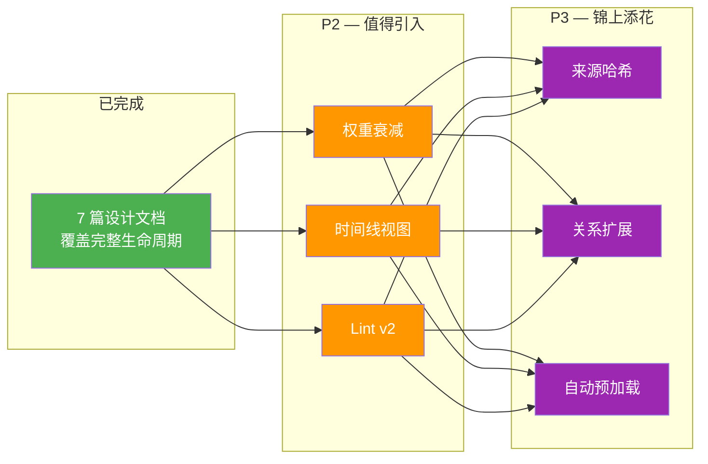

# 交叉验证汇总 — Linglong 设计完备性评估

> 整合来源：claude-mem、Karpathy LLM-Wiki + 社区、MemGPT、Serokell 行业分析
> 整理日期：2026-05-14
> 用途：确认 Linglong 设计无重大遗漏，标记可增强项

---

## 1. 验证方法论

逐一从各参考方案中提取设计点，与 Linglong 7 篇设计文档（00-06）交叉比对，分类为：

- **✅ 已覆盖** — Linglong 已有等价或更强设计
- **🟡 可考虑** — Linglong 缺失但值得引入的增强项
- **❌ 不需要** — 明确不适用于 Linglong 场景

---

## 2. 已充分覆盖（✅）

| 设计点 | 对应文档 | 覆盖情况 | 优于参考 |
|--------|----------|----------|----------|
| **分面分类** | 01-data-model.md | 7 Facet > LLM-Wiki 4 分面 > claude-mem 6 type | ✅ 更丰富 |
| **两步索引** | 02/04 | index.md → index-*.md → 目标文件 | ✅ 与 LLM-Wiki 一致 |
| **审核状态机** | 01 | RAW → PENDING_REVIEW → CONFIRMED/AUTO_CONFIRMED → ARCHIVED | ✅ 完整生命周期 |
| **去重策略** | 03 | 四级去重（ID/内容/标题/语义） | ✅ 优于 Kompl 三层消解 |
| **多模式搜索** | 04 | 关键词/向量/混合 + RRF 融合 | ✅ 强于所有参考方案 |
| **降级策略** | 04 | FTS5→LIKE, 向量→关键词 | ✅ 独有 |
| **健康巡检** | 05 | 4 类检查 + 3 级严重度 + 自动修复 | ✅ 优于 AKBP 一致性测试 |
| **多 Agent 接入** | 06 | CLI 统一工具 + 触发时机规则 | ✅ 领先于所有方案 |
| **归档机制** | 01/02 | archived_at 字段 + archive/ 目录 | ✅ 与 LLM-Wiki 一致 |
| **操作日志** | 02 | log.md 操作日志 | ✅ |
| **版本管理** | 01 | versions 字段 + current_version | ✅ 优于多数方案 |
| **WikiLinks** | 01 | [[target]] 语法 + 解析规则 | ✅ |
| **SQLite 可重建** | 06 | 文件是真相，SQLite 是衍生索引 | ✅ 独有 |
| **Token 经济** | 04 | 两步索引 + Facet 过滤 + `--deep` | ✅ 与 claude-mem 思路一致 |
| **命名空间隔离** | 06 | openclaw: / claude: / codex: 前缀 | ✅ 独有 |

---

## 3. 可考虑引入（🟡）

| 设计点 | 来源 | 当前状态 | 建议 | 优先级 |
|--------|------|----------|------|--------|
| **权重衰减** | expo-llm-wiki | confidence 单因子 | `effective_confidence = confidence × decay(age)`，旧知识自然沉底 | **P2** |
| **时间线视图** | claude-mem | 无 | CLI 增加 `linglong timeline <id> --before 3 --after 3`，按锚点展开上下文 | **P2** |
| **Lint v2 主动整合** | nowissan Dream Cycle | 被动巡检 | 从"发现问题"升级为"主动整合"：实体合并 + 关系推断 + 层级提升 | **P2** |
| **来源哈希** | AKBP | 无 | Source 模型增加 content_hash，检测来源变更后触发重新审核 | **P3** |
| **关系类型扩展** | ΩmegaWiki | 4 种 | 增加 `supersedes`、`derived_from`、`part_of` | **P3** |
| **自动预加载** | MemGPT | `--deep` 手动 | 增加 `auto_deep_threshold` 配置，搜索置信度低时自动加载全文 | **P3** |
| **知识体聚合** | claude-mem corpus | 无 | 在 `linglong kb search --deep` 中实现类似效果，不引入独立 corpus 概念 | **P3** |

### P2 增强项详细说明

#### 权重衰减

**工作量**：小（在 search 排序逻辑中增加衰减因子）
**收益**：搜索排序质量提升，旧知识自然沉底

#### 时间线视图

**工作量**：小（增加 CLI 命令 + 按时间范围查询）
**收益**：Agent 理解决策演进，追溯知识来源

#### Lint v2 主动整合

**工作量**：中（需要内容相似度计算 + 关系推断逻辑）
**收益**：知识库自愈能力，减少人工维护

### P3 增强项

| 增强项 | 触发条件 | 工作量 |
|--------|----------|--------|
| **来源哈希** | Source 模型增加 content_hash 字段 | 小 |
| **关系类型扩展** | Relation 增加 3 种类型 | 小 |
| **自动预加载** | 配置增加 auto_deep_threshold | 小 |
| **知识体聚合** | `--deep` 模式增加聚合总结 | 中 |

---

## 4. 明确不需要（❌）

| 设计点 | 来源 | 不引入理由 |
|--------|------|-----------|
| **代码结构大纲** | claude-mem smart_outline | Linglong 是知识库不是代码库 |
| **Page Fault 换入换出** | MemGPT | Agent 侧上下文管理，非知识库职责 |
| **NLP 预处理管线** | Kompl spaCy | 四级去重已覆盖，不需要 NLP 依赖 |
| **Context Packs** | Synthadoc | Token 预算由 Agent 侧控制 |
| **反思总结** | MemGPT | Agent 侧行为 |
| **双语支持** | ΩmegaWiki | Linglong 以中文为主 |

---

## 5. 增强路线图

---

## 6. 结论

经过与 **claude-mem**、**LLM-Wiki + 6 个社区实现**、**MemGPT**、**Serokell 行业分析**的全面交叉验证：

### 无重大遗漏

Linglong 知识库设计（7 篇文档 00-06）覆盖了知识管理的完整生命周期，在多个维度上领先于现有方案。

### 5 大领先优势

1. **7 分面体系** — 比 LLM-Wiki 4 分面、claude-mem 6 type 更贴合知识管理
2. **三层存储 + 可重建** — 文件 + SQLite + 向量，SQLite 可从文件重建
3. **多 Agent CLI 接入** — 统一 CLI + 触发时机规则 + 命名空间隔离
4. **完整审核管线** — ReviewEngine + LintEngine + 状态机 + 归档
5. **混合搜索 + RRF** — FTS5 + sqlite-vec + RRF + 降级策略

### 3 个 P2 增强项

权重衰减、时间线视图、Lint v2 主动整合。可在实施阶段根据实际需求逐步引入。

---

## 参考来源

- [claude-mem 架构](claude-mem.md) — MCP 持久记忆插件分析
- [MemGPT 范式](memgpt.md) — OS 级记忆管理
- [LLM-Wiki 社区实现](llm-wiki-community.md) — 6 个社区项目
- [行业趋势](industry-trends.md) — 4 范式演进
- [LLM-Wiki 参考设计](llm-wiki-reference.md) — 四层架构 + 流程图
- [差异化比对](gap-analysis.md) — 逐项差距分析
