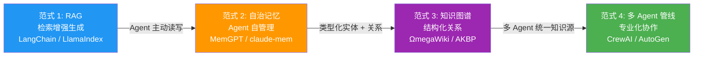
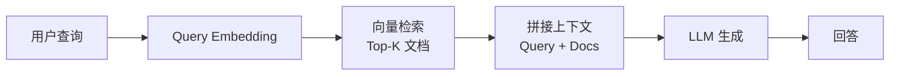
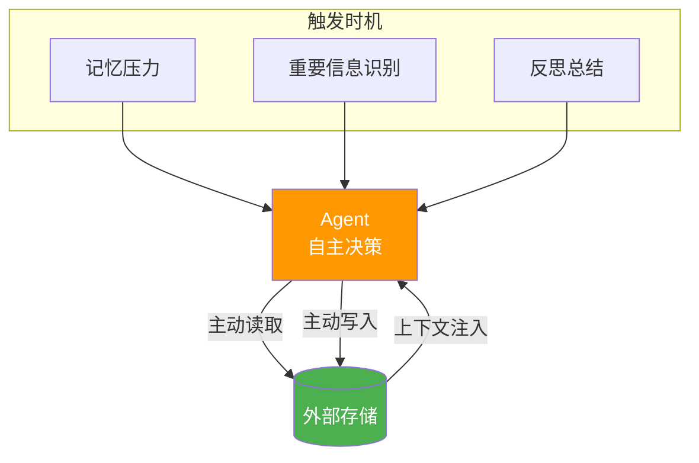
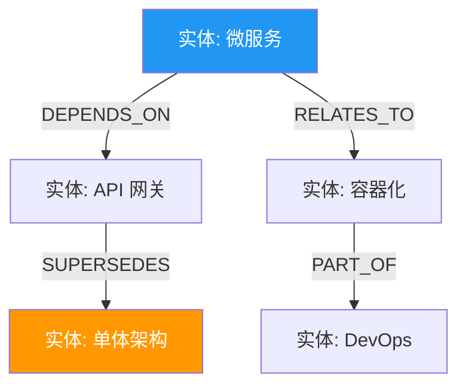
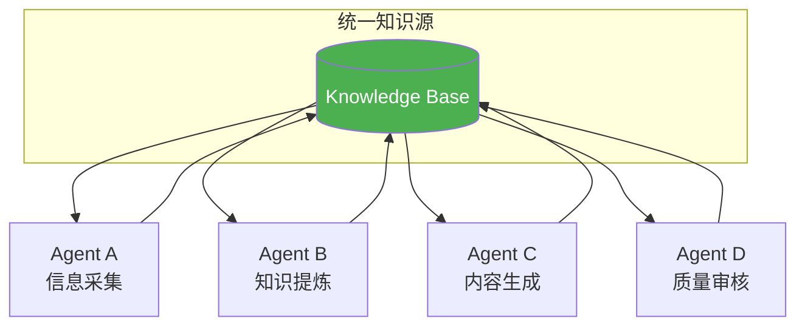
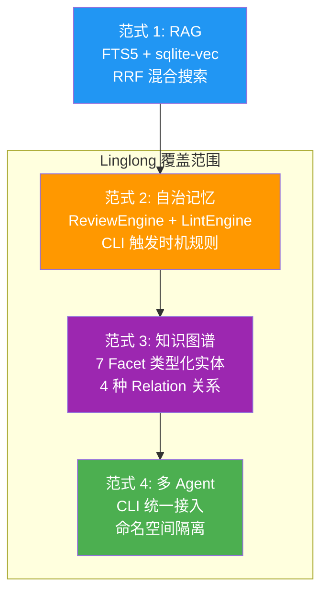

# LLM 长期记忆行业趋势

> 来源：Serokell 博客 *LLM Long-Term Memory* + 多源交叉验证
> 整理日期：2026-05-14
> 用途：理解行业演进方向，定位 Linglong 在生态中的位置

---

## 1. 四大范式演进

---

## 2. 各范式详解

### 范式 1：RAG（检索增强生成）

| 特征 | 说明 |
|------|------|
| **成熟度** | 最成熟，工业级应用广泛 |
| **代表** | LangChain、LlamaIndex、Haystack |
| **优点** | 简单可靠，无需修改 LLM |
| **缺点** | 只读，被动检索，无记忆管理 |
| **适用** | 知识问答、文档检索 |

### 范式 2：自治记忆

| 特征 | 说明 |
|------|------|
| **成熟度** | 成长中，学术界和开源社区活跃 |
| **代表** | MemGPT、claude-mem、Letta |
| **优点** | Agent 自主管理，减少人工干预 |
| **缺点** | LLM 负担重，幻觉风险 |
| **适用** | 长对话、持续交互、个性化 |

### 范式 3：知识图谱

| 特征 | 说明 |
|------|------|
| **成熟度** | 早期，研究原型为主 |
| **代表** | ΩmegaWiki、AKBP、LightRAG |
| **优点** | 结构化表达，支持推理 |
| **缺点** | 构建成本高，维护复杂 |
| **适用** | 复杂关系、知识推理、跨域整合 |

### 范式 4：多 Agent 管线

| 特征 | 说明 |
|------|------|
| **成熟度** | 早期，框架层探索 |
| **代表** | CrewAI、AutoGen、LangGraph |
| **优点** | 专业化分工，可扩展 |
| **缺点** | 协调成本高，一致性难保障 |
| **适用** | 复杂工作流、大规模知识管理 |

---

## 3. 行业演进趋势

| 趋势 | 说明 | 代表方案 |
|------|------|----------|
| **从被动到主动** | 不再被动检索，Agent 主动决定何时读写 | MemGPT、claude-mem |
| **从平铺到结构化** | 类型化实体 + 类型化关系（知识图谱） | ΩmegaWiki、AKBP |
| **从单 Agent 到多 Agent** | 专业化分工 + 统一知识源 | CrewAI、AutoGen |
| **从静态到动态** | 权重衰减 + 后台整合 + 来源变更检测 | expo-llm-wiki、nowissan |

---

## 4. Linglong 在行业中的定位

### Linglong 的独特优势

| 能力 | Linglong 实现 | 行业水平 |
|------|---------------|----------|
| **多 Agent 统一知识源** | CLI 统一接入 + 命名空间隔离 | 领先（大多数方案单 Agent） |
| **7 分面类型化实体** | 7 Facet 分类体系 | 领先（多数方案 4-6 类） |
| **完整审核管线** | ReviewEngine + LintEngine + 状态机 | 领先（多数方案无审核） |
| **三层存储 + 可重建** | 文件 + SQLite + 向量，SQLite 可从文件重建 | 独有（无其他方案做到） |
| **混合搜索 + RRF** | FTS5 + sqlite-vec + RRF 融合 | 领先（多数方案单一搜索） |

---

## 参考来源

- [Serokell: LLM Long-Term Memory](https://serokell.io/blog/llm-long-term-memory) — 4 大范式分析
- [MemGPT 论文](https://arxiv.org/abs/2310.08560) — OS 级记忆管理
- [claude-mem](https://github.com/thedotmack/claude-mem) — MCP 持久记忆
- [LLM-Wiki 社区实现](llm-wiki-community.md) — 6 个社区项目分析
- [交叉验证汇总](convergence.md) — 全方案对比 + 增强建议
