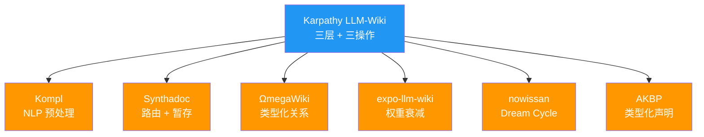
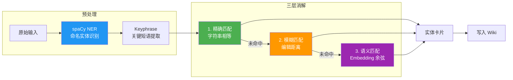
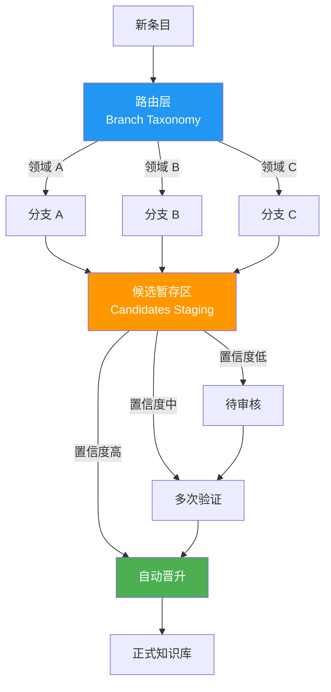
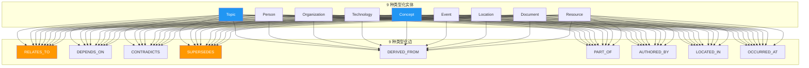
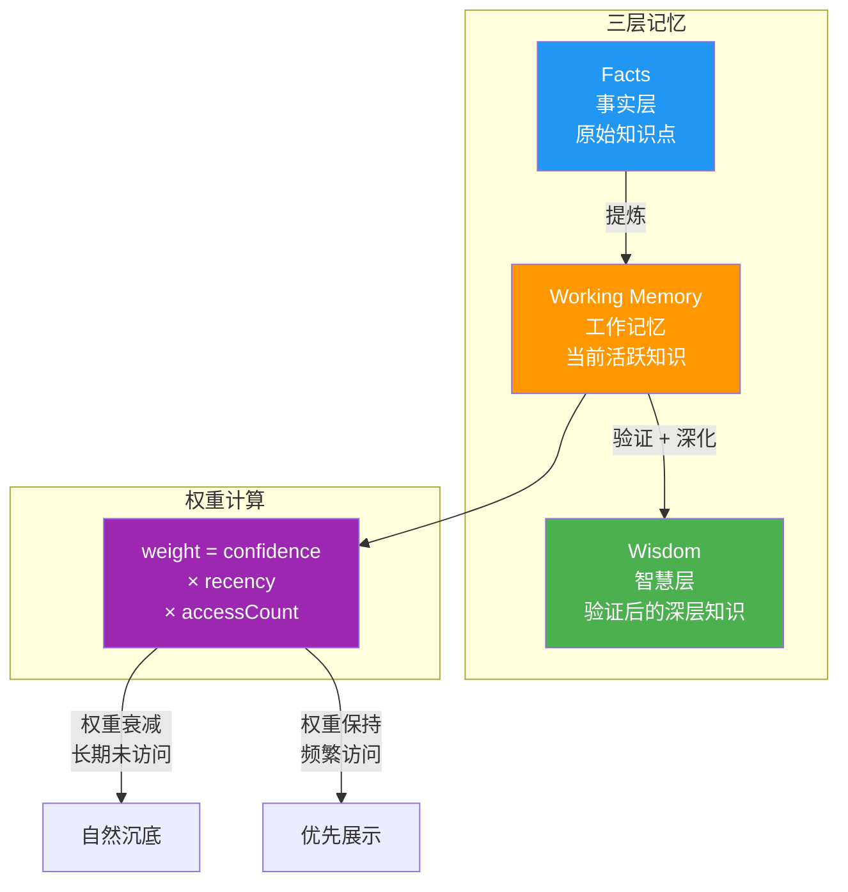
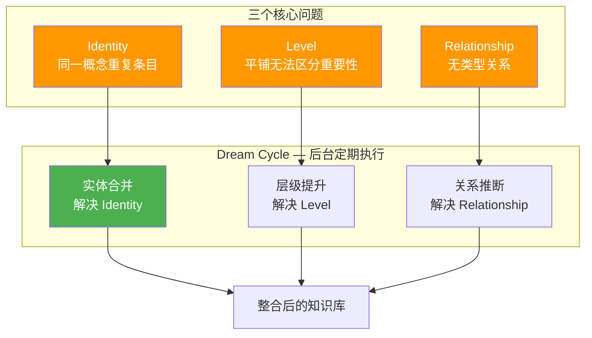
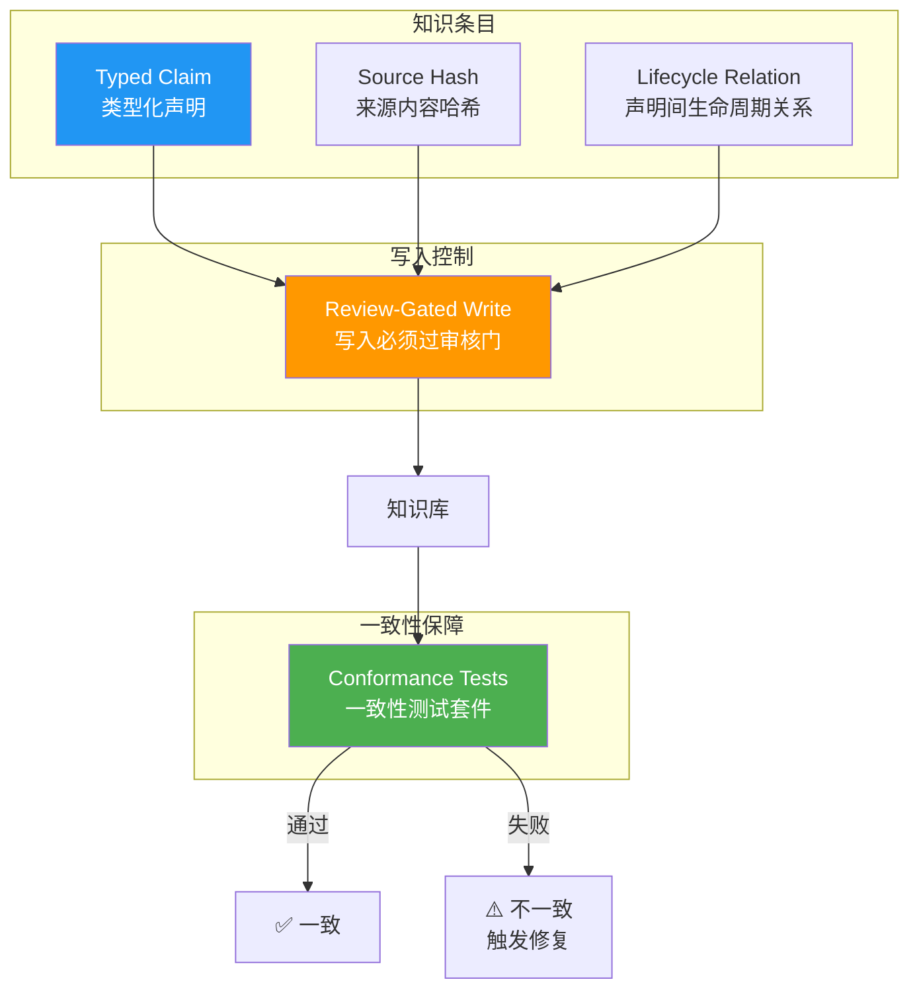

# LLM-Wiki 社区实现亮点

> 来源：Karpathy LLM-Wiki Gist 评论区（35+ 评论）中的 6 个代表性实现
> 整理日期：2026-05-14
> 用途：提取社区创新点，交叉验证 Linglong 知识库设计

---

## 1. 社区实现总览

| 项目 | 核心创新 | Linglong 评估 |
|------|----------|---------------|
| **Kompl** | spaCy NER + 三层实体消解 | 🟡 消解策略可参考 |
| **Synthadoc** | Branch Taxonomy + 候选暂存 | ✅ ReviewEngine 已覆盖 |
| **ΩmegaWiki** | 9 类型化实体 + 9 类型化边 | 🟡 Relation 类型可扩展 |
| **expo-llm-wiki** | 三层记忆 + 权重衰减 | 🟡 衰减机制可引入 |
| **nowissan** | Dream Cycle 后台整合 | 🟡 可升级 Lint v2 |
| **AKBP** | 类型化声明 + 一致性测试 | ✅ 版本管理 + Lint 已覆盖 |

---

## 2. Kompl — NLP 预处理方案

### 架构

### 核心创新

| 机制 | 说明 |
|------|------|
| **spaCy NER** | 使用 spaCy 进行命名实体识别，自动从文本中提取实体 |
| **Keyphrase 提取** | 自动提取关键短语作为候选实体名 |
| **三层消解** | 精确匹配 → 模糊匹配（编辑距离）→ 语义匹配（embedding 余弦） |
| **批量 Ingest** | 支持批量导入文档，自动拆分和实体链接 |

### 与 Linglong 对比

| 维度 | Kompl | Linglong | 评价 |
|------|-------|----------|------|
| 实体消解 | 3 层（精确/模糊/语义） | 4 级（ID/内容/标题/语义） | ✅ Linglong 已覆盖且更强 |
| NLP 预处理 | spaCy NER + keyphrase | 无 | ❌ 不引入，四级去重够用 |
| 批量导入 | 支持 | `linglong kb migrate --no-index` | ✅ 已覆盖 |

---

## 3. Synthadoc — 路由层 + 候选暂存

### 架构

### 核心创新

| 机制 | 说明 |
|------|------|
| **Branch Taxonomy** | 按领域/主题/技术栈分支路由，新条目自动归入对应分支 |
| **Candidates Staging** | 新条目先进入候选区，不直接写入正式知识库 |
| **置信度晋升** | 候选条目经多次验证后自动晋升为正式条目 |
| **Context Packs** | 带 token 预算的上下文包，控制返回内容大小 |

### 与 Linglong 对比

| 维度 | Synthadoc | Linglong | 评价 |
|------|-----------|----------|------|
| 路由 | Branch Taxonomy | 7 Facet 分类 | ✅ 思路类似 |
| 候选暂存 | Candidates Staging | RAW → PENDING_REVIEW | ✅ 已采纳 |
| 置信度晋升 | 多次验证后晋升 | ReviewEngine 自动确认 | ✅ 已覆盖 |
| Context Packs | Token 预算控制 | `--limit` + `--deep` | ✅ 已覆盖 |

---

## 4. ΩmegaWiki — 类型化关系

### 架构

### 核心创新

| 机制 | 说明 |
|------|------|
| **9 种类型化实体** | 比 LLM-Wiki 的 4 分面更精细的实体分类 |
| **9 种类型化边** | 实体间关系有明确语义，支持图查询 |
| **双语支持** | 英文 + 中文双语知识库 |

### 与 Linglong 对比

| 维度 | ΩmegaWiki | Linglong | 评价 |
|------|-----------|----------|------|
| 实体分类 | 9 种类型化实体 | 7 Facet | ✅ 各有侧重，Linglong 更贴合知识管理 |
| 关系类型 | 9 种类型化边 | 4 种（related/depends_on/contradicts/extends） | 🟡 **可扩展** |
| 双语 | EN + 中文 | 中文为主 | ❌ 不需要 |

---

## 5. expo-llm-wiki — 三层记忆 + 权重衰减

### 架构

### 核心创新

| 机制 | 说明 |
|------|------|
| **Facts → Working Memory → Wisdom** | 三层渐进式知识成熟模型 |
| **权重公式** | `confidence × recency × accessCount` 三因子加权 |
| **衰减机制** | 长期未被访问的知识权重递减，自然沉底 |
| **成熟度标记** | 知识从 Facts 晋升到 Wisdom 需要验证 |

### 与 Linglong 对比

| 维度 | expo-llm-wiki | Linglong | 评价 |
|------|---------------|----------|------|
| 知识层级 | Facts → WM → Wisdom | 无显式层级 | 🟡 可参考 |
| 权重计算 | confidence × recency × accessCount | confidence 单因子 | 🟡 **可引入时间衰减** |
| 成熟度 | 自动晋升 | RAW → CONFIRMED | ✅ 部分覆盖 |

---

## 6. nowissan — Dream Cycle 后台整合

### 架构

### 核心创新

| 机制 | 说明 |
|------|------|
| **Identity 问题** | 同一概念可能有多条重复条目（不同名称、不同来源） |
| **Level 问题** | 平铺结构无法区分知识的重要性层级 |
| **Relationship 问题** | 无类型关系 vs 有类型关系的表达能力差异 |
| **Dream Cycle** | 后台定期执行整合：合并重复、提升层级、推断关系 |

### 与 Linglong 对比

| 维度 | nowissan | Linglong | 评价 |
|------|----------|----------|------|
| 实体合并 | Dream Cycle 自动合并 | 四级去重（写入时） | ✅ 写入时已覆盖 |
| 层级管理 | 自动提升 | 7 Facet 分类 | ✅ 已覆盖 |
| 关系推断 | 自动推断 | 手动标记 + WikiLinks | 🟡 可作为 Lint v2 |
| 后台整合 | Dream Cycle | Lint 巡检 | 🟡 **可从"发现问题"升级为"主动整合"** |

---

## 7. AKBP — 类型化声明 + 一致性测试

### 架构

### 核心创新

| 机制 | 说明 |
|------|------|
| **Typed Claims** | 每个知识条目有类型化的声明结构，明确知识类型 |
| **Source Hashes** | 来源内容的哈希值，检测来源是否变更 |
| **Lifecycle Relations** | 声明之间的生命周期关系（如 superseded_by） |
| **Review-Gated Writes** | 写入必须经过审核门 |
| **Conformance Tests** | 自动化一致性测试套件，验证知识库内部一致性 |

### 与 Linglong 对比

| 维度 | AKBP | Linglong | 评价 |
|------|------|----------|------|
| 类型化声明 | Typed Claims | 7 Facet | ✅ 已覆盖 |
| 来源哈希 | Source Hashes | 无 | 🟡 **可引入** |
| 生命周期关系 | Lifecycle Relations | versions 字段 | ✅ 已覆盖 |
| 审核门 | Review-Gated Writes | ReviewEngine | ✅ 已覆盖 |
| 一致性测试 | Conformance Tests | LintEngine | ✅ 已覆盖 |

---

## 8. 汇总对比矩阵

| 能力 | Kompl | Synthadoc | ΩmegaWiki | expo-llm-wiki | nowissan | AKBP | Linglong |
|------|-------|-----------|-----------|---------------|----------|------|----------|
| 实体消解 | ✅ 3 层 | - | - | - | ✅ 合并 | - | ✅ 4 级 |
| 候选暂存 | - | ✅ | - | - | - | - | ✅ |
| 类型化关系 | - | - | ✅ 9 种 | - | ✅ 推断 | ✅ | ✅ 4 种 |
| 权重衰减 | - | - | - | ✅ | - | - | 🟡 待引入 |
| 后台整合 | - | - | - | - | ✅ Dream | - | 🟡 Lint v2 |
| 来源哈希 | - | - | - | - | - | ✅ | 🟡 待引入 |
| 审核门 | - | ✅ | - | - | - | ✅ | ✅ |
| 一致性测试 | - | - | - | - | - | ✅ | ✅ Lint |
| 多 Agent | - | - | - | - | - | - | ✅ |
| 向量搜索 | ✅ | - | - | - | - | - | ✅ |

---

## 参考来源

- [Karpathy LLM-Wiki Gist](https://gist.github.com/karpathy) — 社区评论原始来源
- [LLM-Wiki 参考设计](llm-wiki-reference.md) — 四层架构 + 流程图
- [差异化比对](gap-analysis.md) — 逐项差距分析
- [claude-mem 架构](claude-mem.md) — MCP 持久记忆插件分析
