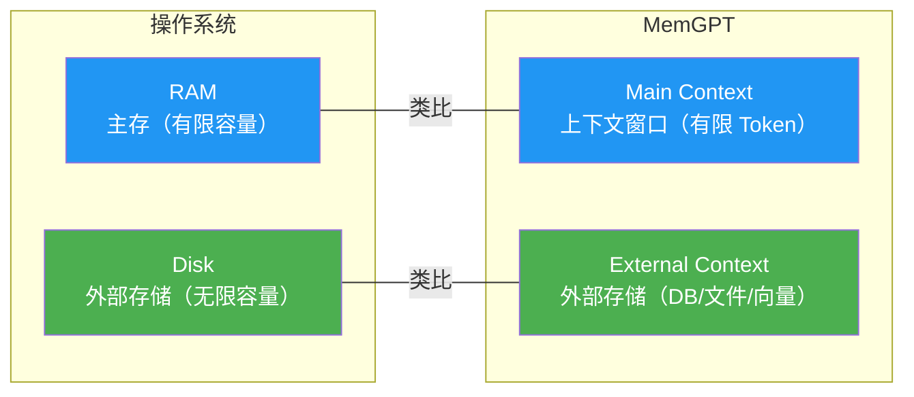
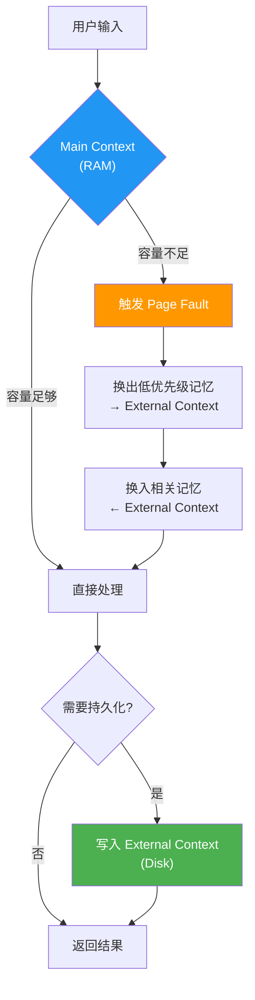
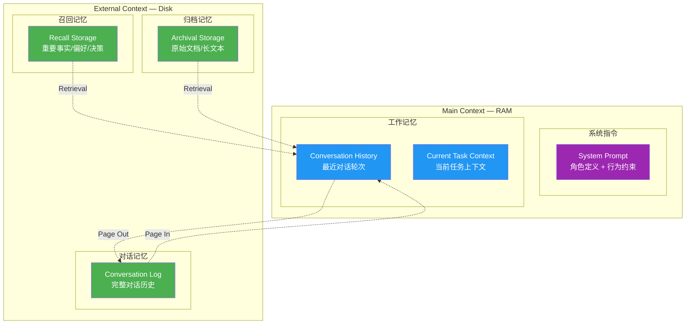
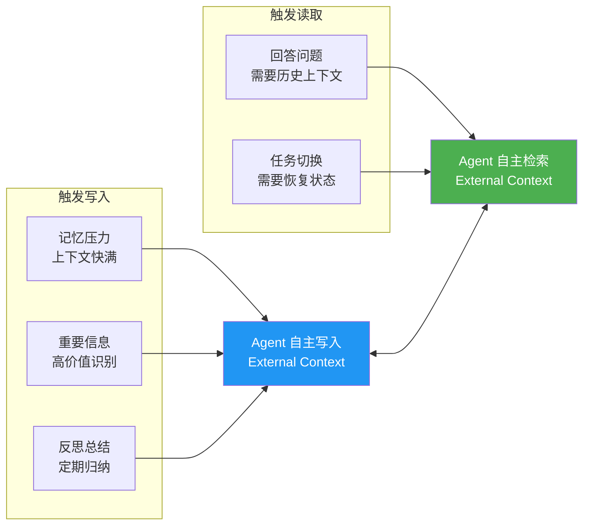
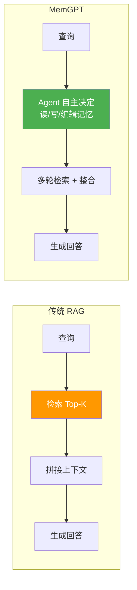

# MemGPT — OS 级记忆管理范式

> 来源：论文 *MemGPT: Towards LLMs as Operating Systems* (arXiv:2310.08560)
> 整理日期：2026-05-14
> 用途：交叉验证 Linglong 知识库设计完备性

---

## 1. 核心类比

MemGPT 将 LLM 记忆管理类比为操作系统（OS）的内存管理：

| OS 概念 | MemGPT 对应 | 说明 |
|---------|-------------|------|
| **RAM** | Main Context | LLM 上下文窗口（有限容量，如 128K tokens） |
| **Disk** | External Context | 外部存储（数据库、文件、向量索引） |
| **Page Fault** | 上下文切换 | RAM 不够时从 Disk 换入/换出 |
| **Write-back** | 记忆持久化 | RAM 中的信息写回 Disk |
| **Swap** | 上下文摘要 | 低优先级信息压缩后换出 |

---

## 2. 虚拟上下文管理

### 核心机制

1. **自动 Page Fault**：当上下文窗口接近满载时，自动触发换入换出
2. **优先级调度**：根据信息重要性和相关性决定保留/换出哪些记忆
3. **摘要压缩**：换出时将长文本压缩为摘要，减少 Disk 占用
4. **按需加载**：根据当前查询从 External Context 加载相关信息

---

## 3. 记忆分层架构

### 三层 External Context

| 层级 | 存储 | 内容 | 访问频率 |
|------|------|------|----------|
| **对话记忆** | Conversation Log | 完整对话历史（按时间索引） | 高（每次对话） |
| **召回记忆** | Recall Storage | 重要事实、用户偏好、关键决策 | 中（按需检索） |
| **归档记忆** | Archival Storage | 原始文档、长文本、外部数据 | 低（偶尔查询） |

---

## 4. 自管理记忆

MemGPT 的核心创新：**Agent 自主决定何时读写记忆**，而非被动等待外部指令。

### 写入触发条件

| 条件 | 说明 | MemGPT 行为 |
|------|------|-------------|
| **记忆压力** | 上下文接近容量上限 | 自动将低优先级信息写回 Disk |
| **重要信息** | 识别到高价值信息 | 主动保存到 Recall Storage |
| **反思总结** | 定期对对话历史总结 | 压缩后存入 Recall Storage |

### 读取触发条件

| 条件 | 说明 | MemGPT 行为 |
|------|------|-------------|
| **回答问题** | 需要历史上下文 | 检索 Conversation/Recall Storage |
| **任务切换** | 需要恢复状态 | 从 Archive 加载相关文档 |

---

## 5. 与传统 RAG 的区别

| 维度 | 传统 RAG | MemGPT |
|------|----------|--------|
| 检索策略 | 单次 Top-K 检索 | Agent 自主多轮检索 |
| 写入能力 | 无（只读） | Agent 可写入/编辑记忆 |
| 上下文管理 | 拼接截断 | 虚拟上下文（换入换出） |
| 检索质量 | 依赖 embedding 质量 | Agent 可反思 + 修正检索 |

---

## 6. 局限性

| 局限 | 说明 |
|------|------|
| **LLM 负担重** | Agent 需要自己决定何时读写，增加了推理成本和错误率 |
| **上下文浪费** | 自管理指令本身占用宝贵的上下文窗口 |
| **评估困难** | 难以量化"记忆管理决策"的质量 |
| **幻觉风险** | Agent 可能"记住"从未发生的事情 |
| **复杂度高** | 实现和调试都远比简单 RAG 复杂 |

---

## 7. 与 Linglong 的交叉对比

| 维度 | MemGPT | Linglong | 评价 |
|------|--------|----------|------|
| **分层存储** | RAM (上下文) + Disk (外部) | 两步索引 + 按需加载 | ✅ 思路一致 |
| **换入换出** | 自动 Page Fault | `--deep` 手动加载 | 🟡 可考虑自动预加载 |
| **自管理写回** | Agent 自主决定 | CLI 工具 + 触发时机规则 | ✅ 已覆盖（06-agent-integration.md） |
| **记忆压力检测** | 自动检测上下文容量 | 无 | ❌ Agent 侧行为，非知识库职责 |
| **反思总结** | 定期对话历史压缩 | 无 | ❌ Agent 侧行为 |
| **多轮检索** | Agent 自主多轮 | 单次搜索 + `--deep` | 🟡 可在 Agent 侧实现 |

### 可借鉴点

1. **自动预加载**：当搜索结果置信度低于阈值时，自动加载全文。可在配置中增加 `auto_deep_threshold`。**低优先级**，当前 `--deep` 手动够用。

### 明确不需要

- **Page Fault 换入换出**：这是 Agent 侧的上下文管理行为，不是知识库的职责
- **反思总结**：Agent 侧行为，Linglong 作为知识库只负责存储和检索

---

## 参考来源

- [MemGPT 论文](https://arxiv.org/abs/2310.08560) — MemGPT: Towards LLMs as Operating Systems
- [MemGPT GitHub](https://github.com/cpacker/memgpt) — 开源实现
- [GoPenAI MemGPT 详解](https://gopenai.com/memgpt-virtual-context-management-revolutionizing-llm-memory/) — 社区分析
- [LLM-Wiki 参考设计](llm-wiki-reference.md) — Linglong 设计基线
