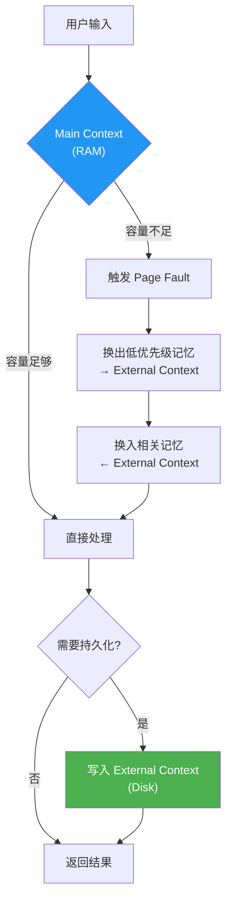

# 现代知识系统研究汇编

> 研究目的：交叉验证 Linglong 知识库设计（7 篇设计文档 00-06）的完备性，识别潜在遗漏。
> 更新日期：2026-05-14

---

## 1. 研究范围

| 方案 | 类型 | 关注点 |
|------|------|--------|
| claude-mem v12.1.0 | MCP 持久记忆插件 | 观测模型、时间线、知识体构建 |
| Karpathy LLM-Wiki | 理论框架 + 社区实现 | 三层架构、知识编译、两步索引 |
| MemGPT | 学术范式 | OS 级记忆管理、分层上下文 |
| Serokell 行业分析 | 综述 | 4 大范式、行业演进方向 |

---

## 2. claude-mem 架构分析

### 2.1 核心概念

claude-mem 是 Claude Code 的 MCP 持久记忆插件（thedotmack/claude-mem），本地安装版本 v12.1.0。

**数据模型 — Observation**：

| 字段 | 类型 | 说明 |
|------|------|------|
| `id` | 自增整数 | 唯一标识 |
| `timestamp` | ISO datetime | 时间戳 |
| `type` | enum | decision / bugfix / feature / refactor / discovery / change |
| `title` | str | 简短标题 |
| `content` | str | 完整内容 |

**三类 type 含义**：

```
decision  — 架构/设计决策（为什么这么做）
bugfix    — 问题修复（什么问题、根因、方案）
feature   — 新功能交付（做了什么）
refactor  — 代码重构（改了什么、为什么）
discovery — 探索发现（代码结构、依赖关系、模式识别）
change    — 杂项变更（配置、文档、流程）
```

### 2.2 工具链 — 3 层工作流


**设计哲学**：先返回轻量索引（~50-100 tokens/条），再按需获取完整详情。10 倍 token 节省。

**7 个 MCP 工具**：

| 工具 | 用途 |
|------|------|
| `search` | 关键词/语义搜索，返回 ID 索引 |
| `timeline` | 按 anchor ID 展开前后上下文 |
| `get_observations` | 按 ID 数组批量获取完整内容 |
| `build_corpus` | 从观测构建知识体（可按类型/概念/文件过滤） |
| `prime_corpus` | 初始化知识体会话 |
| `query_corpus` | 向知识体提问（需先 prime） |
| `list_corpora` | 列出所有知识体及状态 |

### 2.3 Corpus 知识体

claude-mem 的 Corpus 是从 observation 中提取的结构化知识集合：

```
build_corpus(name, types, concepts, files, query, limit)
→ 筛选观测 → 构建知识体
→ prime_corpus(name) → 初始化 AI 会话
→ query_corpus(name, question) → 基于知识体回答问题
```

支持按 type、concept、file、时间范围、语义查询等多维度过滤。

### 2.4 辅助工具

| 工具 | 用途 |
|------|------|
| `smart_outline` | 文件结构大纲（折叠函数体） |
| `smart_search` | AST 级代码符号搜索 |
| `smart_unfold` | 展开特定符号的完整源码 |

### 2.5 与 Linglong 的对比

| 维度 | claude-mem | Linglong | 评价 |
|------|-----------|----------|------|
| 数据模型 | Observation（6 种 type） | Entity（7 种 facet） | ✅ Linglong 更丰富 |
| ID 策略 | 自增整数 | UUID | ✅ Linglong 更适合分布式 |
| 搜索 | 关键词 + corpus 语义 | FTS5 + sqlite-vec + RRF | ✅ Linglong 更强 |
| 时间线 | timeline 工具按 anchor 展开 | 无 | 🟡 **可考虑引入** |
| 知识体 | build/prime/query corpus | 无 | 🟡 **可考虑引入** |
| Token 经济 | 3 层工作流（索引→定位→详情） | 两步索引（index.md → index-*.md → 目标） | ✅ 思路一致 |
| 审核机制 | 无 | ReviewEngine + 状态机 | ✅ Linglong 独有 |
| 多 Agent | 单 Agent | CLI 统一接入 | ✅ Linglong 独有 |

---

## 3. Karpathy LLM-Wiki 核心理念

### 3.1 原文要点

来源：Andrej Karpathy 的 Gist（2025 年），"A long-term memory pattern for LLMs"。

**核心定义**：

> Wiki 是一个**持久、复利增长的工件**（persistent, compounding artifact），每次交互都会让它变得更好。

**三层结构**：

```
L1 Raw Sources  →  L2 Wiki（知识编译产物）  →  L3 Schema（规则约束）
```

**三个操作**：

| 操作 | 说明 |
|------|------|
| **Ingest** | 新资料 → 提炼 → 写入 wiki（创建/更新页面） |
| **Query** | 两步索引 → 定位 → 读取 → 回答 → 可选固化 synthesis |
| **Lint** | 死链检测 + 孤儿检测 + 冲突检测 + 索引一致性 |

**关键设计决策**：

1. **回答可反哺**：好的 query 回答可以固化为新的 wiki 页面（synthesis）
2. **两步索引**：index.md（~500 tokens）→ index-*.md → 目标文件，从 ~40K 降至 ~2-3K tokens
3. **归档而非删除**：已处理文件移入 archive/，保留历史可追溯
4. **log.md**：每次操作记录日志，可审计
5. **Stub 自动替换**：创建新实体时自动替换其他页面中的占位链接

### 3.2 社区实现亮点

Karpathy 的 Gist 引发 35+ 条社区评论，以下是 6 个代表性实现：

#### Kompl（NLP 预处理方案）

```
核心创新：spaCy NER + keyphrase extraction 预处理
三层实体消解：
  1. 精确匹配（字符串相等）
  2. 模糊匹配（编辑距离）
  3. 语义匹配（embedding 余弦）
```

**可借鉴**：实体消解策略可用于 Linglong 写入路径的去重阶段（03-write-path.md 中的四级去重）。

#### Synthadoc（路由层 + 候选暂存）

```
核心创新：
  - Branch Taxonomy：按领域/主题/技术栈分支路由
  - Candidates Staging：新条目先进入候选区
  - 置信度晋升：候选条目经多次验证后自动晋升为正式条目
  - Context Packs：带 token 预算的上下文包
```

**可借鉴**：候选暂存机制与 Linglong 的 RAW → PENDING_REVIEW → CONFIRMED 状态机异曲同工，Context Packs 的 token 预算概念可丰富 `--deep` 模式。

#### ΩmegaWiki（类型化关系）

```
核心创新：
  - 9 种类型化实体（Topic/Person/Organization/...）
  - 9 种类型化边（RELATES_TO/DEPENDS_ON/CONTRADICTS/...）
  - 双语支持（EN + 中文）
```

**可借鉴**：Linglong 的 Relation 模型（01-data-model.md）目前有 4 种关系类型（related / depends_on / contradicts / extends），可参考 ΩmegaWiki 扩展。

#### expo-llm-wiki（三层记忆 + 权重衰减）

```
核心创新：
  - Facts（事实层）→ Working Memory（工作记忆）→ Wisdom（智慧层）
  - 权重计算：confidence × recency × accessCount
  - 衰减机制：长期未被访问的知识权重递减
```

**可借鉴**：权重衰减可解决知识库随时间膨胀、旧知识淹没新知识的问题。Linglong 目前没有时间衰减机制。

#### nowissan（Dream Cycle 后台整合）

```
核心创新：
  三个核心问题：
    1. Identity — 同一概念的重复条目
    2. Level — 平铺结构无法区分重要性
    3. Relationship — 无类型关系 vs 有类型关系
  Dream Cycle：后台定期执行
    - 实体合并（解决 Identity）
    - 层级提升（解决 Level）
    - 关系推断（解决 Relationship）
```

**可借鉴**：Dream Cycle 概念可丰富 Linglong 的 lint 巡检设计（05-lint.md），从"发现问题"升级为"主动整合"。

#### AKBP（类型化声明 + 一致性测试）

```
核心创新：
  - Typed Claims：每个知识条目有类型化的声明结构
  - Source Hashes：来源内容哈希，支持来源变更检测
  - Lifecycle Relations：声明之间的生命周期关系
  - Review-Gated Writes：写入必须经过审核门
  - Conformance Tests：知识库一致性测试套件
```

**可借鉴**：Source Hashes 可用于 Linglong 的来源变更检测；Conformance Tests 可作为 lint 的扩展检查项。

### 3.3 与 Linglong 的对比总结

| 维度 | LLM-Wiki + 社区 | Linglong 设计 | 状态 |
|------|-----------------|---------------|------|
| 分面分类 | 4 分面（→ 社区 9 类） | 7 分面 | ✅ 已覆盖且更丰富 |
| 两步索引 | index.md → index-*.md | 同 | ✅ 已采纳 |
| 实体消解 | 三层匹配（精确/模糊/语义） | 四级去重（ID/内容/标题/语义） | ✅ 已覆盖 |
| 候选暂存 | Candidates Staging | RAW → PENDING_REVIEW | ✅ 已采纳 |
| 时间线 | claude-mem timeline | 无 | 🟡 可考虑 |
| 权重衰减 | expo-llm-wiki | 无 | 🟡 可考虑 |
| 后台整合 | nowissan Dream Cycle | Lint 巡检（发现问题） | 🟡 可升级 |
| 来源哈希 | AKBP Source Hashes | 无 | 🟡 可考虑 |
| 关系类型 | ΩmegaWiki 9 种边 | 4 种（related/depends_on/contradicts/extends） | 🟡 可扩展 |
| Conformance Tests | AKBP | LintEngine | ✅ 已采纳 |

---

## 4. MemGPT / OS 范式

### 4.1 核心概念

MemGPT（论文：*MemGPT: Towards LLMs as Operating Systems*）将 LLM 记忆管理类比为操作系统：

| OS 概念 | MemGPT 对应 | 说明 |
|---------|-------------|------|
| RAM | Main Context | LLM 上下文窗口（有限容量） |
| Disk | External Context | 外部存储（数据库/文件/向量） |
| Page Fault | 上下文切换 | RAM 不够时从 Disk 换入/换出 |
| Write-back | 记忆持久化 | RAM 中的信息写回 Disk |

### 4.2 虚拟上下文管理



### 4.3 自管理记忆

MemGPT 的核心创新：**Agent 自主决定何时读写记忆**，而非被动等待外部指令。

触发写回的条件：
1. **记忆压力**：上下文快满时自动持久化
2. **重要信息**：识别到高价值信息时主动保存
3. **反思总结**：定期对对话历史进行总结并存储

### 4.4 与 Linglong 的对比

| 维度 | MemGPT | Linglong | 评价 |
|------|--------|----------|------|
| 分层存储 | RAM (上下文) + Disk (外部) | 两步索引 + 按需加载 | ✅ 思路一致 |
| 换入换出 | 自动 Page Fault | `--deep` 手动加载 | 🟡 可考虑自动预加载 |
| 自管理写回 | Agent 自主决定 | CLI 工具 + 触发时机规则 | ✅ 已覆盖（06-agent-integration.md 的触发时机表） |
| 记忆压力检测 | 自动检测 | 无 | ❌ 不需要（Agent 侧行为） |

---

## 5. 行业趋势（Serokell 分析）

### 5.1 四大范式

Serokell 的分析文章将 LLM 长期记忆归纳为 4 种范式：


| 范式 | 代表 | 核心思想 | 成熟度 |
|------|------|----------|--------|
| **RAG** | LangChain, LlamaIndex | 检索-增强-生成 | 成熟 |
| **自治记忆** | MemGPT, claude-mem | Agent 自主管理记忆 | 成长中 |
| **知识图谱** | ΩmegaWiki, AKBP | 类型化实体 + 类型化关系 | 早期 |
| **多 Agent 管线** | CrewAI, AutoGen | 专业化 Agent 协作 | 早期 |

### 5.2 行业演进方向

1. **从 RAG 到自治记忆**：不再被动检索，Agent 主动决定何时读写
2. **从平铺到结构化**：类型化实体 + 类型化关系（知识图谱）
3. **从单 Agent 到多 Agent**：专业化分工 + 统一知识源
4. **从静态到动态**：权重衰减 + 后台整合 + 来源变更检测

### 5.3 Linglong 在行业中的定位

```
Linglong = 范式 2（自治记忆）+ 范式 3（知识图谱）+ 范式 4（多 Agent）

独特优势：
  - 统一 CLI 接入多 Agent（范式 4）
  - 7 分面类型化实体（范式 3）
  - ReviewEngine + LintEngine（自治管理）
  - 两步索引 + 向量搜索（混合检索）
```

---

## 6. 对 Linglong 设计的交叉验证

### 6.1 已充分覆盖（✅）

| 设计点 | 对应文档 | 覆盖情况 |
|--------|----------|----------|
| 分面分类 | 01-data-model.md | 7 分面 > LLM-Wiki 4 分面 > claude-mem 6 type |
| 两步索引 | 02-directory-structure.md, 04-search.md | index.md → index-*.md → 目标文件 |
| 审核状态机 | 01-data-model.md | RAW → PENDING_REVIEW → CONFIRMED/AUTO_CONFIRMED → ARCHIVED |
| 去重策略 | 03-write-path.md | 四级去重（ID/内容/标题/语义） |
| 多模式搜索 | 04-search.md | 关键词/向量/混合 + RRF 融合 |
| 健康巡检 | 05-lint.md | 4 类检查 + 3 级严重度 + 自动修复 |
| 多 Agent 接入 | 06-agent-integration.md | CLI 统一工具 + 触发时机规则 |
| 归档机制 | 01-data-model.md, 02-directory-structure.md | archived_at 字段 + archive/ 目录 |
| 操作日志 | 02-directory-structure.md | log.md 操作日志 |
| 版本管理 | 01-data-model.md | versions 字段 + current_version |
| WikiLinks | 01-data-model.md | [[target]] 语法 + 解析规则 |
| SQLite 可重建 | 06-agent-integration.md | 文件是真相，SQLite 是衍生索引 |
| 降级策略 | 04-search.md | FTS5→LIKE, 向量→关键词 |

### 6.2 可考虑引入（🟡）

| 设计点 | 来源 | 当前状态 | 建议 |
|--------|------|----------|------|
| **时间线视图** | claude-mem | 无 | 可在 CLI 中增加 `linglong timeline <id> --before 3 --after 3`，按时间展开某条目前后的上下文。对 Agent 理解决策演进有帮助。 |
| **知识体构建** | claude-mem corpus | 无 | 可在 `linglong kb search --deep` 中实现类似效果——聚合多条目后用 LLM 总结。不建议引入独立 corpus 概念，增加复杂度。 |
| **权重衰减** | expo-llm-wiki | 无 | 可在 confidence 字段基础上引入时间衰减因子：`effective_confidence = confidence × decay(age)`。用于搜索排序，旧知识自然沉底。**建议作为 P2 优先级**。 |
| **后台整合（Dream）** | nowissan | Lint 发现问题 | 可将 lint 从"被动巡检"升级为"主动整合"：定期执行实体合并、关系推断、层级提升。**建议作为 lint 的 v2 增强**。 |
| **来源哈希** | AKBP | 无 | 在 Source 模型中增加 content_hash 字段，检测来源内容变更后触发重新审核。**建议作为 P3**。 |
| **关系类型扩展** | ΩmegaWiki | 4 种 | 可考虑增加：`supersedes`（替代）、`derived_from`（派生）、`part_of`（组成）。**建议作为 P3，当前 4 种够用**。 |
| **自动预加载** | MemGPT | `--deep` 手动 | 可在配置中增加 `auto_deep_threshold`：当搜索结果置信度低于阈值时自动加载全文。**低优先级，当前 `--deep` 手动够用**。 |

### 6.3 明确不需要（❌）

| 设计点 | 来源 | 不引入理由 |
|--------|------|-----------|
| 代码结构大纲 | claude-mem smart_outline | Linglong 是知识库不是代码库，目标对象是 Markdown 文件 |
| Page Fault 换入换出 | MemGPT | 这是 Agent 侧的上下文管理行为，不是知识库职责 |
| NLP 预处理管线 | Kompl spaCy | Linglong 的四级去重已覆盖，不需要引入 NLP 依赖 |
| Context Packs | Synthadoc | token 预算由 Agent 侧控制，知识库侧只需提供 `--limit` |

---

## 7. 研究结论

### 7.1 设计完备性评估

Linglong 知识库设计在以下方面**领先于所有参考方案**：

1. **7 分面体系** — 比 LLM-Wiki 的 4 分面、claude-mem 的 6 type、ΩmegaWiki 的 9 类实体更贴合知识管理场景
2. **三层存储 + 可重建** — 文件 + SQLite + 向量，且 SQLite 可从文件重建，没有其他方案做到这一点
3. **多 Agent CLI 接入** — 统一 CLI 工具 + 触发时机规则 + 命名空间隔离，是最完善的多 Agent 知识共享方案
4. **完整审核管线** — ReviewEngine + LintEngine + 状态机 + 归档，覆盖了从写入到归档的完整生命周期
5. **混合搜索 + RRF** — FTS5 + sqlite-vec + RRF 融合排序，加上降级策略，是最健壮的搜索方案

### 7.2 可增强项（按优先级）

| 优先级 | 增强项 | 工作量 | 收益 |
|--------|--------|--------|------|
| P2 | 权重衰减（confidence × decay） | 小 | 搜索排序质量提升 |
| P2 | 时间线视图（CLI 命令） | 小 | Agent 理解决策演进 |
| P2 | Lint v2：主动整合 | 中 | 知识库自愈能力 |
| P3 | 来源哈希变更检测 | 小 | 来源可信度保障 |
| P3 | 关系类型扩展 | 小 | 知识图谱表达力 |

### 7.3 无重大遗漏

经过与 claude-mem、LLM-Wiki + 6 个社区实现、MemGPT、Serokell 行业分析的全面交叉验证，**Linglong 知识库设计没有重大遗漏**。7 篇设计文档覆盖了知识管理的完整生命周期，在多个维度上领先于现有方案。

上述 P2/P3 增强项可在实施阶段根据实际需求逐步引入。

---

## 参考来源

- [Karpathy LLM-Wiki Gist](https://gist.github.com/karpathy) — 原始理论框架 + 35+ 社区评论
- [claude-mem v12.1.0](https://github.com/thedotmack/claude-mem) — MCP 持久记忆插件
- [MemGPT Paper](https://arxiv.org/abs/2310.08560) — LLM as Operating Systems
- [Serokell: LLM Long-Term Memory](https://serokell.io/blog/llm-long-term-memory) — 4 大范式分析
- [LLM-Wiki 参考设计](llm-wiki-reference.md) — 流程图 + 映射表
- [差异化比对](gap-analysis.md) — LLM-Wiki vs Linglong 逐项比对
