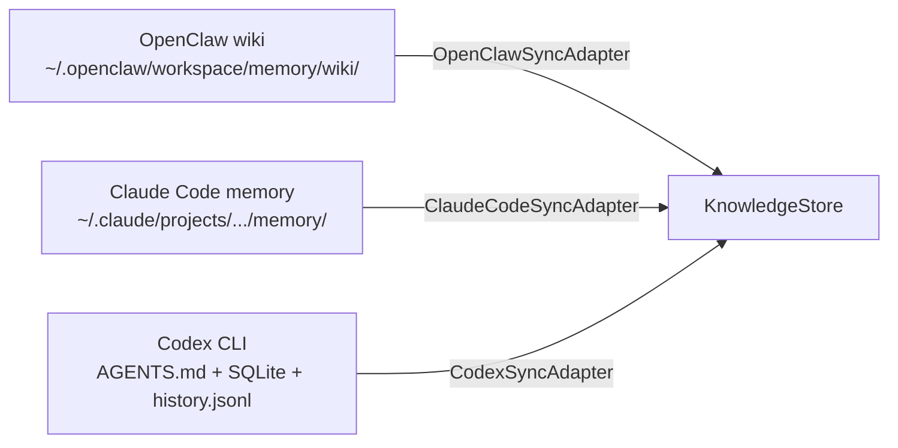

# 跨 Agent 同步协议

## 概述

Linglong 通过 SyncAdapter 将各 Agent 的知识库统一同步到 KnowledgeStore。每个 Agent 写入时带命名空间前缀（`openclaw:`、`claude:`、`codex:`）。

## 同步架构



## 内置适配器

### OpenClawSyncAdapter

同步 OpenClaw wiki 目录中的 Markdown 文件。

- 读取 `~/.openclaw/workspace/memory/wiki/` 下的 `.md` 文件
- 解析 YAML frontmatter 提取元数据
- 转换为 Entity 对象，`created_by="openclaw:{agent_name}"`
- 默认 confidence: 0.95

### ClaudeCodeSyncAdapter

同步 Claude Code 的 memory 目录。

- 读取 `~/.claude/projects/{project}/memory/` 下的 `.md` 文件
- 解析 frontmatter（name, description, type）
- 转换为 Entity 对象，`created_by="claude"`

### CodexSyncAdapter

同步 Codex CLI 的数据目录。

- 读取 `AGENTS.md`（agent 定义）
- 读取 SQLite 数据库（任务历史）
- 读取 `history.jsonl`（对话记录）
- 转换为 Entity 对象，`created_by="codex"`

## 使用方式

```bash
# CLI
linglong sync openclaw
linglong sync claude
linglong sync codex

# 指定路径
linglong sync openclaw --path ~/.openclaw/workspace/memory/wiki
```

```python
# Python
from linglong.knowledge.sync.openclaw import OpenClawSyncAdapter

adapter = OpenClawSyncAdapter(wiki_path="/path/to/wiki")
count = adapter.sync_to_linglong()
print(f"同步 {count} 条实体")
```

## 配置

```yaml
# .linglong.yaml
knowledge:
  sync_confidence: 0.95
  openclaw_wiki_path: ~/.openclaw/workspace/memory/wiki
  claude_memory_path: ~/.claude/projects/.../memory
  codex_path: ~/.codex/
```

## 新增适配器

继承 `BaseSyncAdapter` 实现 `sync_to_linglong()` 方法：

```python
from linglong.knowledge.sync.base import BaseSyncAdapter

class MyAgentSyncAdapter(BaseSyncAdapter):
    def sync_to_linglong(self) -> int:
        # 读取外部数据源
        # 转换为 Entity 对象
        # 调用 store.create()
        return count
```
