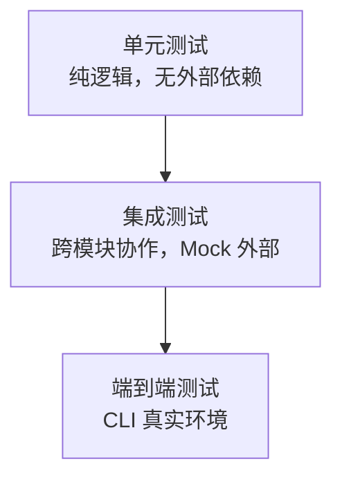

# 测试策略

## 测试分层



### 单元测试

不依赖外部服务、不读写真实文件系统的纯逻辑测试。

| 模块 | 测试要点 |
|------|----------|
| `core.config` | LinglongConfig 加载、默认值、YAML 配置 |
| `core.models` | Entity 构造、AgentID 验证、ConfidenceScore 边界 |
| `reviewer.reviewer` | 规则校验（frontmatter/字数/代码块）、LLM 评分解析 |

### 集成测试

跨模块协作，使用 Mock 替代外部依赖。

- **KnowledgeStore + Entity**: 写入 → search 按 status 过滤
- **Reviewer + LLM**: 注入 fixture → 验证评分/建议输出
- **DispatchManager + LocalPublisher**: 内容 → 文件发布

### 端到端测试

手动执行，验证 CLI 主流程。

- `linglong kb write/read/search` — 知识库 CRUD
- `linglong review <file>` — 文件审稿
- 真实 KnowledgeStore — 验证输出格式

## Mock 原则

| 依赖 | Mock 方式 |
|------|----------|
| 文件系统 | `tempfile.TemporaryDirectory()` + `set_config()` |
| LLM API | `unittest.mock.patch` 替换 `LLMClient.call()` |
| 网络 | `responses` 或 `httpx.MockTransport` |

## 测试纪律

1. **新增功能必带测试**
2. **Mock 外部依赖** — 禁止调用真实 LLM API / 真实文件系统
3. **状态隔离** — 使用临时目录，避免污染 `~/.linglong/`
4. **配置隔离** — `set_config()` 注入临时 LinglongConfig

## 运行

```bash
pytest                          # 全部测试
pytest tests/core/ -v           # core 模块
pytest tests/reviewer/ -v       # reviewer 模块
pytest --cov=linglong           # 带覆盖率
```

## 目录结构

```
tests/
├── core/           # core 模块测试
├── ingest/         # ingest 模块测试
├── knowledge/      # knowledge 模块测试
├── reviewer/       # reviewer 模块测试
├── dispatch/       # dispatch 模块测试
└── integration/    # 端到端集成测试
```
