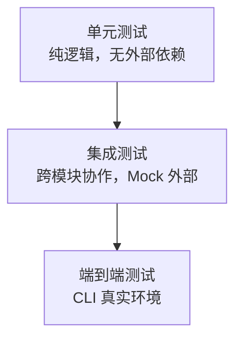

# 测试策略

## 测试分层



### 单元测试

不依赖外部服务、不读写真实文件系统的纯逻辑测试。

| 模块 | 测试要点 |
|------|----------|
| `core.config` | LinglongConfig 加载、默认值、YAML 配置 |
| `core.models` | Entity 构造、AgentID 验证、ConfidenceScore 边界 |
| `knowledge.store` | CRUD、搜索、版本管理 |
| `knowledge.review` | 规则评估（置信度阈值、敏感词、来源可信度） |
| `knowledge.embeddings` | Embedding 生成、fallback |
| `knowledge.sync` | 三个 SyncAdapter 的 pull 逻辑 |

### 集成测试

跨模块协作，使用 Mock 替代外部依赖。

- **KnowledgeStore + Entity**: 写入 → search 按 status 过滤
- **ReviewEngine + KnowledgeStore**: 创建 → review → 状态流转

### 端到端测试

手动执行，验证 CLI 主流程。

- `linglong kb write/read/search` — 知识库 CRUD
- 真实 KnowledgeStore — 验证输出格式

## Mock 原则

| 依赖 | Mock 方式 |
|------|----------|
| 文件系统 | `tempfile.TemporaryDirectory()` + `set_config()` |
| Embedding API | `unittest.mock.patch` 替换 |
| 网络 | `responses` 或 `httpx.MockTransport` |

## 测试纪律

1. **新增功能必带测试**
2. **Mock 外部依赖** — 禁止调用真实 Embedding API / 真实文件系统
3. **状态隔离** — 使用临时目录，避免污染 `~/.knowledge/`
4. **配置隔离** — `set_config()` 注入临时 LinglongConfig

## 运行

```bash
pytest                          # 全部测试（167 tests）
pytest tests/core/ -v           # core 模块
pytest tests/knowledge/ -v      # knowledge 模块
pytest tests/mcp/ -v            # mcp 模块
pytest --cov=linglong           # 带覆盖率
```

## 目录结构

```
tests/
├── core/           # core 模块测试（20 tests）
├── knowledge/      # knowledge 模块测试（102 tests）
├── mcp/            # mcp 模块测试（20 tests）
├── integration/    # 端到端集成测试（1 test）
└── test_cli.py     # CLI 测试（22 tests）
```
